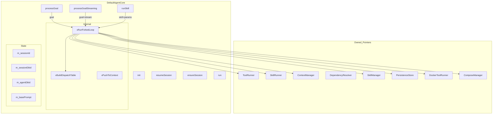
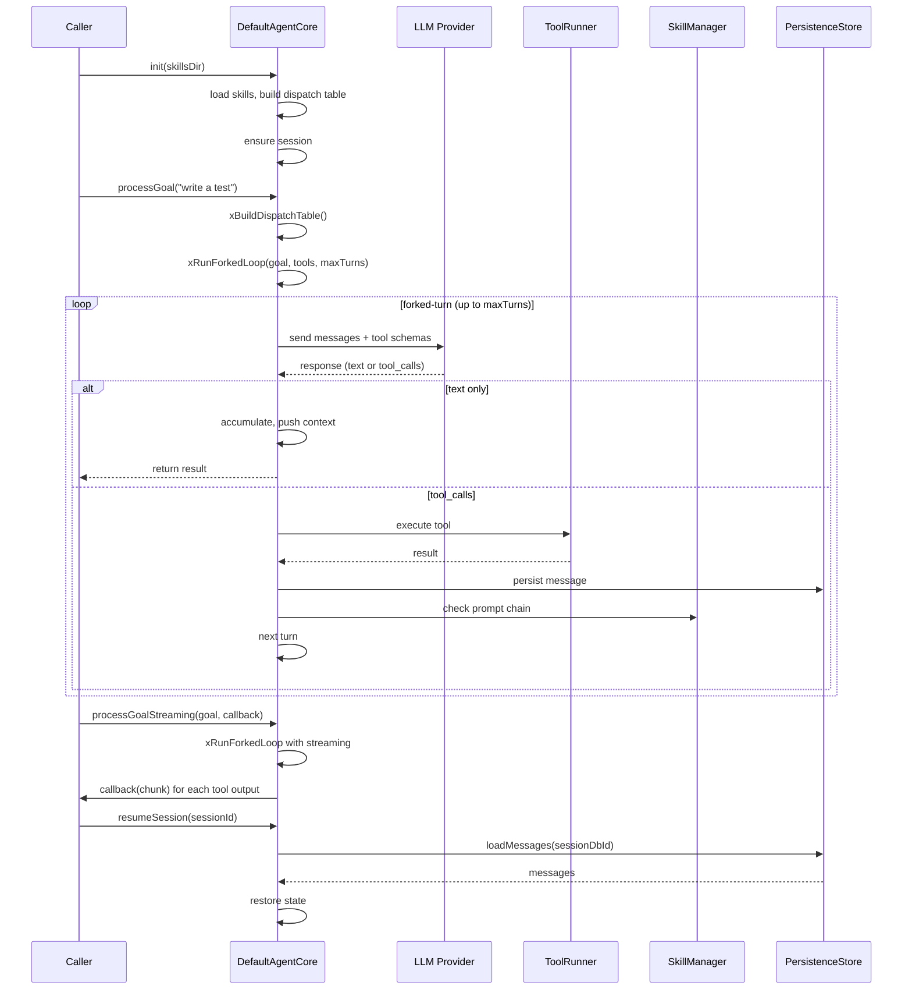

# DefaultAgentCore Spec

## 1. Overview

**Deprecated.** No longer compiled. Kept as reference. Replaced by `DrivenCore` + `runSync()`.

The original `DefaultAgentCore` implemented the `AgentCore` interface with a forked-loop pattern: it dispatched goals through an LLM-powered tool-calling loop (`xRunForkedLoop`) and managed session persistence, tool dispatch, and skill composition. It also coordinated `ToolRunner`, `SkillRunner`, `ContextManager`, `DependencyResolver`, `DockerToolRunner`, and `ComposeManager`.

**Source files:** `src/core/agent_core.h` (no `.cpp`, not compiled)

**Dependencies:** `shared/agent_interfaces.h`, `skills/skills.h`, `bootstrap/session_context.h`, `persistence/persistence_store.h`

## 2. Component Specifications

```cpp
namespace a0 {

/// @deprecated No longer compiled. Kept as reference.
/// Replaced by DrivenCore + runSync().
class DefaultAgentCore : public AgentCore {
public:
    DefaultAgentCore(ToolRunner* toolRunner,
                     SkillRunner* skillRunner,
                     ContextManager* context,
                     DependencyResolver* depResolver,
                     a0::skills::SkillManager* skillMgr,
                     a0::persistence::PersistenceStore* persistence = nullptr,
                     DockerToolRunner* dockerRunner = nullptr,
                     ComposeManager* composeMgr = nullptr);

    bool init(const std::string& skillsDir) override;
    bool init(const std::string& skillsDir, const std::string& a0Dir);
    void setExternalRepo(const std::string& url) { m_externalRepoUrl = url; }
    void setSkillArgs(const std::unordered_map<std::string, std::string>& args) { m_skillArgs = args; }
    void setSessionId(const std::string& sessionId) { m_sessionId = sessionId; }
    json processGoal(const std::string& goal) override;
    json processGoal(const std::string& goal, const json& params);
    json runSkill(const std::string& skillName, const json& params);
    bool resumeSession(const std::string& sessionId) override;
    bool ensureSession() override;
    int64_t sessionDbId() const override { return m_sessionDbId; }
    std::string currentSessionId() const override;
    void run() override;
    a0::StreamHandle processGoalStreaming(const std::string& goal,
                                           a0::StreamCallback onChunk) override;

    int agentDbId() const { return m_agentDbId; }

    void setSession(const std::string& sessionId, int64_t sessionDbId,
                    a0::SessionContext* sessionCtx = nullptr);
    void setMaxParallel(int n) { m_maxParallel = n; }

private:
    void xPushToContext(const std::string& goal, const json& result);
    void xBuildDispatchTable();

    std::string xRunForkedLoop(
        const std::string& userInput,
        const std::vector<ToolSchema>& tools,
        int maxTurns);

    std::string m_basePrompt;
    int m_agentDbId = -1;
    int64_t m_sessionDbId = 0;
    int64_t m_nextSubSession = 1;

    a0::skills::SkillManager* m_skillMgr;
    ToolRunner* m_toolRunner;
    a0::persistence::PersistenceStore* m_persistence;
    DockerToolRunner* m_dockerRunner;
    ComposeManager* m_composeMgr;
    SkillRunner* m_skillRunner;
    ContextManager* m_context;
    DependencyResolver* m_depResolver;
    std::string m_sessionId;
    bool m_initialized;
    a0::SessionContext* m_sessionCtx = nullptr;

    std::unordered_map<std::string, std::string> m_dispatch;
    std::unordered_set<std::string> m_accumulatedTools;
    int m_maxParallel = 4;
    std::string m_skillsDir;
    std::string m_externalRepoUrl = "https://github.com/opensassi/a0";
    std::string m_a0Dir;
    std::unordered_map<std::string, std::string> m_skillArgs;
};

} // namespace a0
```

## 3. Architecture Diagram



## 4. Data Flow



## 5. Testing Requirements

| Test | Verification |
|------|-------------|
| init loads skills | Dispatch table populated, initialized flag true |
| processGoal returns result | Goal processed, result JSON returned |
| processGoalStreaming invokes callback | onChunk called for tool output |
| runSkill dispatches correctly | Skill name resolved and executed |
| resumeSession restores messages | Old messages loaded into context |
| Session persistence | Messages stored to and loaded from DB |
| xRunForkedLoop max turns | Loop exits after maxTurns iterations |
| setSession sets context | SessionCtx stored and available |
| setExternalRepo affects clone URL | External repo URL stored |

## 7. CLI Entry Point

Not wired. This class is deprecated and no longer compiled. The CLI uses `DrivenCore` + `runSync()` or `AppCoreThread` for both interactive and non-interactive modes.
