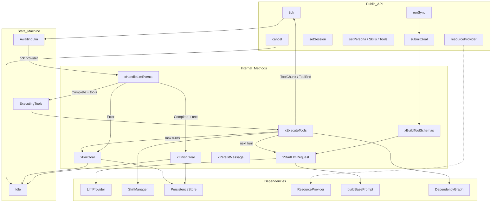
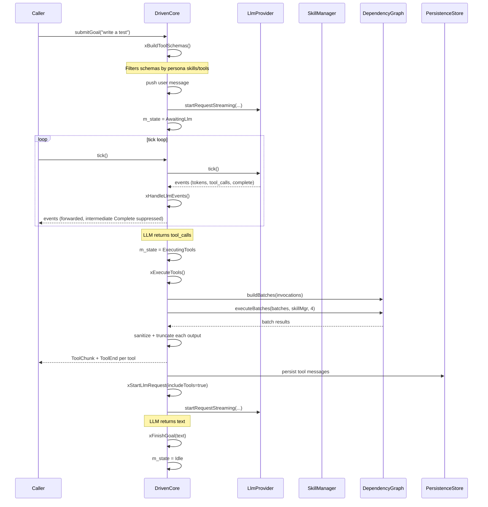

# DrivenCore Spec

## 1. Overview

State-machine driven agent core. Transitions through `Idle → AwaitingLlm → ExecutingTools → Idle` on each goal. `submitGoal()` starts an LLM request, `tick()` drives the provider and tool execution, and `cancel()` resets to idle. `runSync()` provides a synchronous convenience wrapper for headless/CLI use.

Uses `LlmProvider*` instead of a concrete provider — works with any LLM backend. Persona-based tool filtering is applied in `xBuildToolSchemas()` — only tools matching the current persona's `skills` and `tools` lists are included.

Accepts `ResourceProvider*` and flush-size parameters (`tokenFlushSize`, `toolFlushSize`, `outputPreviewSize`) for streaming event batching and output preview truncation.

**Source files:** `src/core/driven_core.h/.cpp`

**Dependencies:** `shared/agent_interfaces.h`, `shared/resource_provider.h`, `llm/llm_provider.h`, `shared/mpsc.h`, `skills/skills.h`, `persistence/persistence_store.h`, `bootstrap/base_prompt.h`, `executor/dependency_graph.h`

## 2. Component Specifications

```cpp
namespace a0 {

class DrivenCore {
public:
    DrivenCore(LlmProvider* provider,
               a0::skills::SkillManager* skillMgr,
               a0::persistence::PersistenceStore* persistence = nullptr,
               ResourceProvider* resourceProvider = nullptr,
               int64_t tokenFlushSize = 256,
               int64_t toolFlushSize = 4096,
               int64_t outputPreviewSize = 4096);

    void submitGoal(const std::string& goal);
    std::string runSync(const std::string& goal);
    std::vector<mpsc::AppCoreEvent> tick();
    bool idle() const { return m_state == CoreState::Idle; }
    void cancel();

    void setSession(int64_t sessionDbId, const std::string& sessionUuid);
    void setPersona(const std::string& persona);
    void setPersonaSkills(const std::vector<std::string>& skills);
    void setPersonaTools(const std::vector<std::string>& tools);

    int64_t sessionDbId() const { return m_sessionDbId; }
    const std::string& lastResult() const { return m_lastResult; }
    ResourceProvider* resourceProvider() const { return m_resourceProvider; }

private:
    enum class CoreState { Idle, AwaitingLlm, ExecutingTools };

    CoreState m_state = CoreState::Idle;
    LlmProvider* m_provider;
    a0::skills::SkillManager* m_skillMgr;
    a0::persistence::PersistenceStore* m_persistence;
    ResourceProvider* m_resourceProvider = nullptr;
    int64_t m_tokenFlushSize = 256;
    int64_t m_toolFlushSize = 4096;
    int64_t m_outputPreviewSize = 4096;

    std::string m_lastResult;
    std::string m_personaName;
    std::vector<std::string> m_personaSkills;
    std::vector<std::string> m_personaTools;
    std::string m_sessionUuid;
    int64_t m_sessionDbId = 0;
    int64_t m_subSessionId = 0;
    int m_seq = 0;
    int m_turnCount = 0;
    bool m_systemPromptPersisted = false;

    std::vector<Message> m_messages;
    std::vector<ToolSchema> m_toolSchemas;
    std::vector<ToolSchema> m_emptySchemas;
    std::unordered_map<std::string, std::string> m_dispatch;

    std::string m_accumText;

    struct PendingToolCall {
        std::string id;
        std::string name;
        json arguments;
    };
    std::vector<PendingToolCall> m_pendingToolCalls;

    static constexpr int MAX_TURNS = 25;

    void xBuildToolSchemas();
    void xStartLlmRequest(bool includeTools = true);
    void xHandleLlmEvents(const std::vector<mpsc::AppCoreEvent>& events);
    std::vector<mpsc::AppCoreEvent> xExecuteTools();
    void xFinishGoal(const std::string& text);
    void xFailGoal(const std::string& error);
    void xPersistMessage(const std::string& role, const std::string& content,
                         const std::string& toolCallId = "",
                         const std::vector<ToolCall>& toolCalls = {});
};

} // namespace a0
```

### xBuildToolSchemas — Persona-Based Filtering

`xBuildToolSchemas()` always applies the persona filter:

1. Build `allowedPrefixes` from `m_personaSkills` (e.g. `"system_task-manager"` → `"system_task-manager_"`)
2. Iterate all loaded manifests (`SYSTEM`, `LOCAL`, `GITHUB` namespaces), keeping only default tools whose qualified name passes `isAllowed()` (matches a prefix from `m_personaSkills` or appears in `m_personaTools` by exact qualified name)
3. Add individual tools from `m_personaTools` via `getTool()` reference — duplicates against manifest tools are skipped
4. Filter the dispatch table entries against `m_personaSkills` (by `ns_comp` skill reference) and `m_personaTools` (by exact QN match); remaining entries add their `ToolSchema` or `Prompt`-based schema

When both `m_personaSkills` and `m_personaTools` are empty, no tool schemas are loaded.

### xStartLlmRequest — System Prompt

Calls `buildBasePrompt(m_skillMgr, m_personaName)` to load the persona's prompt text with `{{BUILD_HASH}}`, `{{OS_INFO}}`, `{{CWD}}` substitution. The system prompt and tool definitions are persisted once per session via `saveSessionSystemPrompt()`.

### xExecuteTools — Batch Execution

Tool invocations are formed from `m_pendingToolCalls`, resolving short names via `m_dispatch`. `DependencyGraph::buildBatches` and `DependencyGraph::executeBatches` run the tools with parallelism (max 4). Each output is sanitized (UTF-8), truncated to 64KB, and emitted as `ToolChunk` + `ToolEnd` events. The `outputPreviewSize` limits the preview text in `ToolEnd.outputPreview`.

## 3. Architecture Diagram



## 4. Data Flow



## 5. Testing Requirements

| Test | Verification |
|------|-------------|
| submitGoal from idle | Transitions to AwaitingLlm, starts request |
| runSync completes | Returns final output text, core idle |
| tick in Idle state | Returns empty vector |
| tick in AwaitingLlm | Forwards provider events |
| LLM returns text only | Calls xFinishGoal, transitions to Idle |
| LLM returns tool calls | Transitions to ExecutingTools |
| Tool executes successfully via DependencyGraph | Result added to messages, next LLM started |
| Tool output sanitized | Invalid UTF-8 replaced with `?` |
| Tool output truncated to 64KB | Output capped with truncation notice |
| ToolEnd preview respects outputPreviewSize | Preview text limited to m_outputPreviewSize |
| Max tool call turns exceeded | xFailGoal with error message |
| cancel() from any state | Provider cancelled, state = Idle |
| setSession before submit | User message persisted to session |
| User message persisted | `loadMessages(sessionId)` contains user role |
| Assistant text persisted | `loadMessages(sessionId)` contains assistant role |
| No persistence without session | `loadMessages(0)` returns empty |
| Session switch | Messages go to correct session |
| No persona — empty schemas | `xBuildToolSchemas` returns no tools |
| Filter by skills | Only tools from persona skill list included |
| Filter by tools | Only individually listed tools included |
| Filter by skills+tools | Combined set returned |
| resourceProvider accessor | Returns the ResourceProvider* passed at construction |
