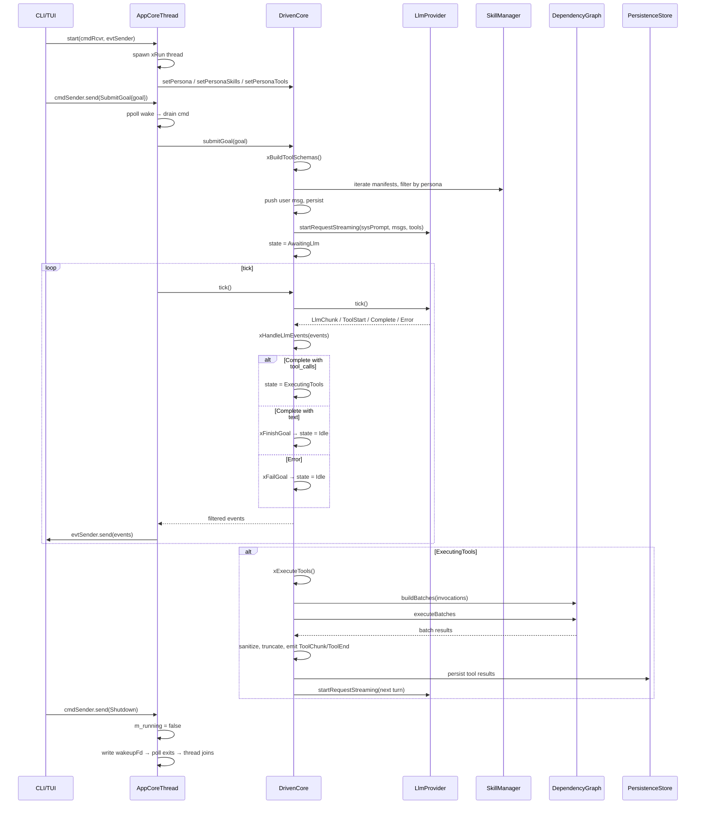

# Technical Specification: Core Sub-Module

## For a0 Agent — Version 2.0

## §1. Overview

The Core sub-module is the **controller** — it owns the tick-driven state machine (`DrivenCore`) and its thread wrapper (`AppCoreThread`). It is the single point of coordination that links all other sub-modules together. A deprecated `DefaultAgentCore` class is kept as reference only (not compiled).

**Source files:**
- `driven_core.h/.cpp` — tick-based state machine
- `app_core_thread.h/.cpp` — thread wrapper + MPSC command dispatch
- `agent_core.h` — deprecated, not compiled

**Dependencies:** `llm_lib`, `executor_lib`, `skills_lib`, `persistence_lib`, `docker_lib`, `bootstrap_lib`, `ipc_lib`, `tui_lib`

**Namespace:** `a0`

**Lifecycle:**
1. CLI/TUI creates `AppCoreThread` (or directly uses `DrivenCore::runSync()` for headless)
2. `AppCoreThread::start()` spawns a thread that constructs `DeepSeekProvider` + `DrivenCore`
3. The thread runs a `ppoll()` event loop draining MPSC commands and ticking `DrivenCore`
4. `AppCoreThread::stop()` writes to eventfd, breaks the poll loop, joins the thread
5. `DrivenCore` transitions `Idle → AwaitingLlm → ExecutingTools → Idle` per goal

## §2. Component Specifications

### DrivenCore

```cpp
namespace a0 {

class DrivenCore {
public:
    DrivenCore(LlmProvider* provider,
               a0::skills::SkillManager* skillMgr,
               a0::persistence::PersistenceStore* persistence = nullptr,
               ResourceProvider* resourceProvider = nullptr,
               int64_t tokenFlushSize = 256,
               int64_t toolFlushSize = 4096,
               int64_t outputPreviewSize = 4096);

    void submitGoal(const std::string& goal);
    std::string runSync(const std::string& goal);
    std::vector<mpsc::AppCoreEvent> tick();
    bool idle() const;
    void cancel();

    void setSession(int64_t sessionDbId, const std::string& sessionUuid);
    void setPersona(const std::string& persona);
    void setPersonaSkills(const std::vector<std::string>& skills);
    void setPersonaTools(const std::vector<std::string>& tools);

    int64_t sessionDbId() const;
    const std::string& lastResult() const;
    ResourceProvider* resourceProvider() const;

private:
    enum class CoreState { Idle, AwaitingLlm, ExecutingTools };
    CoreState m_state = CoreState::Idle;
    LlmProvider* m_provider;
    a0::skills::SkillManager* m_skillMgr;
    a0::persistence::PersistenceStore* m_persistence;
    ResourceProvider* m_resourceProvider = nullptr;
    int64_t m_tokenFlushSize, m_toolFlushSize, m_outputPreviewSize;
    std::string m_lastResult, m_personaName, m_sessionUuid;
    std::vector<std::string> m_personaSkills, m_personaTools;
    int64_t m_sessionDbId = 0, m_subSessionId = 0;
    int m_seq = 0, m_turnCount = 0;
    bool m_systemPromptPersisted = false;
    std::vector<Message> m_messages;
    std::vector<ToolSchema> m_toolSchemas, m_emptySchemas;
    std::unordered_map<std::string, std::string> m_dispatch;
    std::string m_accumText;
    struct PendingToolCall { std::string id, name; json arguments; };
    std::vector<PendingToolCall> m_pendingToolCalls;
    static constexpr int MAX_TURNS = 25;

    void xBuildToolSchemas();
    void xStartLlmRequest(bool includeTools = true);
    void xHandleLlmEvents(const std::vector<mpsc::AppCoreEvent>& events);
    std::vector<mpsc::AppCoreEvent> xExecuteTools();
    void xFinishGoal(const std::string& text);
    void xFailGoal(const std::string& error);
    void xPersistMessage(const std::string& role, const std::string& content,
                         const std::string& toolCallId = "",
                         const std::vector<ToolCall>& toolCalls = {});
};

} // namespace a0
```

### AppCoreThread

```cpp
namespace a0 {

class AppCoreThread {
public:
    AppCoreThread(const std::string& apiKey,
                  const std::string& model,
                  a0::skills::SkillManager* skillMgr,
                  a0::persistence::PersistenceStore* persistence = nullptr,
                  ResourceProvider* resourceProvider = nullptr,
                  int64_t tokenFlushSize = 256,
                  int64_t toolFlushSize = 4096,
                  int64_t outputPreviewSize = 4096,
                  const std::string& personaName = "",
                  const std::vector<std::string>& personaSkills = {},
                  const std::vector<std::string>& personaTools = {});
    ~AppCoreThread();

    AppCoreThread(const AppCoreThread&) = delete;
    AppCoreThread& operator=(const AppCoreThread&) = delete;

    void setMockUrl(const std::string& url);
    void start(mpsc::Receiver<mpsc::Command> cmdRcvr,
               mpsc::Sender<mpsc::AppCoreEvent> evtSender,
               std::function<void()> wakeupFn = nullptr);
    void setWakeupFn(std::function<void()> fn);
    void stop();
    bool running() const;

private:
    std::string m_apiKey, m_model, m_mockUrl;
    std::string m_personaName;
    std::vector<std::string> m_personaSkills, m_personaTools;
    a0::skills::SkillManager* m_skillMgr;
    a0::persistence::PersistenceStore* m_persistence;
    ResourceProvider* m_resourceProvider = nullptr;
    int64_t m_tokenFlushSize, m_toolFlushSize, m_outputPreviewSize;
    mpsc::Receiver<mpsc::Command> m_cmdReceiver;
    mpsc::Sender<mpsc::AppCoreEvent> m_evtSender;
    std::function<void()> m_wakeupFn;
    int m_wakeupFd = -1;
    std::thread m_thread;
    std::atomic<bool> m_running{false};
    void xRun();
};

} // namespace a0
```

### DefaultAgentCore (deprecated, not compiled)

```cpp
namespace a0 {

class DefaultAgentCore : public AgentCore {
public:
    DefaultAgentCore(ToolRunner*, SkillRunner*, ContextManager*,
                     DependencyResolver*, a0::skills::SkillManager*,
                     a0::persistence::PersistenceStore* = nullptr,
                     DockerToolRunner* = nullptr, ComposeManager* = nullptr);
    bool init(const std::string& skillsDir) override;
    bool init(const std::string& skillsDir, const std::string& a0Dir);
    void setExternalRepo(const std::string& url);
    void setSkillArgs(const std::unordered_map<std::string, std::string>& args);
    void setSessionId(const std::string& sessionId);
    json processGoal(const std::string& goal) override;
    json processGoal(const std::string& goal, const json& params);
    json runSkill(const std::string& skillName, const json& params);
    bool resumeSession(const std::string& sessionId) override;
    bool ensureSession() override;
    int64_t sessionDbId() const override;
    std::string currentSessionId() const override;
    void run() override;
    a0::StreamHandle processGoalStreaming(const std::string& goal,
                                           a0::StreamCallback onChunk) override;
    int agentDbId() const;
    void setSession(const std::string& sessionId, int64_t sessionDbId,
                    a0::SessionContext* sessionCtx = nullptr);
    void setMaxParallel(int n);

private:
    void xPushToContext(const std::string& goal, const json& result);
    void xBuildDispatchTable();
    std::string xRunForkedLoop(const std::string& userInput,
                                const std::vector<ToolSchema>& tools,
                                int maxTurns);
    // ... 20+ private members (see src/agent_core.spec.md)
};

} // namespace a0
```

## §3. Architecture Diagram

```mermaid
graph TB
    subgraph External
        UI[CLI / TUI Thread]
    end

    subgraph AppCoreThread
        THD[std::thread]
        RUN[xRun ppoll loop]
        WFD[wakeupFd]
        CFD[cmdFd]
    end

    subgraph DrivenCore
        SMACH[State Machine: Idle / AwaitingLlm / ExecutingTools]
        SCHEMA[xBuildToolSchemas]
        START[xStartLlmRequest]
        HANDLE[xHandleLlmEvents]
        EXEC[xExecuteTools]
    end

    subgraph Providers_and_Services
        LLM[DeepSeekProvider / LlmProvider]
        SKILL[SkillManager]
        PERS[PersistenceStore]
        RPROV[ResourceProvider]
        DEPGRAPH[DependencyGraph]
    end

    UI -->|MPSC Commands| CFD
    CFD --> RUN
    RUN -->|drain commands| SMACH
    RUN -->|tick()| SMACH
    SMACH -->|startRequestStreaming| LLM
    SMACH --> SCHEMA
    SCHEMA --> SKILL
    SMACH --> EXEC
    EXEC --> DEPGRAPH
    DEPGRAPH --> SKILL
    SMACH -->|persist| PERS
    SMACH -->|resourceProvider| RPROV
    SMACH -->|events| RUN
    RUN -->|MPSC Events| UI
    UI -->|stop()| WFD
    WFD -->|wake| RUN
```

## §4. Data Flow



## §5. Testing Requirements

### DrivenCore

| Test | Verification |
|------|-------------|
| submitGoal from idle | Transitions to AwaitingLlm, starts request |
| runSync completes | Returns final output text, core idle |
| tick in Idle state | Returns empty vector |
| tick in AwaitingLlm | Forwards provider events |
| LLM returns text only | Calls xFinishGoal, transitions to Idle |
| LLM returns tool calls | Transitions to ExecutingTools |
| Tool executes via DependencyGraph | Result added to messages, next LLM started |
| Tool output sanitized | Invalid UTF-8 replaced with `?` |
| Tool output truncated at 64KB | Output capped with truncation notice |
| ToolEnd preview respects outputPreviewSize | Preview limited to configured size |
| Max tool call turns exceeded | xFailGoal with error message |
| cancel() from any state | Provider cancelled, state = Idle |
| Session persistence | Messages persisted to and loaded from DB |
| No persona — empty schemas | xBuildToolSchemas returns no tools |
| Filter by skills/tools | Only matching tools included |

### AppCoreThread

| Test | Verification |
|------|-------------|
| start() launches thread | running() returns true |
| SubmitGoal command | Core receives goal, events sent back |
| SetSession command | Core session set, SessionReady sent |
| ListSessions command | Persistence queried, SessionList sent |
| ResumeSession command | Messages loaded, SessionHistory sent |
| LoadResource command | ResourceProvider opened, result sent |
| Cancel command | Core.cancel() called, returns to idle |
| Shutdown command | Thread exits, running() returns false |
| stop() from idle | Thread joins cleanly, no crash |
| SIGCHLD handling | Zombie children reaped in poll loop |
| setMockUrl before start | Provider created with mock URL |
| Persona/ResourceProvider/Flush sizes forwarded | Construction args reach DrivenCore |

## §6. (skipped — no D3)

## §7. CLI Entry Point

The core sub-module is wired in through `src/main.cpp` (or the equivalent binary entry point). The CLI creates either:

1. **Interactive/TUI mode**: `AppCoreThread` is constructed and started, then the UI thread feeds commands via `MPSC::Sender<Command>` and receives events via `MPSC::Receiver<AppCoreEvent>`. The UI calls `stop()` on shutdown.

2. **Headless/script mode**: `DrivenCore::runSync(goal)` is used directly — it creates a `DeepSeekProvider`, calls `submitGoal()`, and busy-polls `tick()` until idle, then returns `lastResult()`.

3. **Testing**: `AppCoreThread::setMockUrl()` is called before `start()` to route the `DeepSeekProvider` to a mock server. Flush-size parameters control event batching granularity.

No direct CLI commands exist for the deprecated `DefaultAgentCore`. It is not compiled.
