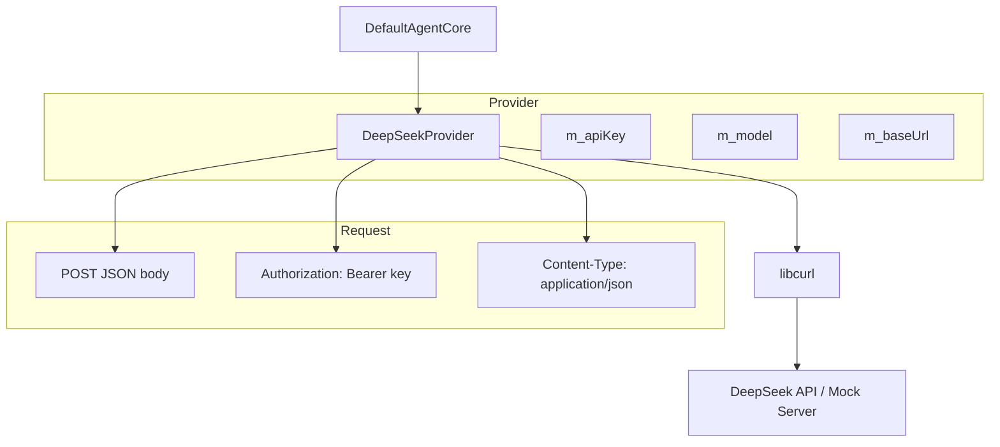
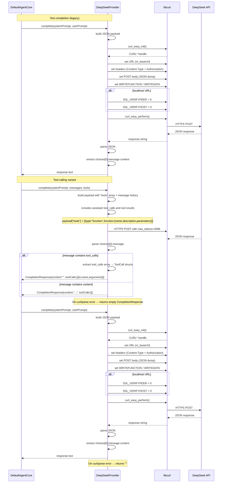

# DeepSeekProvider Spec

## 1. Overview

DeepSeekProvider implements InferenceProvider by making HTTPS POST requests to the DeepSeek Chat Completions API via libcurl. It constructs a JSON payload with system and user messages, sends it to `https://api.deepseek.com/v1/chat/completions`, and extracts the assistant's reply from `choices[0].message.content`. SSL verification is skipped when the base URL contains `localhost` or `127.0.0.1` (for test mocking). It is consumed by DefaultAgentCore during skill inference and prompt expansion.

## 2. Component Specifications

```cpp
struct ToolCall {
    std::string id;
    std::string name;
    json arguments;
};

struct CompletionResponse {
    std::string content;
    std::vector<ToolCall> toolCalls;
};

class DeepSeekProvider : public InferenceProvider {
public:
    /// \param apiKey  DeepSeek API key (sent as Bearer token)
    /// \param model   Model identifier (default: "deepseek-chat")
    DeepSeekProvider(const std::string& apiKey,
                     const std::string& model = "deepseek-chat");

    /// \param systemPrompt  System-level instruction (may be empty)
    /// \param userPrompt    User message content
    /// \retval Assistant response text from choices[0].message.content
    /// \retval Empty string on HTTP/network/parse error
    std::string complete(const std::string& systemPrompt,
                         const std::string& userPrompt) override;

    /// Tool-calling variant. Sends message history + tool schemas to the API.
    /// \param systemPrompt  System-level instruction
    /// \param messages      Conversation history including tool results
    /// \param tools         JSON Schema tool definitions for function calling
    /// \retval CompletionResponse with content and/or tool_calls array
    CompletionResponse complete(
        const std::string& systemPrompt,
        const std::vector<Message>& messages,
        const std::vector<ToolSchema>& tools) override;

    /// \param url  Override base URL (used for mock/test servers)
    void setMockUrl(const std::string& url) override;

private:
    std::string m_apiKey;
    std::string m_model;
    std::string m_baseUrl;  // Default: https://api.deepseek.com/v1/chat/completions
};
```

## 3. Architecture Diagram



## 4. Data Flow



## 5. Error Handling

| Condition | Behaviour |
|-----------|-----------|
| `curl_easy_init()` returns nullptr | Returns empty string |
| Network failure / timeout (30s) | `curl_easy_perform` returns non-CURLE_OK; returns empty string |
| API returns JSON with an `"error"` field | Returns empty string |
| Response JSON missing `choices[0].message.content` | JSON parse exception caught; returns empty string |
| Response body is not valid JSON | `json::parse` exception caught; returns empty string |
| Empty apiKey provided | Request sent with `"Authorization: Bearer "` — API returns 401; returns empty string |

## 6. Edge Cases

| Case | Behaviour |
|------|-----------|
| Empty `systemPrompt` | `messages` array contains only the user message |
| Empty `userPrompt` | Request sent with empty user content |
| Very long prompts (>100K tokens) | Sent as-is; API may truncate or reject |
| Mock URL with trailing slash | Sent as-is to the mock server (no normalization) |
| Mock URL on `localhost:PORT` | SSL verification is skipped automatically |
| API key with special characters | Passed verbatim in the Bearer header |
| Multiple `choices` in response | Only `choices[0]` is used |
| Concurrent calls from different threads | Not thread-safe (shared curl handle) |
| `setMockUrl` after construction | `m_baseUrl` is updated; next `complete()` call uses it |

## 7. Testing Requirements

| Method | Test | Input | Expected |
|--------|------|-------|----------|
| `complete` (text) | Successful response | Valid prompts, mock returns `{"choices":[{"message":{"content":"ok"}}]}` | Returns `"ok"` |
| `complete` (text) | API error field | Mock returns `{"error":"rate limit"}` | Returns `""` |
| `complete` (text) | Network timeout | Mock hangs for 31s | Returns `""` (curl 30s timeout) |
| `complete` (text) | Invalid JSON response | Mock returns `not json` | Returns `""` |
| `complete` (text) | Empty system prompt | `systemPrompt=""` | Content returned (system message omitted) |
| `complete` (text) | Empty user prompt | `userPrompt=""` | Returns content |
| `complete` (text) | curl init failure* | Force curl_easy_init to return nullptr | Returns `""` |
| `complete` (text) | Missing `choices` key | Mock returns `{}` | Returns `""` |
| `complete` (text) | Missing `message.content` | Mock returns `{"choices":[{}]}` | Returns `""` |
| `complete` (tool) | Tool call returned | Mock returns tool_calls array | CompletionResponse with toolCalls populated |
| `complete` (tool) | Both content and tool_calls | Mock returns both fields | Both fields populated in response |
| `complete` (tool) | Unparseable arguments JSON | Mock returns invalid arguments | Empty arguments object, no crash |
| `complete` (tool) | No tools registered | Empty tools vector, mock returns text | CompletionResponse with content only |
| `setMockUrl` | Override URL | `"http://127.0.0.1:9999/v1/chat"` | Next `complete()` uses the new URL |

\* *Hard to unit test without dependency injection; acceptance via code review.*
