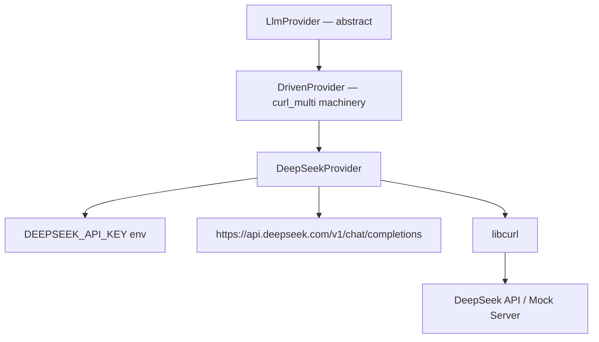
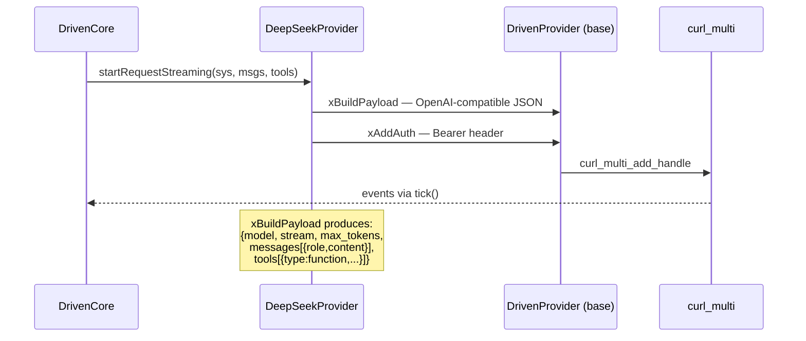

# DeepSeekProvider Spec

## 1. Overview

Concrete LLM provider for DeepSeek's API. Inherits from `DrivenProvider` which provides the universal `curl_multi` machinery. Implements the two pure virtual hooks with DeepSeek-specific logic:

- **`xBuildPayload()`** — builds OpenAI-compatible JSON request body (DeepSeek API follows the OpenAI format)
- **`xAddAuth()`** — adds `Authorization: Bearer <key>` header

API key is resolved from the constructor argument first, falling back to the `DEEPSEEK_API_KEY` environment variable.

**Source files:** `src/deepseek_provider.h/.cpp`

**Dependencies:** `driven_provider.h`, `libcurl`, `nlohmann/json`

## 2. Component Specifications

```cpp
namespace a0 {

class DeepSeekProvider : public DrivenProvider {
public:
    explicit DeepSeekProvider(const std::string& apiKey = "",
                              const std::string& model = "deepseek-chat");

protected:
    void xBuildPayload(json& payload,
                       const std::string& systemPrompt,
                       const std::vector<Message>& messages,
                       const std::vector<ToolSchema>& tools,
                       bool stream) const override;

    void xAddAuth(curl_slist*& headers) override;
};

} // namespace a0
```

## 3. Architecture Diagram



## 4. Data Flow



## 5. Error Handling

| Condition | Behaviour |
|-----------|-----------|
| `DEEPSEEK_API_KEY` not set and apiKey empty | `m_apiKey` is empty; auth header sent without key |
| Mock URL with trailing slash | Sent as-is (no normalization) |
| Mock URL on `localhost:PORT` | SSL verification skipped automatically |

## 6. Testing Requirements

Tested via integration with `DrivenCore` and `DrivenProvider` tests (no standalone unit tests needed since all logic is in the base class hooks).

| Test | Verification |
|------|-------------|
| Constructor with explicit apiKey | `m_baseUrl` set to DeepSeek URL, apiKey used |
| Constructor with empty apiKey | `DEEPSEEK_API_KEY` env var checked |
| xBuildPayload | Produces valid OpenAI-compatible JSON with system prompt, messages, tools |
| xAddAuth | Adds `Authorization: Bearer <key>` to curl headers |
