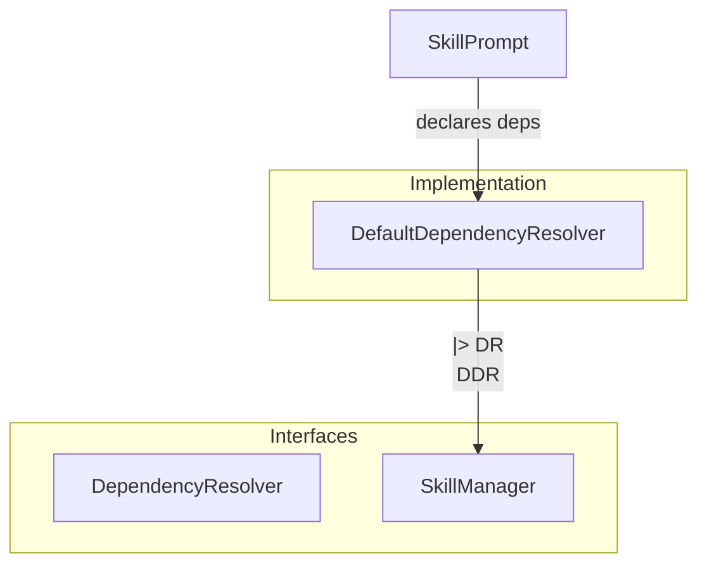
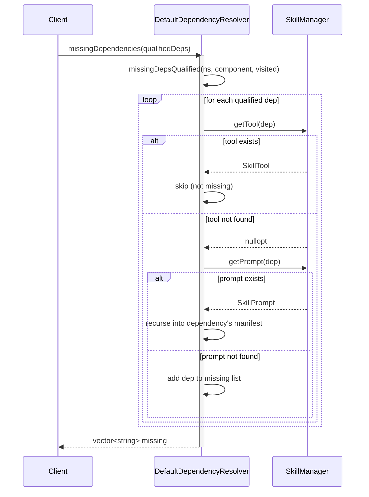

# DefaultDependencyResolver Spec

## 1. Overview

DefaultDependencyResolver implements DependencyResolver. It validates that all dependencies declared by a SkillPrompt are present in the SkillManager. Dependencies use qualified names (`ns:skill:name`) with no fallback or overrides. Resolution follows the transitive closure across skills. A `visited` set prevents infinite loops from circular references.

**Dependencies:** SkillManager (lookup-only)
**Lifecycle:** Instantiated with a SkillManager pointer; must outlive the resolver.

## 2. Component Specifications

```cpp
class DefaultDependencyResolver : public DependencyResolver {
public:
    /// \param skillMgr  Non-owning pointer to the skill manager; must remain valid for the lifetime of this resolver.
    explicit DefaultDependencyResolver(const a0::skills::SkillManager* skillMgr);

    /// \param tool  The tool to check (ignored – tools always pass).
    /// \retval true  Always, because tools have no dependency semantics.
    bool checkToolDependencies(const Tool& tool) const override;

    /// \param prompt  The prompt whose dependency set to check.
    /// \retval true  When missingDependencies(prompt) returns an empty vector.
    bool checkPromptDependencies(const Prompt& prompt) const override;

    /// \param prompt  The prompt to audit.
    /// \returns  Names of every transitive dependency that is neither a registered tool nor a registered skill.
    std::vector<std::string> missingDependencies(const Prompt& prompt) const override;

private:
    /// Recursive helper. Inserts prompt.name into visited before iterating its deps.
    /// \param prompt   Current prompt node to expand.
    /// \param visited  Mutable set of already-visited prompt names (cycle guard).
    /// \returns        Accumulated missing dependencies for this subtree.
    std::vector<std::string> missingDependenciesRecursive(
        const Prompt& prompt, std::set<std::string>& visited) const;

    const a0::skills::SkillManager* m_skillMgr;
};
```

## 3. Architecture Diagram



## 4. Data Flow



## 5. Error Handling

| Scenario | Behaviour |
|----------|-----------|
| Dependency not found in SkillManager | Included in the returned missing list |
| Circular skill dependency (A→B→A) | Cut by `visited` set; not reported as missing |
| Duplicate dependency declared twice | Deduplicated by `visited` set |
| Transitive chain where an intermediate skill is missing | Intermediate skill name appears in missing list, its children are not visited |
| SkillManager pointer is null | Undefined behaviour (caller must ensure valid pointer) |

## 6. Edge Cases

| Case | Expected Result |
|------|----------------|
| Skill with empty `dependencies` vector | Empty result from `missingDependencies` |
| Skill depending only on registered tools | Empty result (tools always pass) |
| Deep chain (A→B→C→D where D is missing) | `[D]` is returned after full traversal |
| SkillManager loaded with zero skills | Every dependency reported as missing |
| Skill depending on itself | Visited set prevents re-entry; self-dependency not reported as missing |

## 7. Testing Requirements

| Method | Test Case | Input | Expected Output |
|--------|-----------|-------|----------------|
| `checkToolDependencies` | Any tool | `Tool{name="ls", ...}` | `true` |
| `checkPromptDependencies` | All deps satisfied | Prompt with dep pointing to registered tool | `true` |
| `checkPromptDependencies` | Missing dep | Prompt with dep absent from registry | `false` |
| `missingDependencies` | Fully satisfied | Skill with only tool deps | `[]` |
| `missingDependencies` | Single missing | Skill with one dep missing | `["missing_dep"]` |
| `missingDependencies` | Transitive missing | A→B→toolX, toolX missing | `["toolX"]` |
| `missingDependencies` | Circular | A→B→A, both registered | `[]` |
| `missingDependencies` | No deps | Skill with empty deps | `[]` |
