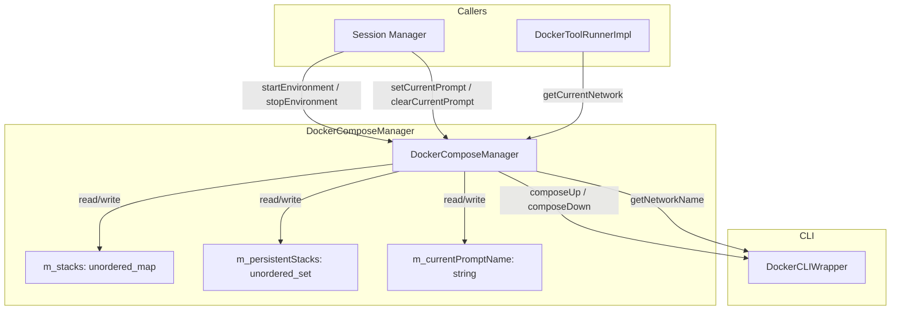
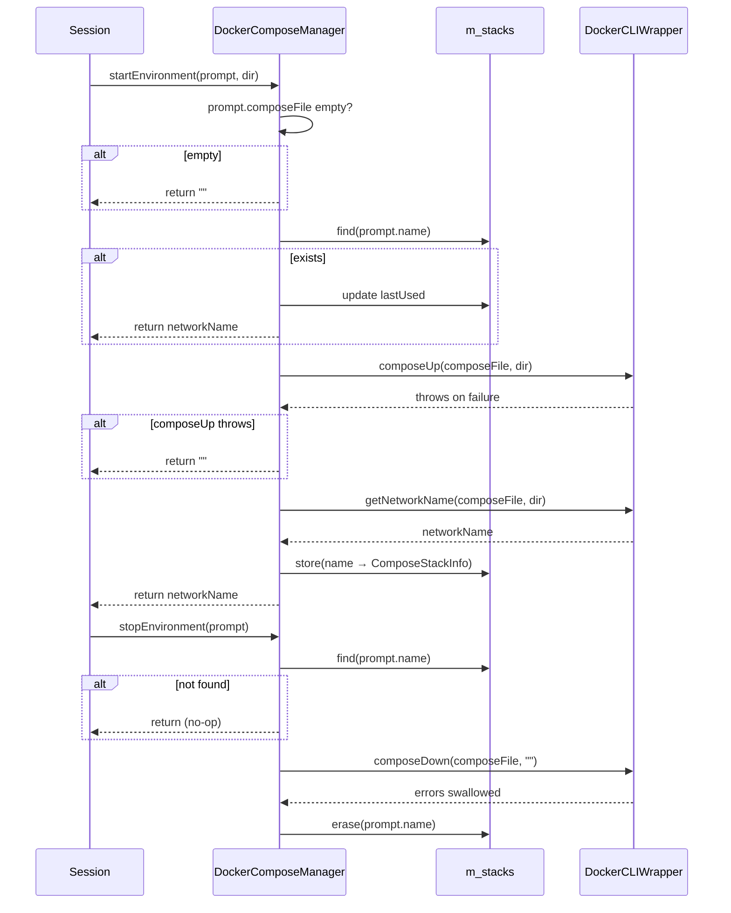
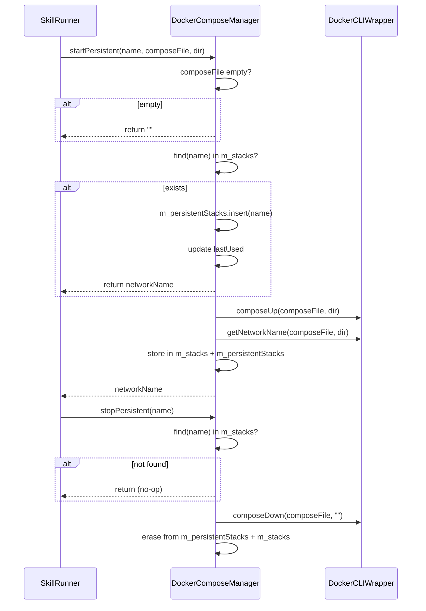

# DockerComposeManager Spec

## §1. Overview
Manages Docker Compose environments for skills. Bridges skill lifecycle events to docker-compose up/down operations and tracks running stacks with idle timeouts. Owns `ComposeStackInfo` entries mapped by prompt name. Delegates all CLI calls to `DockerCLIWrapper`.

**Base class:** `ComposeManager` (from `shared/agent_interfaces.h:186`)
**Source files:** `compose_manager.h`, `compose_manager.cpp`
**Dependencies:** `DockerCLIWrapper` (static utility), `shared/agent_interfaces.h` (Prompt, ComposeManager)
**Lifecycle:** Created per-session with idle timeout. Stacks accumulate until explicitly stopped or implicitly pruned by caller.

## §2. Component Specifications

```cpp
struct ComposeStackInfo {
    std::string composeFile;   // path to the compose file for this stack
    std::string networkName;   // Docker network name for this stack
    time_t lastUsed;           // timestamp of last activity
};

class DockerComposeManager : public ComposeManager {
public:
    /**
     * @param idleTimeout Seconds before a stack is considered idle
     */
    explicit DockerComposeManager(int idleTimeout);

    /**
     * @brief  Start a compose environment for a prompt
     * @param  prompt         The prompt requesting the environment
     * @param  skillDirectory Filesystem path to the prompt's compose file
     * @return The Docker network name for the started stack, or empty string on failure
     */
    std::string startEnvironment(const Prompt& prompt,
                                  const std::string& skillDirectory) override;

    /**
     * @brief  Stop and remove a compose environment
     * @param  prompt The prompt whose environment to tear down
     * @retval void  Errors are swallowed
     */
    void stopEnvironment(const Prompt& prompt) override;

    /**
     * @brief  Bump the last-used timestamp for a prompt's stack
     * @param  prompt The prompt to mark
     * @retval void  No-op if stack does not exist
     */
    void markUsed(const Prompt& prompt) override;

    /**
     * @brief  Record which prompt is currently active
     * @param  prompt The active prompt
     * @retval void  Stores prompt.name internally
     */
    void setCurrentPrompt(const Prompt& prompt) override;

    /**
     * @brief  Get the network of the currently active prompt
     * @return Network name string, or empty if none set
     */
    std::string getCurrentNetwork() const override;

    /**
     * @brief  Clear the currently active prompt name
     * @retval void  Resets m_currentPromptName to empty
     */
    void clearCurrentPrompt() override;

    // --- Persistent compose (multi-call lifecycle) ---

    /**
     * @brief  Start a persistent compose environment that stays alive across multiple tool calls
     * @param  name           Logical name for the persistent stack
     * @param  composeFile    Path to docker-compose.yml
     * @param  skillDirectory Working directory
     * @return Network name, or empty on failure
     */
    std::string startPersistent(const std::string& name,
                                 const std::string& composeFile,
                                 const std::string& skillDirectory) override;

    /**
     * @brief  Tear down a persistent compose environment
     * @param  name Logical name of the persistent stack
     */
    void stopPersistent(const std::string& name) override;

    /**
     * @brief  Check if a compose stack is in persistent mode
     * @param  name Logical name to check
     * @return true if persistent
     */
    bool isPersistent(const std::string& name) const override;

private:
    int m_idleTimeout;                                              // idle threshold in seconds
    std::unordered_map<std::string, ComposeStackInfo> m_stacks;    // prompt name → stack info
    std::unordered_set<std::string> m_persistentStacks;            // names of persistent stacks
    std::string m_currentPromptName;                               // currently active prompt name
};
```

## §3. Architecture Diagram



## §4. Data Flow



### Persistent Compose Flow



## §5. Testing Requirements

| Method | Test case | Expected outcome |
|--------|-----------|-----------------|
| `startEnvironment` | composeFile empty | Returns `""`, no CLI call |
| `startEnvironment` | Existing stack | Returns cached networkName, updates timestamp |
| `startEnvironment` | New stack, composeUp succeeds | Returns networkName, entry in m_stacks |
| `startEnvironment` | composeUp throws | Returns `""` (error caught), no map entry |
| `stopEnvironment` | Existing stack | composeDown called, entry erased |
| `stopEnvironment` | Non-existent stack | No-op |
| `markUsed` | Existing stack | lastUsed updated |
| `markUsed` | Non-existent stack | No-op |
| `setCurrentPrompt` | Any prompt | m_currentPromptName set |
| `getCurrentNetwork` | Current prompt has stack | Returns networkName |
| `getCurrentNetwork` | No current prompt | Returns `""` |
| `clearCurrentPrompt` | After set | m_currentPromptName cleared |
| `startPersistent` | New stack | composeUp called, entry in both maps |
| `startPersistent` | Already running | Existing stack, timestamp updated |
| `startPersistent` | composeFile empty | Returns `""` |
| `stopPersistent` | Active persistent stack | composeDown, entries removed from both maps |
| `stopPersistent` | Non-existent stack | No-op |
| `isPersistent` | Stack is in m_persistentStacks | true |
| `isPersistent` | Ephemeral or missing | false |

## §6. (not used)

## §7. CLI Entry Point

`DockerComposeManager` is instantiated in `main.cpp` with the `--container-idle-timeout` value (default 300s). A pointer to it is passed to `DockerToolRunnerImpl` as the `ComposeManager*` argument. `SkillRunner` calls `startEnvironment`/`stopEnvironment` before/after skill execution, and `DockerToolRunnerImpl` calls `getCurrentNetwork()` to attach containers to the compose network.
