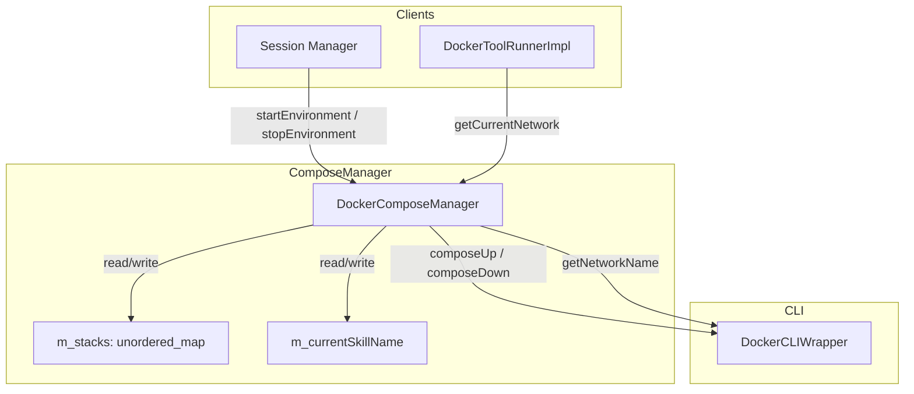
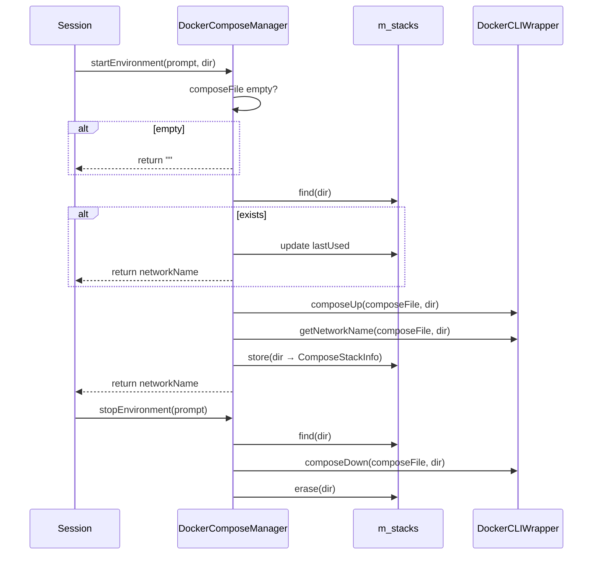

# DockerComposeManager Spec

## 1. Overview
Manages Docker Compose environments for skills. Bridges skill lifecycle events to docker-compose up/down operations and tracks running stacks with idle timeouts. Owns `ComposeStackInfo` entries mapped by skill directory. Delegates all CLI calls to `DockerCLIWrapper`.

**Base class:** `ComposeManager` (from `agent_interfaces.h`)
**Dependencies:** `DockerCLIWrapper` (static utility), `Skill` model
**Lifecycle:** Created per-session with idle timeout. Stacks accumulate until explicitly stopped or implicitly pruned by start.

## 2. Component Specifications

```cpp
struct ComposeStackInfo {
    std::string networkName;  // Docker network name for this stack
    time_t lastUsed;          // Timestamp of last activity
};

class DockerComposeManager : public ComposeManager {
public:
    /**
     * @param idleTimeout Seconds before a stack is considered idle
     */
    explicit DockerComposeManager(int idleTimeout);

    /**
     * @brief  Start a compose environment for a prompt
     * @param  prompt         The prompt requesting the environment
     * @param  skillDirectory Filesystem path to the prompt's compose file
     * @return The Docker network name for the started stack,
     *         or empty string on failure
     */
    std::string startEnvironment(const Prompt& prompt,
                                  const std::string& skillDirectory) override;

    /**
     * @brief  Stop and remove a compose environment
     * @param  prompt The prompt whose environment to tear down
     * @retval void  Errors are swallowed
     */
    void stopEnvironment(const Prompt& prompt) override;

    /**
     * @brief  Bump the last-used timestamp for a prompt's stack
     * @param  prompt The prompt to mark
     * @retval void  No-op if stack does not exist
     */
    void markUsed(const Prompt& prompt) override;

    /**
     * @brief  Record which prompt is currently active
     * @param  prompt The active prompt
     * @retval void  Stores prompt name internally
     */
    void setCurrentPrompt(const Prompt& prompt) override;

    /**
     * @brief  Get the network of the currently active prompt
     * @return Network name string, or empty if none set
     */
    std::string getCurrentNetwork() const override;

    /**
     * @brief  Clear the currently active prompt name
     * @retval void  Resets internal tracker
     */
    void clearCurrentPrompt() override;

private:
    int m_idleTimeout;
    std::unordered_map<std::string, ComposeStackInfo> m_stacks;
    std::string m_currentPromptName;
};
```

## 3. Architecture Diagram



## 4. Data Flow



## 5. Error Handling
- **Empty compose file:** `startEnvironment` returns `""` immediately — no CLI call.
- **Compose up failure:** `DockerCLIWrapper::composeUp` throws; the exception propagates up to the caller. No entry is added to `m_stacks`.
- **Compose down failure:** Errors are swallowed (no-fail cleanup).
- **Missing stack on stop:** `find` returns end iterator; `stopEnvironment` is a no-op.
- **`getCurrentNetwork` with no current skill:** Returns empty string.

## 6. Edge Cases
- **Re-entrant start:** Calling `startEnvironment` for the same directory twice refreshes the timestamp and returns the existing network name, without calling composeUp again.
- **Concurrent access:** All methods are expected to be called from a single thread; no internal locking.
- **Idle timeout field:** `m_idleTimeout` is stored but not actively checked by this class — the caller (session/pruner) is responsible for calling `stopEnvironment` based on `markUsed` timestamps.
- **Rapid start/stop:** Successive start/stop cycles for the same directory each trigger full compose lifecycle.

## 7. Testing Requirements

| Method | Test case | Expected outcome |
|---|---|---|
| `startEnvironment` | Empty compose file | Returns `""`, no CLI call |
| `startEnvironment` | Existing stack | Returns cached networkName, updates timestamp |
| `startEnvironment` | New stack, composeUp succeeds | Returns networkName, entry in m_stacks |
| `startEnvironment` | composeUp throws | Exception propagates, no map entry |
| `stopEnvironment` | Existing stack | composeDown called, entry erased |
| `stopEnvironment` | Non-existent stack | No-op |
| `markUsed` | Existing stack | lastUsed updated |
| `markUsed` | Non-existent stack | No-op |
| `setCurrentPrompt` + `getCurrentNetwork` | Prompt set | Returns matching network |
| `clearCurrentPrompt` | After set | `getCurrentNetwork` returns `""` |
