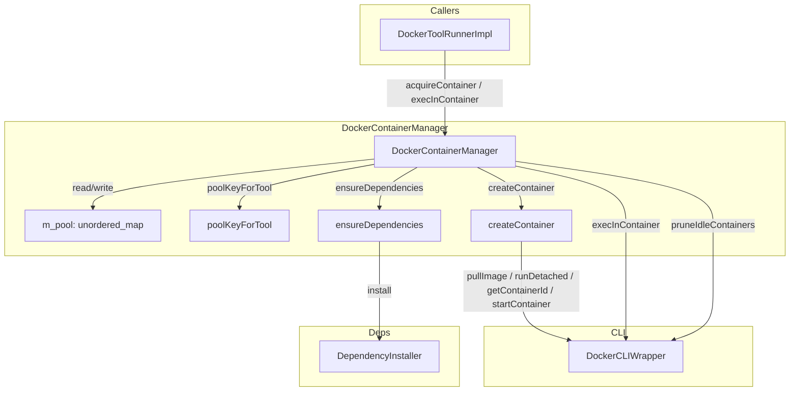
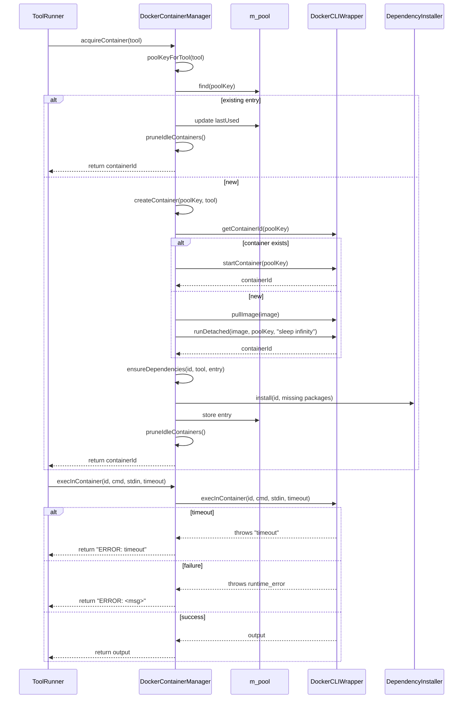

# DockerContainerManager Spec

## §1. Overview
Manages a pool of reusable Docker containers for tool execution. Each container is lazily created, cached by a pool key derived from trust level, session prefix, and image, and pruned when idle or when the pool exceeds `m_maxIdle`. Delegates container lifecycle to `DockerCLIWrapper` and dependency installation to `DependencyInstaller`.

**Base class:** `ContainerManager` (from `shared/agent_interfaces.h:175`)
**Source files:** `container_manager.h`, `container_manager.cpp`
**Dependencies:** `DockerCLIWrapper`, `DependencyInstaller`, `shared/agent_interfaces.h` (Tool, ContainerManager, TrustLevel)
**Lifecycle:** Created per-session with idle timeout, max idle count, and default image. Pool grows on demand; pruned on every `acquireContainer` call.

## §2. Component Specifications

```cpp
struct ContainerPoolEntry {
    std::string containerId;
    std::string image;
    time_t lastUsed;
    std::vector<std::string> installedDeps;
};

class DockerContainerManager : public ContainerManager {
public:
    /**
     * @param idleTimeout  Seconds of inactivity before a container is pruned
     * @param maxIdle      Maximum number of idle containers to retain
     * @param defaultImage Default Docker image when tool specifies none
     */
    DockerContainerManager(int idleTimeout,
                           int maxIdle,
                           const std::string& defaultImage);

    /**
     * @brief  Acquire a container from the pool (or create one)
     * @param  tool Tool descriptor with image, trust level, dependencies
     * @return Container ID string
     * @throws std::runtime_error on container creation failure
     */
    std::string acquireContainer(const Tool& tool) override;

    /**
     * @brief  Execute a command inside a container
     * @param  containerId Target container
     * @param  command     Shell command to execute
     * @param  stdinData   Optional data piped to stdin
     * @param  timeoutSecs Max seconds before timeout
     * @return Command output, or "ERROR: timeout" / "ERROR: <msg>" on failure
     */
    std::string execInContainer(const std::string& containerId,
                                 const std::string& command,
                                 const std::string& stdinData = "",
                                 int timeoutSecs = 30) override;

    /**
     * @brief  Remove expired and excess idle containers
     * @retval void  Errors from DockerCLIWrapper are swallowed
     */
    void pruneIdleContainers() override;

    /**
     * @brief  Set session prefix for pool key namespacing
     * @param  prefix Session identifier (e.g. UUID prefix)
     * @retval void  Affects subsequent poolKeyForTool calls
     */
    void setSessionPrefix(const std::string& prefix);

private:
    /**
     * @brief  Derive pool key from tool + session prefix
     * @param  tool Source descriptor
     * @return Pool key string:
     *         HIGH   → "a0-<pfx>high_pool"
     *         MEDIUM → "a0-<pfx>medium_pool"
     *         LOW    → "a0-<pfx>low_<name>_<image>"
     */
    std::string poolKeyForTool(const Tool& tool) const;

    /**
     * @brief  Pull image and create (or reuse) a detached container
     * @param  poolKey Pool key used as container name
     * @param  tool    Tool descriptor for image resolution
     * @return Container ID
     */
    std::string createContainer(const std::string& poolKey,
                                 const Tool& tool);

    /**
     * @brief  Install missing apt dependencies in the container
     * @param  containerId Target container
     * @param  tool        Tool descriptor with aptDependencies
     * @param  entry       Pool entry updated with installed packages
     */
    void ensureDependencies(const std::string& containerId,
                             const Tool& tool,
                             ContainerPoolEntry& entry);

    int m_idleTimeout;
    int m_maxIdle;
    std::string m_defaultImage;
    std::string m_sessionPrefix;
    std::unordered_map<std::string, ContainerPoolEntry> m_pool;
};
```

## §3. Architecture Diagram



## §4. Data Flow



## §5. Testing Requirements

| Method | Test case | Expected outcome |
|--------|-----------|-----------------|
| `poolKeyForTool` | HIGH priority | Returns `<pfx>high_pool` |
| `poolKeyForTool` | MEDIUM priority | Returns `<pfx>medium_pool` |
| `poolKeyForTool` | LOW priority | Returns `<pfx>low_<name>_<image>` |
| `acquireContainer` | Existing pool entry | Returns cached ID, updates timestamp, prunes |
| `acquireContainer` | New entry, container reuse | Finds existing container by name, starts it |
| `acquireContainer` | New entry, fresh create | Pulls image, creates container, installs deps, stores, prunes |
| `acquireContainer` | Image pull fails | Exception thrown, no side effects |
| `acquireContainer` | Dep install fails | Exception thrown |
| `execInContainer` | Normal execution | Returns command output |
| `execInContainer` | Timeout | Returns `"ERROR: timeout"` |
| `execInContainer` | Exec failure | Returns `"ERROR: <msg>"` |
| `pruneIdleContainers` | Expired entries | Removed from pool + Docker stopped/removed |
| `pruneIdleContainers` | Pool > maxIdle | Oldest entries evicted |
| `setSessionPrefix` | Session prefix set | Subsequent poolKeyForTool returns namespaced keys |
| `createContainer` | Existing container by name | Reused instead of creating new |
| `ensureDependencies` | All packages already installed | No CLI call |

## §6. (not used)

## §7. CLI Entry Point

`DockerContainerManager` is instantiated in `main.cpp` with CLI flags `--container-idle-timeout` (default 300), `--max-idle-containers` (default 10), and `--default-docker-image` (default `ubuntu:22.04`). A pointer to it is passed to `DockerToolRunnerImpl` as the `ContainerManager*` argument. The session manager calls `setSessionPrefix()` during session initialization to namespace pool keys per session.
