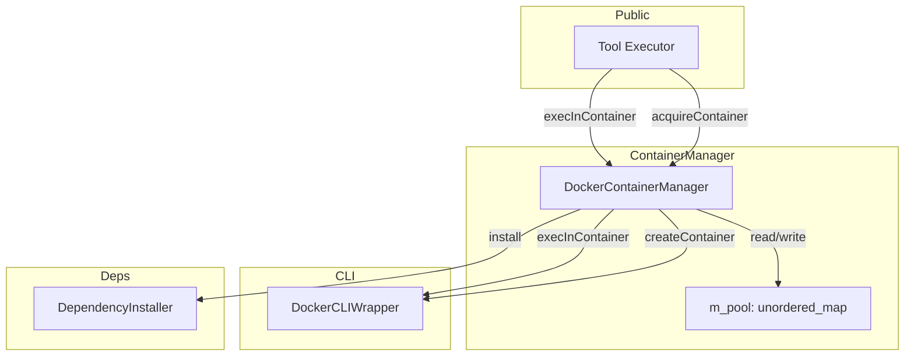
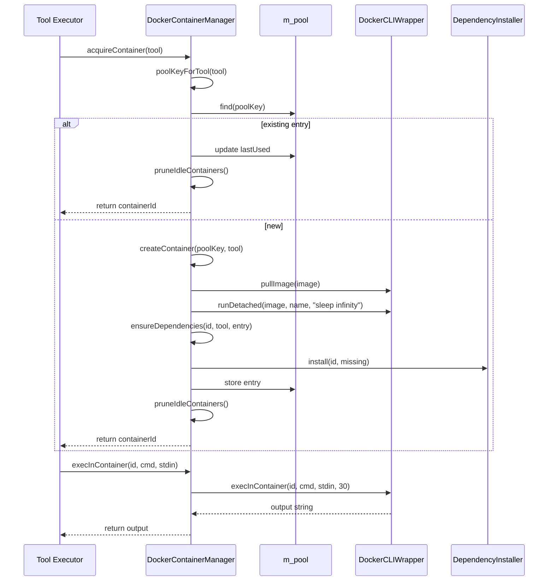

# DockerContainerManager Spec

## 1. Overview
Manages a pool of reusable Docker containers for tool execution. Each container is lazily created, cached by a pool key derived from tool priority and image, and pruned when idle or when the pool exceeds `m_maxIdle`.

**Base class:** `ContainerManager` (from `agent_interfaces.h`)
**Dependencies:** `DockerCLIWrapper`, `DependencyInstaller`
**Owns:** `unordered_map<string, ContainerPoolEntry> m_pool`

## 2. Component Specifications

```cpp
struct ContainerPoolEntry {
    std::string containerId;
    std::string image;
    time_t lastUsed;
    std::vector<std::string> installedDeps;
};

class DockerContainerManager : public ContainerManager {
public:
    /**
     * @param idleTimeout  Seconds before an idle container is evictable
     * @param maxIdle      Maximum number of idle containers to retain
     * @param defaultImage Default image when Tool specifies none
     */
    DockerContainerManager(int idleTimeout,
                           int maxIdle,
                           const std::string& defaultImage);

    /**
     * @brief  Get or create a container for the given tool
     * @param  tool Descriptor with image, priority, dependency info
     * @return Container ID string
     * @throws std::runtime_error on creation or dependency failure
     */
    std::string acquireContainer(const Tool& tool) override;

    /**
     * @brief  Run a command inside an existing container
     * @param  containerId Target container
     * @param  command     Shell command to execute
     * @param  stdinData   Optional stdin payload
     * @return stdout + stderr output
     * @throws std::runtime_error on exec failure
     */
    std::string execInContainer(const std::string& containerId,
                                 const std::string& command,
                                 const std::string& stdinData = "") override;

    /**
     * @brief  Remove expired containers, then trim to maxIdle
     * @retval void
     */
    void pruneIdleContainers() override;

private:
    /**
     * @brief  Derive pool key from tool priority/image
     * @param  tool Source descriptor
     * @return Pool key string:
     *         HIGH   → "high_pool"
     *         MEDIUM → "medium_pool"
     *         LOW    → "low_<name>_<image>"
     */
    std::string poolKeyForTool(const Tool& tool) const;

    /**
     * @brief  Pull image and run "sleep infinity" container
     * @param  poolKey Key for the pool entry
     * @param  tool    Tool for image resolution
     * @return Container ID
     */
    std::string createContainer(const std::string& poolKey,
                                 const Tool& tool);

    /**
     * @brief  Diff installed vs required deps; install missing
     * @param  containerId Container to install into
     * @param  tool        Declares aptDependencies
     * @param  entry       Updated in-place with new installedDeps
     */
    void ensureDependencies(const std::string& containerId,
                             const Tool& tool,
                             ContainerPoolEntry& entry);

    int m_idleTimeout;
    int m_maxIdle;
    std::string m_defaultImage;
    std::unordered_map<std::string, ContainerPoolEntry> m_pool;
};
```

## 3. Architecture Diagram



## 4. Data Flow



## 5. Error Handling
- **Image pull failure:** `createContainer` propagates `DockerCLIWrapper::pullImage` exception.
- **Container create failure:** `runDetached` exception propagates; no pool entry created.
- **Exec failure:** `execInContainer` catches `DockerCLIWrapper` exceptions and re-throws as `std::runtime_error`.
- **Dependency install failure:** `ensureDependencies` exception propagates; container is left in pool (orphaned).
- **Empty tool image:** Falls back to `m_defaultImage`.

## 6. Edge Cases
- **Pool key collision:** HIGH and MEDIUM priorities share keys across tools with different images — last-write wins. The spec allows this because the first container per pool is reused.
- **Rapid acquire/release:** `pruneIdleContainers` runs on every `acquireContainer` — frequent calls keep pool tight but add overhead.
- **Zero maxIdle:** Every `acquireContainer` immediately prunes to zero. Only the acquired container survives.
- **`execInContainer` on stopped container:** `DockerCLIWrapper` throws; caller gets `runtime_error`.
- **Empty dependency list:** `ensureDependencies` does nothing; no apt-get call.

## 7. Testing Requirements

| Method | Test case | Expected outcome |
|---|---|---|
| `poolKeyForTool` | HIGH priority | Returns "high_pool" |
| `poolKeyForTool` | MEDIUM priority | Returns "medium_pool" |
| `poolKeyForTool` | LOW priority | Returns "low_<name>_<image>" |
| `acquireContainer` | Existing pool entry | Returns cached ID, updates timestamp |
| `acquireContainer` | New entry, success | Creates container, installs deps, stores, prunes |
| `acquireContainer` | Image pull fails | Exception thrown, no side effects |
| `acquireContainer` | Dep install fails | Exception thrown |
| `execInContainer` | Normal execution | Returns command output |
| `execInContainer` | Timeout (30s) | Exception thrown |
| `pruneIdleContainers` | Expired entries | Removed from pool + Docker |
| `pruneIdleContainers` | Pool > maxIdle | Oldest entries evicted |
