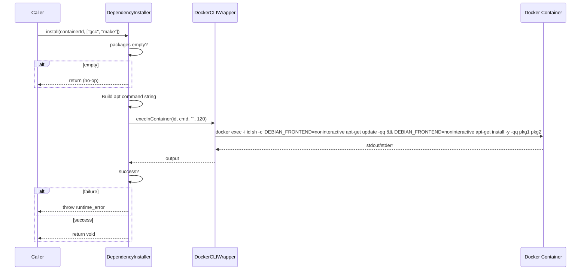

# DependencyInstaller Spec

## §1. Overview
Static utility class that installs apt packages inside a running container. Thin wrapper around `DockerCLIWrapper::execInContainer` with a 120-second timeout and `DEBIAN_FRONTEND=noninteractive` to suppress prompts.

**Source files:** `dependency_installer.h`, `dependency_installer.cpp`
**Dependencies:** `DockerCLIWrapper` (static utility)
**Lifecycle:** Stateless — single static method, no construction needed.

## §2. Component Specifications

```cpp
class DependencyInstaller {
public:
    /**
     * @brief  Install one or more apt packages inside a container
     * @param  containerId Target running container
     * @param  packages    List of Debian package names
     * @throws std::runtime_error if apt-get fails
     * @retval void
     * @note   Empty packages list is a silent no-op.
     */
    static void install(const std::string& containerId,
                        const std::vector<std::string>& packages);
};
```

## §3. Architecture Diagram

```mermaid
graph TB
    subgraph Callers
        DCM[DockerContainerManager]
    end

    subgraph DependencyInstaller
        DI[DependencyInstaller]
    end

    subgraph CLI
        DCW[DockerCLIWrapper]
    end

    subgraph Container
        C[Docker Container]
    end

    DCM -->|install(id, pkgs)| DI
    DI -->|execInContainer(id, apt-cmd, "", 120)| DCW
    DCW -->|docker exec -i| C
```

## §4. Data Flow



## §5. Testing Requirements

| Method | Test case | Expected outcome |
|--------|-----------|-----------------|
| `install` | Empty package list | No CLI call, returns void |
| `install` | Single package, success | CLI called with apt-get, returns void |
| `install` | Multiple packages, success | CLI called once for all packages |
| `install` | apt-get fails | `std::runtime_error` thrown with details |
| `install` | 120s timeout | Exception thrown |
| `install` | Container unreachable | Exception thrown |
| `install` | Already installed packages | No error, returns void |

## §6. (not used)

## §7. CLI Entry Point

`DependencyInstaller` is not directly wired to any CLI entry point. It is used internally by `DockerContainerManager::ensureDependencies()` when a new or reused container is acquired and its `installedDeps` list is missing packages declared by the tool.
