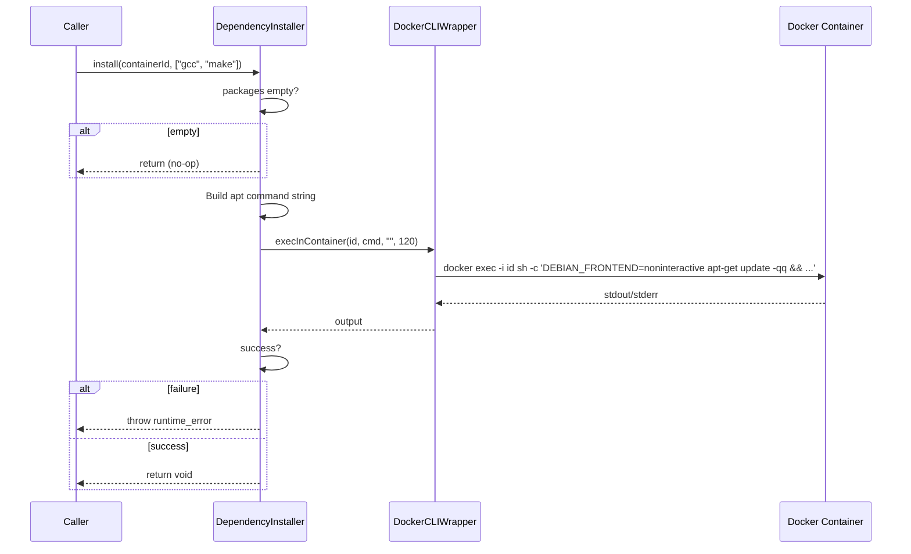

# DependencyInstaller Spec

## 1. Overview
Static utility class that installs apt packages inside a running container. Thin wrapper around `DockerCLIWrapper::execInContainer` with a 120-second timeout and `DEBIAN_FRONTEND=noninteractive` to suppress prompts.

**Namespace:** `a0::docker`
**Dependencies:** `DockerCLIWrapper`
**Lifecycle:** Stateless — single static method, no construction needed.

## 2. Component Specifications

```cpp
class DependencyInstaller {
public:
    /**
     * @brief  Install one or more apt packages inside a container
     * @param  containerId Target running container
     * @param  packages    List of Debian package names
     * @throws std::runtime_error if apt-get fails
     * @retval void
     * @note   Empty packages list is a silent no-op.
     */
    static void install(const std::string& containerId,
                        const std::vector<std::string>& packages);
};
```

## 3. Architecture Diagram

```mermaid
graph TB
    subgraph Callers
        DCM[DockerContainerManager]
    end

    subgraph DependencyInstaller
        DI[DependencyInstaller]
    end

    subgraph CLI
        DCW[DockerCLIWrapper]
    end

    DCM -->|install(id, pkgs)| DI
    DI -->|execInContainer(id, apt-cmd, "", 120)| DCW
```

## 4. Data Flow



## 5. Error Handling
- **Empty packages:** Returns immediately — no Docker exec call.
- **apt-get update failure:** Exception from `DockerCLIWrapper::execInContainer` caught. `DependencyInstaller` wraps it in `std::runtime_error` with the CLI output.
- **apt-get install failure:** Same handling as update failure.
- **120s timeout:** `DockerCLIWrapper` enforces via `alarm()`; exception propagates through.
- **Container missing/stopped:** `execInContainer` throws; wrapped and re-thrown.

## 6. Edge Cases
- **Package with spaces in name:** Not supported — the string is concatenated naively into the shell command. Packages are assumed to be well-formed single tokens.
- **Already-installed packages:** apt-get is idempotent; no error.
- **Large package list:** Command length is bounded by Linux `ARG_MAX`. Very large lists may cause shell failures.
- **apt lock contention:** If another process holds the apt lock inside the container, the call will fail with `std::runtime_error`.

## 7. Testing Requirements

| Method | Test case | Expected outcome |
|---|---|---|
| `install` | Empty package list | No CLI call, returns void |
| `install` | Single package, success | CLI called with apt-get, returns void |
| `install` | Multiple packages, success | CLI called once for all packages |
| `install` | apt-get fails | `std::runtime_error` thrown |
| `install` | 120s timeout | Exception thrown |
| `install` | Container unreachable | Exception thrown |
| `install` | Already installed packages | No error, returns void |
