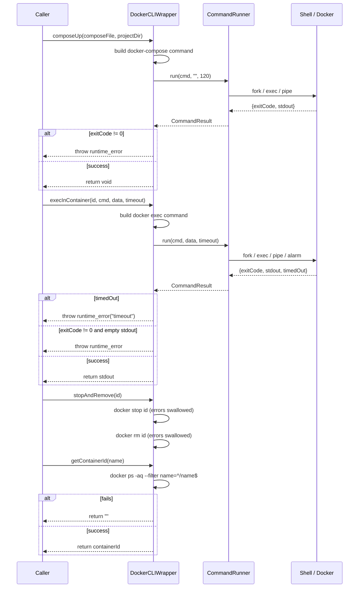

# DockerCLIWrapper Spec

## §1. Overview
Static utility class providing a C++ interface over the Docker and docker-compose CLIs. Every method shells out via `CommandRunner`. All subprocess management (fork, exec, pipe, timeout, alarm) is delegated to `CommandRunner`. A file-static helper `execSimple()` provides common error-checked command execution with trailing newline trimming.

**Source files:** `docker_cli_wrapper.h`, `docker_cli_wrapper.cpp`
**Dependencies:** `CommandRunner` (from `executor/command_runner.h`), `shared/trace.h`
**Lifecycle:** Stateless — all methods static.

**File-static helper:**
```cpp
// Executes a command via CommandRunner::run with 120s timeout.
// Throws std::runtime_error on non-zero exit.
// Trims trailing newlines from stdout.
static std::string execSimple(const std::string& cmd);
```

## §2. Component Specifications

```cpp
class DockerCLIWrapper {
public:
    /**
     * @brief  Create and start a detached container
     * @param  image   Docker image name (e.g. "ubuntu:22.04")
     * @param  name    Container name (--name flag)
     * @param  command Shell command to run inside container (e.g. "sleep infinity")
     * @return Container ID (stdout from docker run -d)
     */
    static std::string runDetached(const std::string& image,
                                    const std::string& name,
                                    const std::string& command);

    /**
     * @brief  Execute a command inside a running container
     * @param  containerId Target container
     * @param  command     Shell command
     * @param  stdinData   Optional data to pipe to stdin
     * @param  timeoutSecs Max seconds before timeout
     * @return Combined stdout + stderr
     * @throws std::runtime_error on timeout or non-zero exit with empty stdout
     */
    static std::string execInContainer(const std::string& containerId,
                                        const std::string& command,
                                        const std::string& stdinData = "",
                                        int timeoutSecs = 30);

    /**
     * @brief  Stop and remove a container (errors swallowed)
     * @param  containerId Target container
     * @retval void  Both stop and rm errors are caught silently
     */
    static void stopAndRemove(const std::string& containerId);

    /**
     * @brief  Pull a Docker image
     * @param  image Docker image name
     * @throws std::runtime_error on non-zero exit
     */
    static void pullImage(const std::string& image);

    /**
     * @brief  Get container ID for a named container
     * @param  name Container name
     * @return Container ID string, or empty if not found
     */
    static std::string getContainerId(const std::string& name);

    /**
     * @brief  Start a stopped container (errors swallowed)
     * @param  name Container name
     * @retval void  Errors are silently caught
     */
    static void startContainer(const std::string& name);

    /**
     * @brief  Start a docker-compose stack
     * @param  composeFile Path to docker-compose.yml
     * @param  projectDir  Project directory (used as -p flag)
     * @throws std::runtime_error on non-zero exit
     */
    static void composeUp(const std::string& composeFile,
                           const std::string& projectDir);

    /**
     * @brief  Stop and remove a docker-compose stack
     * @param  composeFile Path to docker-compose.yml
     * @param  projectDir  Project directory
     * @throws std::runtime_error on non-zero exit
     */
    static void composeDown(const std::string& composeFile,
                             const std::string& projectDir);

    /**
     * @brief  Derive the default network name for a compose stack
     * @param  composeFile Path to docker-compose.yml (unused)
     * @param  projectDir  Project directory; last path component + "_default"
     * @return Network name string
     */
    static std::string getNetworkName(const std::string& composeFile,
                                       const std::string& projectDir);
};
```

## §3. Architecture Diagram

```mermaid
graph TB
    subgraph Callers
        CM[DockerComposeManager]
        CT[DockerContainerManager]
        DI[DependencyInstaller]
        TR[DockerToolRunnerImpl]
    end

    subgraph DockerCLIWrapper
        DCW[DockerCLIWrapper]
        ES[execSimple (file-static)]
    end

    subgraph Utility
        CR[CommandRunner]
    end

    subgraph System
        DOCKER[docker CLI]
        DC[docker-compose CLI]
    end

    CM -->|composeUp / composeDown / getNetworkName| DCW
    CT -->|runDetached / execInContainer / stopAndRemove / pullImage / getContainerId / startContainer| DCW
    DI -->|execInContainer| DCW
    TR -->|execInContainer| DCW
    DCW -->|execSimple| ES
    ES -->|CommandRunner::run| CR
    CR --> DOCKER
    CR --> DC
```

## §4. Data Flow



## §5. Testing Requirements

| Method | Test case | Expected outcome |
|--------|-----------|-----------------|
| `runDetached` | Valid image+name | Returns container ID string |
| `runDetached` | Invalid image | Throws runtime_error |
| `execInContainer` | Normal command | Returns output |
| `execInContainer` | Timeout | Throws runtime_error("timeout") |
| `execInContainer` | With stdinData | Data appears in container stdin |
| `execInContainer` | Non-zero exit, empty stdout | Throws runtime_error |
| `stopAndRemove` | Existing container | Container stopped + removed |
| `stopAndRemove` | Non-existent container | No-op (errors swallowed) |
| `pullImage` | Valid image | Returns void |
| `pullImage` | Invalid image | Throws runtime_error |
| `getContainerId` | Container exists | Returns container ID |
| `getContainerId` | Container does not exist | Returns `""` |
| `startContainer` | Stopped container | Container started |
| `startContainer` | Non-existent container | No-op |
| `composeUp` | Valid compose file | Stack started |
| `composeUp` | Invalid compose file | Throws runtime_error |
| `composeDown` | Running stack | Stack stopped + removed |
| `composeDown` | Already-stopped stack | No-op |
| `getNetworkName` | compose in /a/b/c/d.yml, dir=/a/b | Returns `"b_default"` |

## §6. (not used)

## §7. CLI Entry Point

`DockerCLIWrapper` has no direct CLI entry point — it is a stateless utility called by all other docker sub-module components (`DockerComposeManager`, `DockerContainerManager`, `DependencyInstaller`, `DockerToolRunnerImpl`). Command construction details (quoting, escaping) are delegated to `CommandRunner::shellEscape()` and `CommandRunner::run()`.
