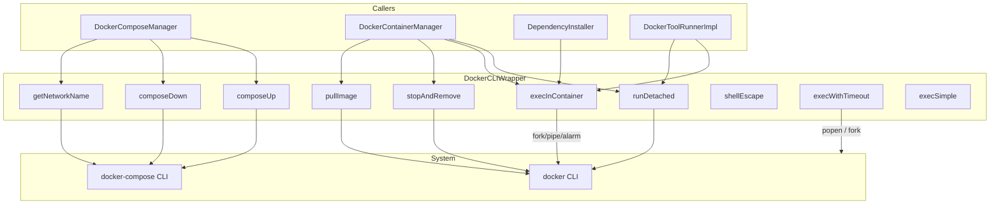
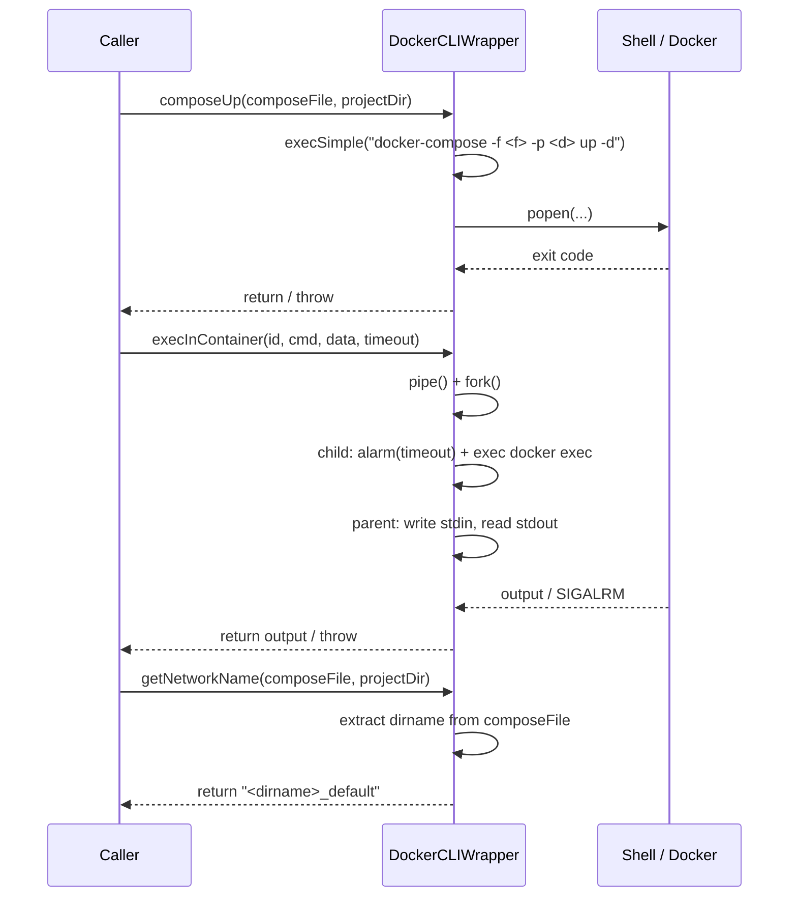

# DockerCLIWrapper Spec

## 1. Overview
Static utility class providing a C++ interface over the Docker CLI. Every method shells out to `docker` or `docker-compose` via `popen()` (simple) or `fork()`/`pipe()`/`alarm()` (for timeout-capable exec). Also provides `shellEscape` for safe argument quoting.

**Namespace:** `a0::docker`
**Dependencies:** POSIX (`fork`, `pipe`, `alarm`, `popen`, `waitpid`, `signal`)
**Lifecycle:** Stateless — all methods static.

## 2. Component Specifications

```cpp
class DockerCLIWrapper {
public:
    /**
     * @brief  Create and start a detached container
     * @param  image   Docker image name
     * @param  name    Container name (--name flag)
     * @param  command Shell command to run inside container
     * @return Container ID (stdout from docker run -d)
     */
    static std::string runDetached(const std::string& image,
                                    const std::string& name,
                                    const std::string& command);

    /**
     * @brief  Execute a command inside a running container
     * @param  containerId Target container
     * @param  command     Shell command
     * @param  stdinData   Optional data to pipe to stdin
     * @param  timeoutSecs Max seconds before SIGALRM kills the exec
     * @return Combined stdout + stderr
     */
    static std::string execInContainer(const std::string& containerId,
                                        const std::string& command,
                                        const std::string& stdinData = "",
                                        int timeoutSecs = 30);

    /**
     * @brief  Stop and remove a container (errors swallowed)
     * @param  containerId Target container
     * @retval void
     */
    static void stopAndRemove(const std::string& containerId);

    /**
     * @brief  Pull a Docker image
     * @param  image Image to pull
     * @retval void  Throws on failure
     */
    static void pullImage(const std::string& image);

    /**
     * @brief  Start a docker-compose stack
     * @param  composeFile Path to docker-compose YAML
     * @param  projectDir  Project directory for -p flag
     * @retval void
     */
    static void composeUp(const std::string& composeFile,
                           const std::string& projectDir);

    /**
     * @brief  Stop and remove a docker-compose stack
     * @param  composeFile Path to docker-compose YAML
     * @param  projectDir  Project directory for -p flag
     * @retval void
     */
    static void composeDown(const std::string& composeFile,
                             const std::string& projectDir);

    /**
     * @brief  Derive the default network name for a compose stack
     * @param  composeFile Path to docker-compose YAML
     * @param  projectDir  Project directory
     * @return "<dirname>_default"
     */
    static std::string getNetworkName(const std::string& composeFile,
                                       const std::string& projectDir);
};
```

## 3. Architecture Diagram



## 4. Data Flow



## 5. Error Handling
- **execSimple (popen):** Returns stdout on success; throws `std::runtime_error` on non-zero exit.
- **execWithTimeout (fork/pipe/alarm):** SIGALRM kills the child process. Returns output on success; throws `std::runtime_error` on timeout or child failure.
- **stopAndRemove:** Calls `docker stop` then `docker rm` — both errors are swallowed (best-effort cleanup).
- **pullImage:** Uses `execSimple` — any failure propagates as `std::runtime_error`.
- **shellEscape:** Wraps string in single quotes and escapes embedded single quotes via `'\''`. No other shell metacharacter handling.

## 6. Edge Cases
- **Empty command in execInContainer:** Docker exec still runs; returns shell prompt output or nothing.
- **Very large stdinData:** Written to pipe in a loop; bounded by pipe buffer + kernel buffer.
- **Alarm signal handler:** Global `signal(SIGALRM, handler)` — non-reentrant. Consecutive calls without reset could interfere.
- **Concurrent calls:** No internal synchronization. `alarm()` is a process-wide resource — concurrent calls from multiple threads will race.
- **File path shell escaping:** `getNetworkName` does not shell-escape the compose path; callers must guarantee safe paths.

## 7. Testing Requirements

| Method | Test case | Expected outcome |
|---|---|---|
| `runDetached` | Valid image+name | Returns container ID string |
| `runDetached` | Invalid image | Throws runtime_error |
| `execInContainer` | Normal command | Returns output |
| `execInContainer` | Timeout (1s on "sleep 10") | Throws runtime_error |
| `execInContainer` | With stdinData | Data appears in container stdin |
| `stopAndRemove` | Existing container | Container stopped + removed |
| `stopAndRemove` | Non-existent container | No-op (errors swallowed) |
| `pullImage` | Valid image | Returns void |
| `pullImage` | Invalid image | Throws runtime_error |
| `composeUp` | Valid compose file | Stack started |
| `composeUp` | Invalid compose file | Throws runtime_error |
| `composeDown` | Running stack | Stack stopped + removed |
| `composeDown` | Already-stopped stack | No-op |
| `getNetworkName` | compose in /a/b/c/d.yml | Returns "c_default" |
| `shellEscape` | Simple string | `'simple'` |
| `shellEscape` | String with single quote | `"it's"` → `'it'\''s'` |
