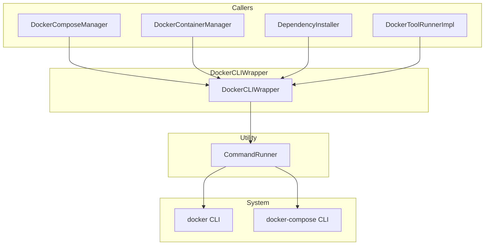
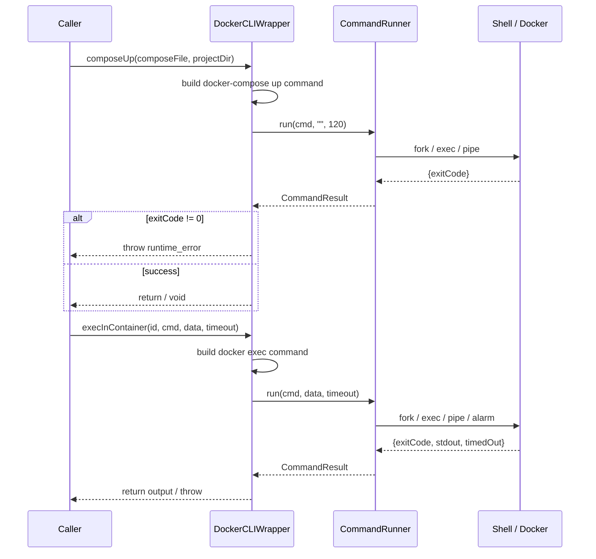

# DockerCLIWrapper Spec

## 1. Overview

Static utility class providing a C++ interface over the Docker CLI. Every method shells out to `docker` or `docker-compose` via `CommandRunner`. All subprocess management (fork, exec, pipe, timeout) is delegated to `CommandRunner`.

**Namespace:** `a0::docker`
**Dependencies:** `CommandRunner` (stateless utility)
**Lifecycle:** Stateless — all methods static.

## 2. Component Specifications

```cpp
namespace a0 {
namespace docker {

class DockerCLIWrapper {
public:
    /// \brief  Create and start a detached container
    /// \param  image   Docker image name
    /// \param  name    Container name (--name flag)
    /// \param  command Shell command to run inside container
    /// \return Container ID (stdout from docker run -d)
    static std::string runDetached(const std::string& image,
                                    const std::string& name,
                                    const std::string& command);

    /// \brief  Execute a command inside a running container
    /// \param  containerId Target container
    /// \param  command     Shell command
    /// \param  stdinData   Optional data to pipe to stdin
    /// \param  timeoutSecs Max seconds before timeout
    /// \return Combined stdout + stderr
    static std::string execInContainer(const std::string& containerId,
                                        const std::string& command,
                                        const std::string& stdinData = "",
                                        int timeoutSecs = 30);

    /// \brief  Stop and remove a container (errors swallowed)
    static void stopAndRemove(const std::string& containerId);

    /// \brief  Pull a Docker image
    static void pullImage(const std::string& image);

    /// \brief  Get container ID for a named container, or empty string
    static std::string getContainerId(const std::string& name);

    /// \brief  Start a stopped container (errors swallowed)
    static void startContainer(const std::string& name);

    /// \brief  Start a docker-compose stack
    static void composeUp(const std::string& composeFile,
                           const std::string& projectDir);

    /// \brief  Stop and remove a docker-compose stack
    static void composeDown(const std::string& composeFile,
                             const std::string& projectDir);

    /// \brief  Derive the default network name for a compose stack
    static std::string getNetworkName(const std::string& composeFile,
                                       const std::string& projectDir);
};

} // namespace docker
} // namespace a0
```

## 3. Architecture Diagram



## 4. Data Flow



## 5. Error Handling

| Scenario | Behaviour |
|----------|-----------|
| Command returns non-zero exit | Throws `std::runtime_error` with exit code and command |
| Timeout in execInContainer | Throws `std::runtime_error("timeout")` |
| stopAndRemove | Both calls have errors swallowed (best-effort cleanup) |
| pullImage failure | CommandRunner returns non-zero → throws runtime_error |
| Invalid compose file | composeUp/throw via CommandRunner |

## 6. Edge Cases

| Case | Expected Result |
|------|----------------|
| Empty command in execInContainer | Docker exec still runs; returns shell prompt output or nothing |
| Very large stdinData | CommandRunner handles pipe in loop |
| Concurrent calls | No internal synchronization (CommandRunner is stateless) |
| File path shell escaping | `getNetworkName` uses pure string ops, no shell escape needed |

## 7. Testing Requirements

| Method | Test case | Expected outcome |
|--------|-----------|-----------------|
| `runDetached` | Valid image+name | Returns container ID string |
| `runDetached` | Invalid image | Throws runtime_error |
| `execInContainer` | Normal command | Returns output |
| `execInContainer` | Timeout | Throws runtime_error |
| `execInContainer` | With stdinData | Data appears in container stdin |
| `stopAndRemove` | Existing container | Container stopped + removed |
| `stopAndRemove` | Non-existent container | No-op (errors swallowed) |
| `pullImage` | Valid image | Returns void |
| `pullImage` | Invalid image | Throws runtime_error |
| `composeUp` | Valid compose file | Stack started |
| `composeUp` | Invalid compose file | Throws runtime_error |
| `composeDown` | Running stack | Stack stopped + removed |
| `composeDown` | Already-stopped stack | No-op |
| `getNetworkName` | compose in /a/b/c/d.yml | Returns "c_default" |
