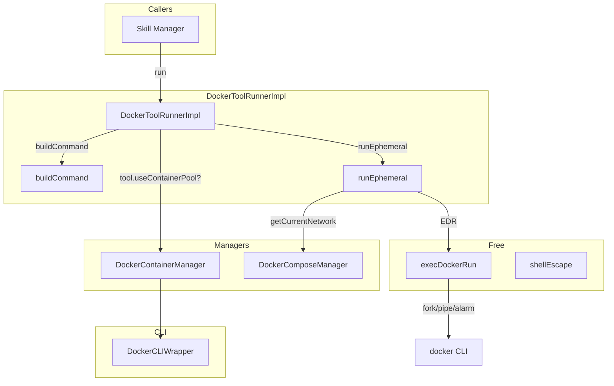
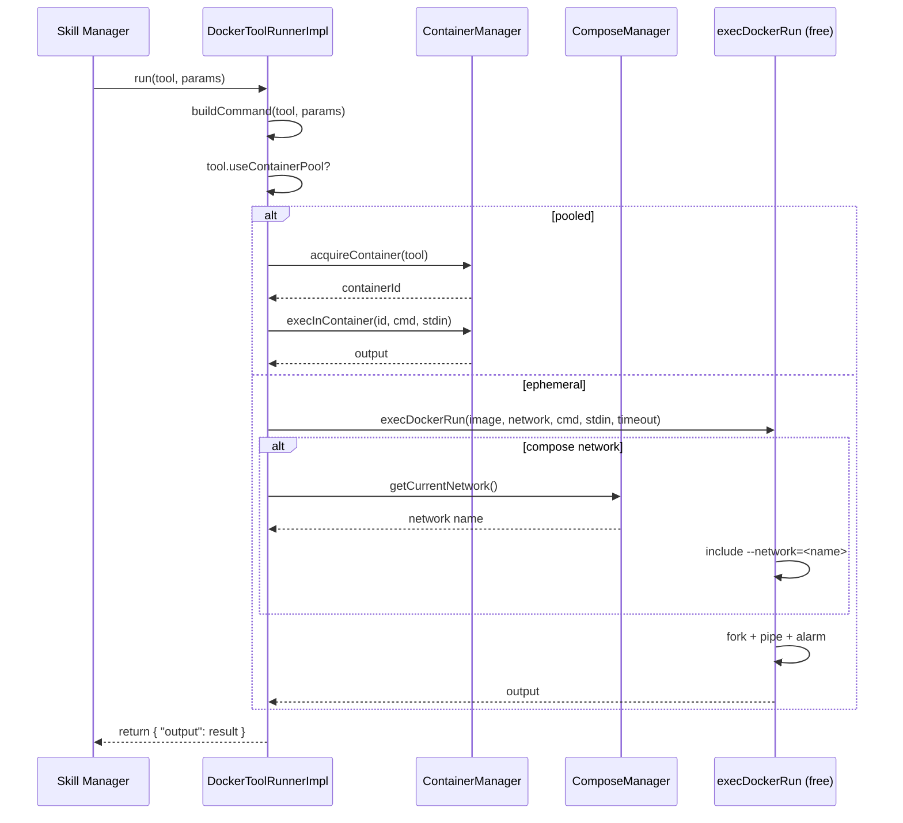

# DockerToolRunnerImpl Spec

## 1. Overview
Implements `DockerToolRunner` by executing tool commands inside Docker containers. Supports two modes: pooled (via `DockerContainerManager`) and ephemeral (`docker run --rm`). Compose network attachment is supported for ephemeral runs when a compose manager is available.

**Base class:** `DockerToolRunner` (from `agent_interfaces.h`)
**Dependencies:** `ContainerManager`, `ComposeManager` (raw pointers; non-owning)

## 2. Component Specifications

```cpp
class DockerToolRunnerImpl : public DockerToolRunner {
public:
    /**
     * @param containerManager Pooled container manager (non-owning)
     * @param composeManager   Compose stack manager (non-owning)
     */
    DockerToolRunnerImpl(ContainerManager* containerManager,
                         ComposeManager* composeManager);

    /**
     * @brief  Execute a tool with the given params
     * @param  tool   Tool descriptor (image, priority, deps, args, etc.)
     * @param  params JSON parameters for the invocation
     * @return JSON result object with "output" field
     * @throws std::runtime_error on execution failure
     */
    json run(const Tool& tool, const json& params) override;

private:
    /**
     * @brief  Construct the shell command string from tool + params
     * @param  tool    Tool descriptor
     * @param  params  Invocation parameters
     * @param  outStdin [out] Extracted stdin payload
     * @return Shell command string
     */
    std::string buildCommand(const Tool& tool,
                              const json& params,
                              std::string& outStdin) const;

    /**
     * @brief  Run a one-shot ephemeral container
     * @param  tool       Tool descriptor
     * @param  command    Shell command
     * @param  stdinData  Optional stdin
     * @return Command output
     */
    std::string runEphemeral(const Tool& tool,
                              const std::string& command,
                              const std::string& stdinData) const;

    ContainerManager* m_containerManager;
    ComposeManager* m_composeManager;
};
```

### Free functions (same file)

```cpp
/**
 * @brief  Execute a docker run --rm -i command with fork/pipe/alarm
 * @param  image      Docker image
 * @param  network    Optional network flag (empty = none)
 * @param  command    Shell command
 * @param  stdinData  Optional stdin
 * @param  timeoutSecs Max seconds
 * @return stdout + stderr
 */
std::string execDockerRun(const std::string& image,
                           const std::string& network,
                           const std::string& command,
                           const std::string& stdinData,
                           int timeoutSecs);

/**
 * @brief  Shell-escape a string (single-quote wrapping)
 */
std::string shellEscape(const std::string& s);
```

## 3. Architecture Diagram



## 4. Data Flow



## 5. Error Handling
- **Null manager pointers:** `m_containerManager` or `m_composeManager` may be null. `run` must check before dereferencing.
- **buildCommand parsing:** Malformed params JSON throws `std::runtime_error`.
- **execInContainer failure:** Exception from `ContainerManager` propagates to caller.
- **execDockerRun failure:** SIGALRM timeout → child killed → `std::runtime_error`. Non-zero exit → `runtime_error` with stderr.
- **Compose network missing:** `getCurrentNetwork` returns empty → no `--network` flag added.

## 6. Edge Cases
- **Empty command string:** Shell inside container receives empty string; returns empty output.
- **Binary stdout:** Output captured as raw string; binary data may truncate at null byte.
- **Very large stdin:** Piped via fork/pipe; kernel pipe buffer mediates.
- **Ephemeral with no compose manager:** `m_composeManager` is null → `getCurrentNetwork` not called → no network attached.
- **Stdin mode vs args mode:** `buildCommand` inspects `params` — args mode builds `--key=value` style, stdin mode passes input field as stdin payload.
- **Concurrent ephemeral runs:** Each call forks, so no shared state issues.

## 7. Testing Requirements

| Method | Test case | Expected outcome |
|---|---|---|
| `run` | Pooled tool, success | Acquires container, execs, returns output JSON |
| `run` | Ephemeral tool, success | Runs `docker run --rm`, returns output JSON |
| `run` | Ephemeral with compose network | Includes `--network=<name>` flag |
| `run` | Null container manager | Graceful error or exception |
| `buildCommand` | Args mode (`--key=value`) | Correct shell command string |
| `buildCommand` | Positional args (`_`) | Append to command in order |
| `buildCommand` | Stdin mode | Extracts stdin, returns empty command if no other args |
| `runEphemeral` | Normal execution | Returns stdout |
| `runEphemeral` | Timeout | `std::runtime_error` thrown |
| `execDockerRun` | Valid params | fork/exec succeeds, output returned |
| `execDockerRun` | Non-zero exit | `std::runtime_error` thrown |
| `execDockerRun` | Timeout via alarm | Child killed, exception thrown |
