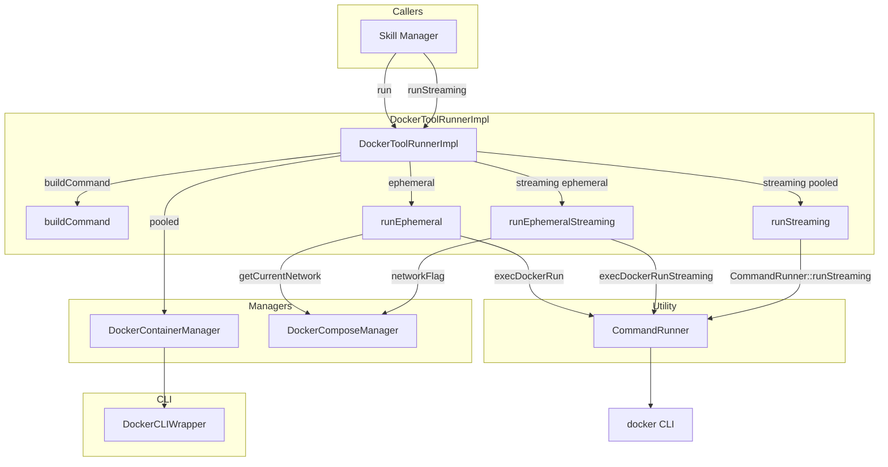
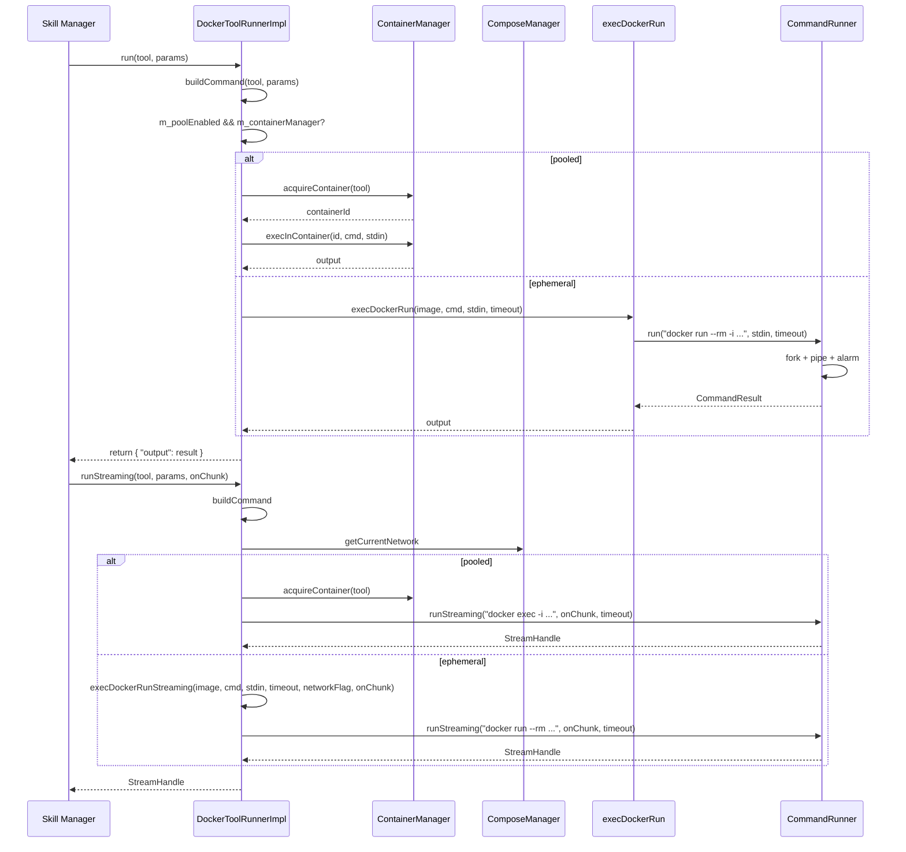

# DockerToolRunnerImpl Spec

## 1. Overview

Implements `DockerToolRunner` by executing tool commands inside Docker containers. Supports two modes: pooled (via `DockerContainerManager`) and ephemeral (`docker run --rm`). All subprocess management (fork, exec, pipe, alarm) is delegated to `CommandRunner`.

**Base class:** `DockerToolRunner` (from `agent_interfaces.h`)
**Dependencies:** `ContainerManager`, `ComposeManager` (raw pointers; non-owning), `CommandRunner`

## 2. Component Specifications

```cpp
class DockerToolRunnerImpl : public DockerToolRunner {
public:
    /**
     * @param containerManager Pooled container manager (non-owning)
     * @param composeManager   Compose stack manager (non-owning)
     * @param poolEnabled      Enable container pooling (default: true)
     */
    DockerToolRunnerImpl(ContainerManager* containerManager,
                         ComposeManager* composeManager,
                         bool poolEnabled = true);

    /**
     * @brief  Execute a tool with the given params
     * @param  tool   Tool descriptor (image, priority, deps, args, etc.)
     * @param  params JSON parameters for the invocation
     * @return JSON result object with "output" field
     * @throws std::runtime_error on execution failure
     */
    json run(const Tool& tool, const json& params) override;

    /**
     * @brief  Streaming variant of run. Returns a StreamHandle.
     * Supports both pooled (docker exec) and ephemeral (docker run --rm) modes.
     * @param  tool    Tool descriptor
     * @param  params  JSON parameters
     * @param  onChunk Called from background thread with (data, direction)
     * @return StreamHandle for polling/interaction
     */
    a0::StreamHandle runStreaming(const Tool& tool,
                                   const json& params,
                                   a0::StreamCallback onChunk) override;

private:
    /**
     * @brief  Construct the shell command string from tool + params
     * @param  tool    Tool descriptor
     * @param  params  Invocation parameters
     * @param  outStdin [out] Extracted stdin payload
     * @return Shell command string
     */
    std::string buildCommand(const Tool& tool,
                              const json& params,
                              std::string& outStdin) const;

    /**
     * @brief  Run a one-shot ephemeral container
     * @param  tool       Tool descriptor
     * @param  command    Shell command
     * @param  stdinData  Optional stdin
     * @return Command output
     */
    std::string runEphemeral(const Tool& tool,
                              const std::string& command,
                              const std::string& stdinData) const;

    /**
     * @brief  Run a one-shot ephemeral container with streaming
     * @param  image       Docker image
     * @param  command     Shell command
     * @param  stdinData   Optional stdin
     * @param  timeoutSecs Timeout in seconds
     * @param  networkFlag "--network=<name>" or empty
     * @param  onChunk     Streaming callback
     * @return StreamHandle
     */
    static a0::StreamHandle execDockerRunStreaming(
        const std::string& image,
        const std::string& command,
        const std::string& stdinData,
        int timeoutSecs,
        const std::string& networkFlag,
        a0::StreamCallback onChunk);

    ContainerManager* m_containerManager;
    ComposeManager* m_composeManager;
};
```

### Private members

```cpp
    ContainerManager* m_containerManager;
    ComposeManager* m_composeManager;
    bool m_poolEnabled;
```

## 3. Architecture Diagram



## 4. Data Flow



## 5. Error Handling
- **Null manager pointers:** `m_containerManager` or `m_composeManager` may be null. `run` must check before dereferencing.
- **buildCommand parsing:** Malformed params JSON throws `std::runtime_error`.
- **execInContainer failure:** Exception from `ContainerManager` propagates to caller.
- **execDockerRun failure:** Timeout returns `"ERROR: timeout"`. Non-zero exit code returns stdout.
- **Compose network missing:** `getCurrentNetwork` returns empty → no `--network` flag added.

## 6. Edge Cases
- **Empty command string:** Shell inside container receives empty string; returns empty output.
- **Binary stdout:** Output captured as raw string; binary data may truncate at null byte.
- **Very large stdin:** Piped via fork/pipe; kernel pipe buffer mediates.
- **Ephemeral with no compose manager:** `m_composeManager` is null → `getCurrentNetwork` not called → no network attached.
- **Stdin mode vs args mode:** `buildCommand` inspects `params` — args mode builds `--key=value` style, stdin mode passes input field as stdin payload.
- **Concurrent ephemeral runs:** Each call forks, so no shared state issues.

## 7. Testing Requirements

| Method | Test case | Expected outcome |
|---|---|---|
| `run` | Pooled tool, success | Acquires container, execs, returns output JSON |
| `run` | Ephemeral tool, success | Runs `docker run --rm`, returns output JSON |
| `run` | Ephemeral with compose network | Includes `--network=<name>` flag |
| `run` | Null container manager | Graceful error or exception |
| `buildCommand` | Args mode (`--key=value`) | Correct shell command string |
| `buildCommand` | Positional args (`_`) | Append to command in order |
| `buildCommand` | Stdin mode | Extracts stdin, returns empty command if no other args |
| `runEphemeral` | Normal execution | Returns stdout |
| `runEphemeral` | Timeout | `std::runtime_error` thrown |
| `runStreaming` | Pooled, normal | StreamHandle acquired, chunks received via callback |
| `runStreaming` | Ephemeral, normal | StreamHandle acquired, `docker run --rm` path taken |
| `runStreaming` | With compose network | `--network=<name>` flag included in docker command |
| `runStreaming` | Timeout | Handle completes after timeout with partial data |
| `execDockerRunStreaming` | Valid params | StreamHandle returned, command runner invoked |
| `execDockerRun` | Valid params | CommandRunner exec succeeds, output returned |
| `execDockerRun` | Non-zero exit | Error string returned, no exception |
| `execDockerRun` | Timeout via alarm | `"ERROR: timeout"` returned |
