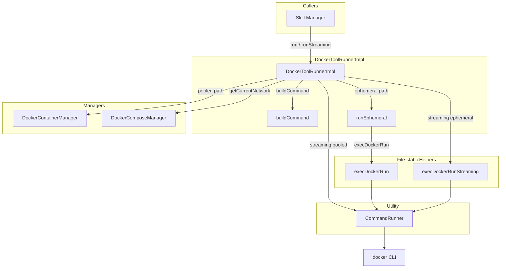
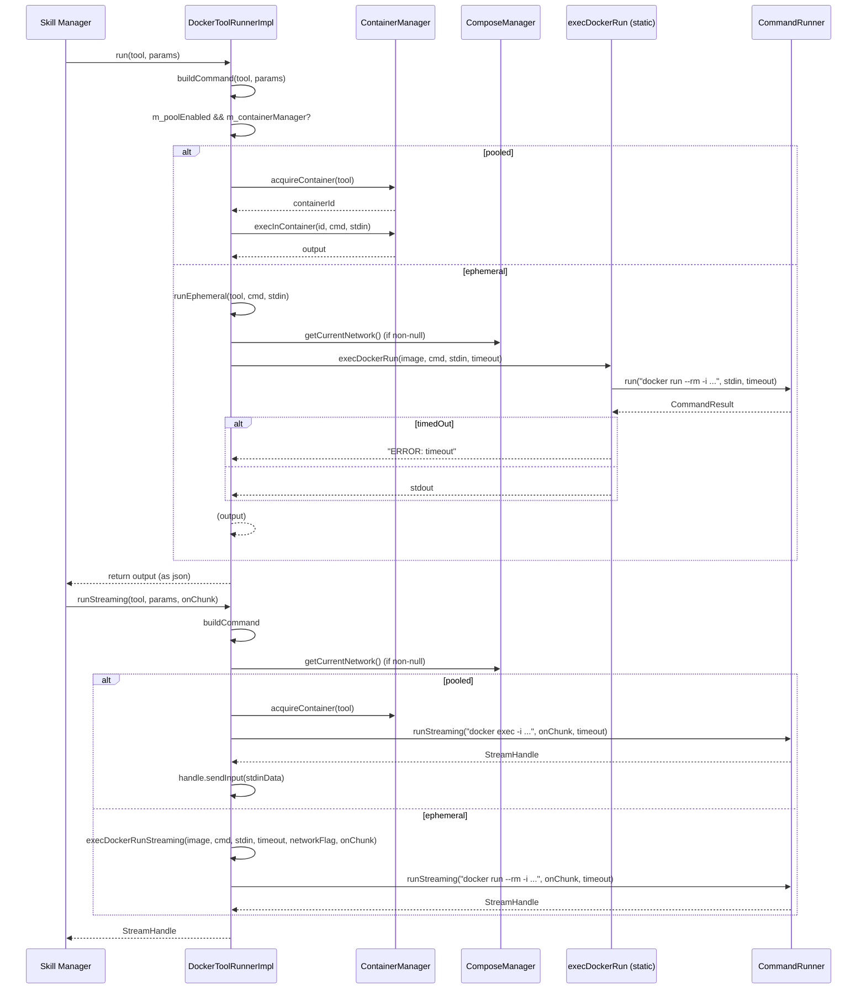

# DockerToolRunnerImpl Spec

## §1. Overview
Implements `DockerToolRunner` by executing tool commands inside Docker containers. Supports two modes: pooled (via `DockerContainerManager`) and ephemeral (`docker run --rm`). For streaming, supports both pooled docker exec streaming and ephemeral docker run streaming with optional compose network attachment.

**Base class:** `DockerToolRunner : ToolRunner` (from `shared/agent_interfaces.h:206`)
**Source files:** `docker_tool_runner.h`, `docker_tool_runner.cpp`
**Dependencies:** `ContainerManager` (raw pointer, non-owning), `ComposeManager` (raw pointer, non-owning), `CommandRunner`, `DockerCLIWrapper`
**Lifecycle:** Created with manager pointers, lives for the duration of the agent session. Pointers may be null.

**File-static helpers:**
```cpp
// Runs a one-shot ephemeral container: docker run --rm -i
// On timeout returns "ERROR: timeout", otherwise returns stdout.
static std::string execDockerRun(const std::string& image,
                                  const std::string& command,
                                  const std::string& stdinData,
                                  int timeoutSecs);

// Streaming variant of ephemeral docker run with optional --network flag.
// Returns a StreamHandle after sending stdinData.
static a0::StreamHandle execDockerRunStreaming(
    const std::string& image,
    const std::string& command,
    const std::string& stdinData,
    int timeoutSecs,
    const std::string& networkFlag,
    a0::StreamCallback onChunk);
```

## §2. Component Specifications

```cpp
class DockerToolRunnerImpl : public DockerToolRunner {
public:
    /**
     * @param containerManager Pooled container manager (may be null)
     * @param composeManager   Compose stack manager (may be null)
     * @param poolEnabled      Enable container pooling (default: true)
     */
    DockerToolRunnerImpl(ContainerManager* containerManager,
                         ComposeManager* composeManager,
                         bool poolEnabled = true);

    /**
     * @brief  Execute a tool with the given params
     * @param  tool   Tool descriptor (image, priority, deps, command, etc.)
     * @param  params JSON parameters for the invocation
     * @return JSON result object (string output, or full json on error)
     */
    json run(const Tool& tool, const json& params) override;

    /**
     * @brief  Streaming variant of run
     * @param  tool    Tool descriptor
     * @param  params  JSON parameters
     * @param  onChunk Called from background thread with (data, direction)
     * @return StreamHandle for polling/interaction
     */
    a0::StreamHandle runStreaming(const Tool& tool,
                                   const json& params,
                                   a0::StreamCallback onChunk) override;

private:
    /**
     * @brief  Construct the shell command string from tool + params
     * @param  tool     Tool descriptor
     * @param  params   Invocation parameters
     * @param  outStdin [out] Extracted stdin payload
     * @return Shell command string
     *
     * In "args" mode: builds `--key=value` flags and positional `_` args.
     * In "stdin" mode: returns tool.command, extracts "input" field as stdin.
     */
    std::string buildCommand(const Tool& tool,
                              const json& params,
                              std::string& outStdin) const;

    /**
     * @brief  Run a one-shot ephemeral container
     * @param  tool      Tool descriptor
     * @param  command   Shell command
     * @param  stdinData Optional stdin
     * @return Command output
     *
     * Builds docker run --rm command with optional --network=<name>
     * from m_composeManager->getCurrentNetwork().
     */
    std::string runEphemeral(const Tool& tool,
                              const std::string& command,
                              const std::string& stdinData) const;

    ContainerManager* m_containerManager;
    ComposeManager* m_composeManager;
    bool m_poolEnabled;
};
```

## §3. Architecture Diagram



## §4. Data Flow



## §5. Testing Requirements

| Method | Test case | Expected outcome |
|--------|-----------|-----------------|
| `run` | Pooled tool, success | Acquires container, execs, returns JSON output |
| `run` | Ephemeral tool, success | Runs `docker run --rm`, returns JSON output |
| `run` | Ephemeral with compose network | Includes `--network=<name>` flag |
| `run` | Null container manager | Falls through to ephemeral |
| `run` | Null compose manager | No network flag added |
| `buildCommand` | Args mode (`--key=value`) | Correct shell command string |
| `buildCommand` | Positional args (`_`) | Append to command in order |
| `buildCommand` | Stdin mode, object with "input" | Extracts stdin, returns tool.command |
| `buildCommand` | Stdin mode, string params | Uses params as stdin |
| `buildCommand` | Stdin mode, null params | Empty stdin, returns tool.command |
| `buildCommand` | Boolean param | `--key=true` or `--key=false` |
| `buildCommand` | Number param | `--key=3.14` |
| `runEphemeral` | Normal execution | Returns stdout |
| `runEphemeral` | Timeout | `"ERROR: timeout"` returned |
| `runStreaming` | Pooled, normal | StreamHandle acquired, chunks received |
| `runStreaming` | Ephemeral, normal | StreamHandle acquired, `docker run --rm` path |
| `runStreaming` | With compose network | `--network=<name>` flag included |
| `runStreaming` | Stdin data present | handle.sendInput called |
| `execDockerRun` | Valid params | CommandRunner exec succeeds, output returned |
| `execDockerRun` | Non-zero exit | Stdout returned, no exception |
| `execDockerRun` | Timeout | `"ERROR: timeout"` returned |
| `execDockerRunStreaming` | Valid params | StreamHandle returned, stdin sent |

## §6. (not used)

## §7. CLI Entry Point

`DockerToolRunnerImpl` is instantiated in `main.cpp` with the `ContainerManager*`, `ComposeManager*`, and `--no-docker` / pool-enabled flag. It is registered with the agent as the Docker-backed tool runner. When `tool.dockerImage` is non-empty, the agent dispatches to `DockerToolRunnerImpl::run()` instead of the host tool runner. CLI flags `--no-docker` disables pooling entirely by setting `poolEnabled = false`.
