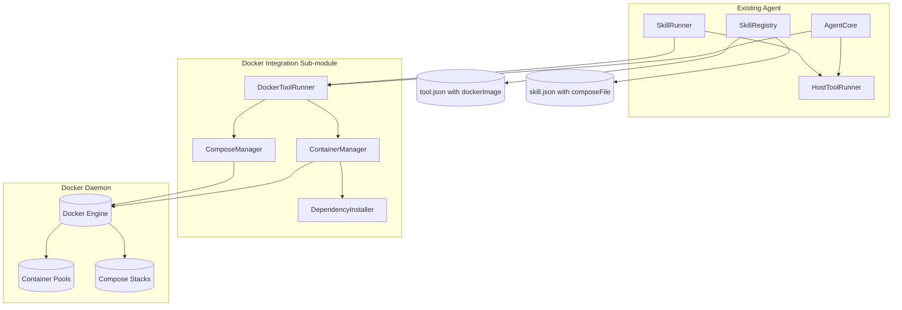
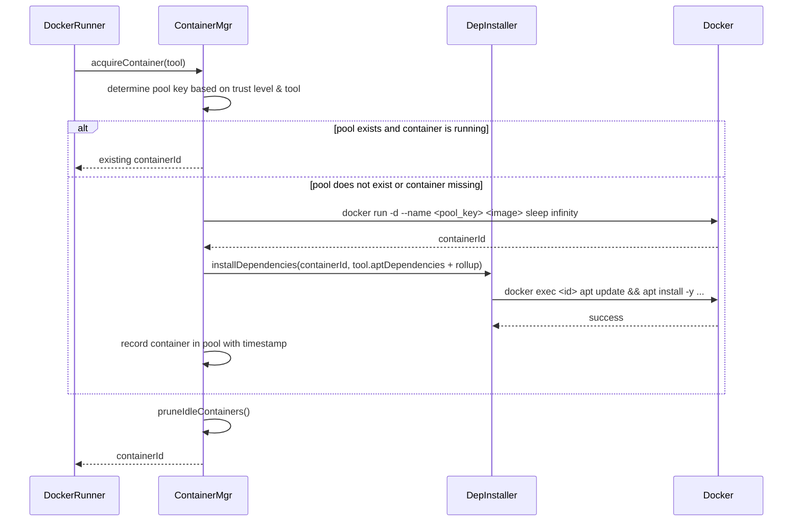
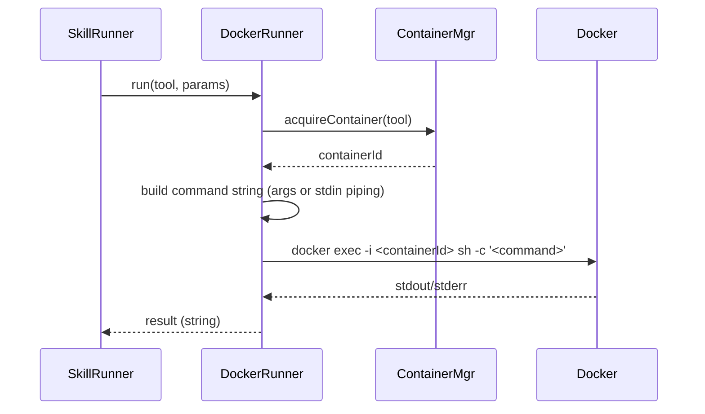
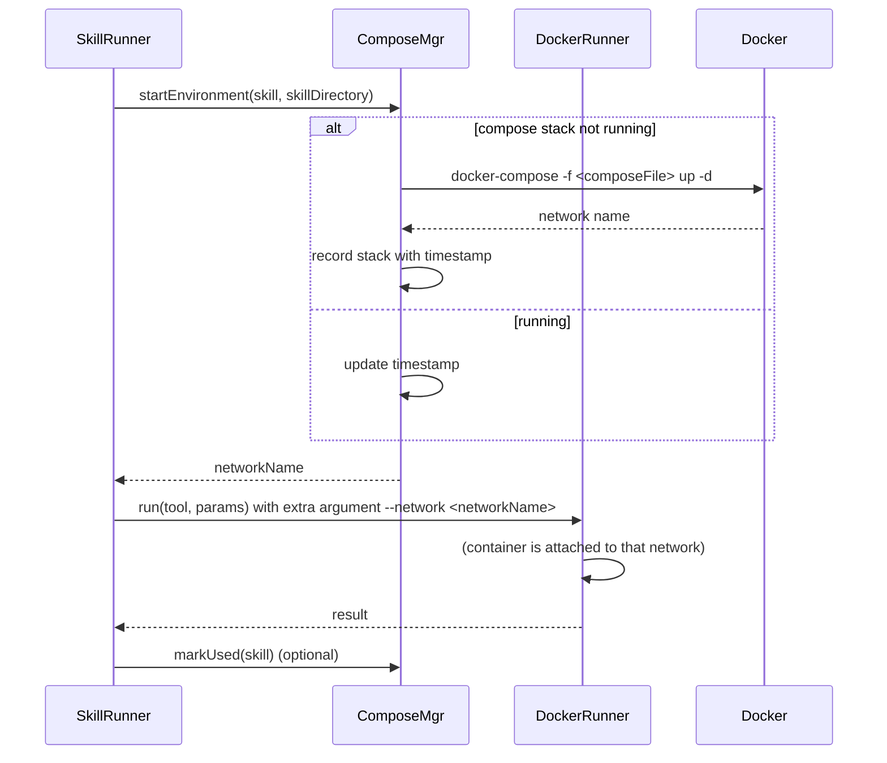
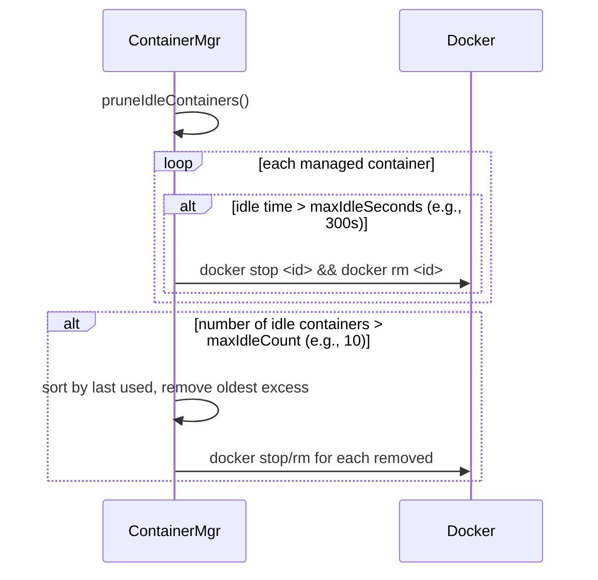

# Technical Specification: Docker Integration Sub‑Module

## For a0 Agent – Version 1.0

---

## 1. Overview

This document specifies a **Docker integration sub‑module** for the existing a0 C++17 agent. The sub‑module enables:

- Execution of tools inside **long‑lived Docker containers** organised by **trust levels** (HIGH, MEDIUM, LOW).
- **Shared container pools** per trust level (except LOW where each tool gets its own container).
- **Declarative tool configuration** including custom Docker image, apt dependencies, and trust level.
- **Docker Compose support** for skills to bring up multi‑service environments.
- **Host‑side file editing** (`file_edit` tool) restricted to the project directory (read‑only container mounts, writeable only via `file_edit` on host).
- **Container pruning** triggered on each container acquisition (idle timeout and maximum count limits).

The sub‑module is designed to integrate with the existing `ToolRunner` interface without breaking existing tools that run directly on the host (e.g., `bash` when `dockerImage` is absent).

---

## 2. Component Specifications (C++ Interfaces)

All new classes are defined in `docker_integration.h`. They use C++17 and are dependency‑injected into the main agent components.

### 2.1 Trust Level Enumeration

```cpp
enum class TrustLevel {
    HIGH,      // Shared container across all high-trust tools
    MEDIUM,    // Shared container across all medium-trust tools
    LOW        // One container per (image, tool name) combination
};
```

### 2.2 Extended Tool and Skill Structures

Add the following fields to the existing `Tool` and `Skill` structs (defined in `agent_interfaces.h`):

```cpp
// Additional fields for Tool
struct Tool {
    // ... existing fields (name, description, command, inputMode)
    std::string dockerImage;                     // e.g., "ubuntu:22.04"
    TrustLevel trustLevel = TrustLevel::MEDIUM;
    bool useContainerPool = true;                // false = ephemeral docker run --rm
    std::vector<std::string> aptDependencies;    // packages to install via apt
};

// Additional fields for Skill
struct Skill {
    // ... existing fields (name, description, prompt, dependencies, validators)
    std::string composeFile;                     // path to docker-compose.yml (relative to skill dir)
    std::vector<std::string> aptDependencies;    // rolled up into container(s) used by skill's tools
};
```

### 2.3 Container Manager Interface

```cpp
class ContainerManager {
public:
    virtual ~ContainerManager() = default;

    // Returns a container ID (or handle) suitable for executing commands.
    // The container is guaranteed to be running and have all required apt dependencies installed.
    virtual std::string acquireContainer(const Tool& tool) = 0;

    // Execute a command inside a container. stdinData is piped to the command's stdin.
    // Returns stdout + stderr as a string. On timeout (30s), returns "ERROR: timeout".
    virtual std::string execInContainer(const std::string& containerId,
                                        const std::string& command,
                                        const std::string& stdinData = "") = 0;

    // Prune idle containers according to policy (called inside acquireContainer).
    virtual void pruneIdleContainers() = 0;
};
```

### 2.4 Dependency Installer (optional, may be part of ContainerManager)

```cpp
class DependencyInstaller {
public:
    virtual ~DependencyInstaller() = default;
    // Ensures all given apt packages are installed inside the container.
    virtual void installDependencies(const std::string& containerId,
                                     const std::vector<std::string>& packages) = 0;
};
```

### 2.5 Compose Manager Interface

```cpp
class ComposeManager {
public:
    virtual ~ComposeManager() = default;

    // Starts docker-compose up -d for the skill's composeFile (if not already running).
    // Returns the network name that tools should attach to.
    virtual std::string startEnvironment(const Skill& skill, const std::string& skillDirectory) = 0;

    // Stops and removes containers for the compose environment (if idle).
    virtual void stopEnvironment(const Skill& skill) = 0;

    // Updates last‑used timestamp for a skill's compose environment.
    virtual void markUsed(const Skill& skill) = 0;
};
```

### 2.6 Docker Tool Runner (implements existing `ToolRunner`)

```cpp
class DockerToolRunner : public ToolRunner {
public:
    DockerToolRunner(ContainerManager* containerManager, ComposeManager* composeManager = nullptr);
    json run(const Tool& tool, const json& params) override;
};
```

### 2.7 Host Tool Runner (renamed from `SubprocessToolRunner`)

The existing `SubprocessToolRunner` remains, but is optionally renamed to `HostToolRunner` for clarity. It is used for tools with `dockerImage` empty and for the special `file_edit` tool.

---

## 3. System Architecture (C4 Diagram)

The following diagram shows the new components (blue) and their relationship to the existing agent (grey).



**Caption**: The `AgentCore` and `SkillRunner` delegate tool execution to either `HostToolRunner` (for host‑based tools like `bash` or `file_edit`) or `DockerToolRunner`. The `DockerToolRunner` uses `ContainerManager` to obtain a container (from a pool) and `ComposeManager` to start any required compose environment. `DependencyInstaller` ensures required apt packages are present.

---

## 4. Data Flow Diagrams

### 4.1 Acquiring a Container from a Pool



### 4.2 Executing a Tool Inside Docker



### 4.3 Skill with Docker Compose Environment



### 4.4 Container Pruning (Triggered on Acquisition)



---

## 5. Configuration & CLI Extensions

The following new command‑line flags are added to the agent (in `main.cpp`):

| Flag                       | Default                       | Description                                                                  |
| -------------------------- | ----------------------------- | ---------------------------------------------------------------------------- |
| `--docker-host`            | `unix:///var/run/docker.sock` | Docker daemon socket URL.                                                    |
| `--container-idle-timeout` | `300`                         | Seconds after which an idle container is pruned.                             |
| `--max-idle-containers`    | `10`                          | Maximum number of idle containers allowed per pool (or total).               |
| `--default-docker-image`   | `ubuntu:22.04`                | Default image when tool does not specify `dockerImage`.                      |
| `--no-docker`              | `false`                       | Disable Docker integration entirely; fall back to host runner for all tools. |

**Environment variables** (optional override):

- `A0_DOCKER_HOST`
- `A0_CONTAINER_IDLE_TIMEOUT`
- `A0_MAX_IDLE_CONTAINERS`

**Example usage**:

```bash
a0 --components-dir ./my_components --container-idle-timeout 600 --max-idle-containers 5
```

---

## 6. Testing Requirements

### 6.1 Unit Tests (Google Test)

| Class                 | Test Case                          | Verification                                                  |
| --------------------- | ---------------------------------- | ------------------------------------------------------------- |
| `ContainerManager`    | `acquireContainer` with HIGH trust | Returns same container ID for two different high‑trust tools. |
| `ContainerManager`    | `acquireContainer` with LOW trust  | Returns different containers for different tool names.        |
| `ContainerManager`    | `pruneIdleContainers`              | Container last used > timeout is removed.                     |
| `ContainerManager`    | `execInContainer`                  | Command output captured correctly (stdout+stderr).            |
| `DependencyInstaller` | `installDependencies`              | Idempotent; multiple calls do not reinstall.                  |
| `ComposeManager`      | `startEnvironment`                 | `docker-compose up -d` called only once per skill.            |
| `DockerToolRunner`    | `run` with `args` mode             | Command arguments passed correctly inside container.          |
| `DockerToolRunner`    | `run` with timeout                 | 30‑second timeout enforced (kills container command).         |

**Mocking**: All unit tests use a fake Docker CLI executable (a bash script that simulates responses) to avoid requiring a real Docker daemon.

### 6.2 End‑to‑End Tests (with Real Docker)

**Prerequisites**: Docker daemon installed, test images available.

| ID     | Scenario                    | Steps                                                                                                           | Expected                                                      |
| ------ | --------------------------- | --------------------------------------------------------------------------------------------------------------- | ------------------------------------------------------------- |
| E2E‑D1 | Basic tool in default image | Tool with `dockerImage: "ubuntu:22.04"`, command `echo hello`                                                   | Output `hello\n`                                              |
| E2E‑D2 | apt dependency installation | Tool declares `aptDependencies: ["curl"]`, command `curl --version`                                             | Succeeds (curl found)                                         |
| E2E‑D3 | Trust level HIGH – sharing  | Two tools, same image, HIGH trust → both run in same container                                                  | Container ID identical, second invocation faster              |
| E2E‑D4 | Trust level LOW – isolation | Two tools, same image, LOW trust → each gets own container                                                      | Container IDs different                                       |
| E2E‑D5 | Compose environment         | Skill with `composeFile: "docker-compose.yml"` that runs a PostgreSQL container, tool runs `psql -c 'SELECT 1'` | Query succeeds                                                |
| E2E‑D6 | Pruning                     | Run tool, wait > idle timeout, run another tool → idle container removed                                        | `docker ps` shows container gone                              |
| E2E‑D7 | Host `file_edit`            | Edit a file under project root                                                                                  | File modified; edit outside root fails with permission error. |

**Test runner**: A bash script that creates temporary components, starts the agent, and validates outputs. It must run on a system with Docker installed.

---

## 7. Integration with Existing Main Specification

The Docker sub‑module does **not** replace the existing `technical-specification.md`. Instead, it is designed to be **plugged into** the existing agent as follows:

1. **Class registration** – In `main.cpp`, the agent creates a `ContainerManager` and `ComposeManager` only if Docker is available and `--no-docker` is not set.
2. **Tool runner selection** – For each tool, if `tool.dockerImage` is non‑empty, the agent uses `DockerToolRunner`; otherwise it uses `HostToolRunner`.
3. **Skill execution** – Before executing a skill, `SkillRunner` calls `ComposeManager::startEnvironment` if `skill.composeFile` is set.
4. **Configuration** – The CLI flags described in Section 5 are added to the existing argument parser.

The existing testing plan (Section 5 of the main spec) is extended with the tests from Section 6.

---

## 8. Implementation Outline (High‑Level)

### Phase 1: Base Docker infrastructure

- Implement `DockerCLIWrapper` (calls `docker` command via `popen`).
- Implement `ContainerManager` with in‑memory pool tracking.
- Implement `DependencyInstaller` using `docker exec`.

### Phase 2: ToolRunner integration

- Implement `DockerToolRunner`.
- Modify `AgentCore` to decide runner per tool.

### Phase 3: Compose support

- Implement `ComposeManager` with stack state.
- Modify `SkillRunner` to call `startEnvironment` before prompt expansion.

### Phase 4: File_edit tool

- Create `HostFileEditTool` that inherits from `HostToolRunner` and enforces CWD allow‑list.
- Register as a built‑in tool at agent startup.

### Phase 5: Pruning & limits

- Implement pruning logic inside `ContainerManager::acquireContainer`.
- Add CLI flags for timeouts and counts.

### Phase 6: Testing

- Write unit tests with mock Docker.
- Write E2E tests with real Docker (optional for CI, mandatory for release).

---

## 9. Future Extensions

- **Image caching** – Pre‑pull images to reduce startup latency.
- **Resource limits** – Allow tools to declare CPU/memory limits in `tool.json`.
- **Volume mounts** – Support custom volume mounts per tool (e.g., for cache directories).
- **Rootless Docker** – Ensure compatibility with rootless mode.
- **LXC backend** – Alternative container runtime for environments without Docker.

---
