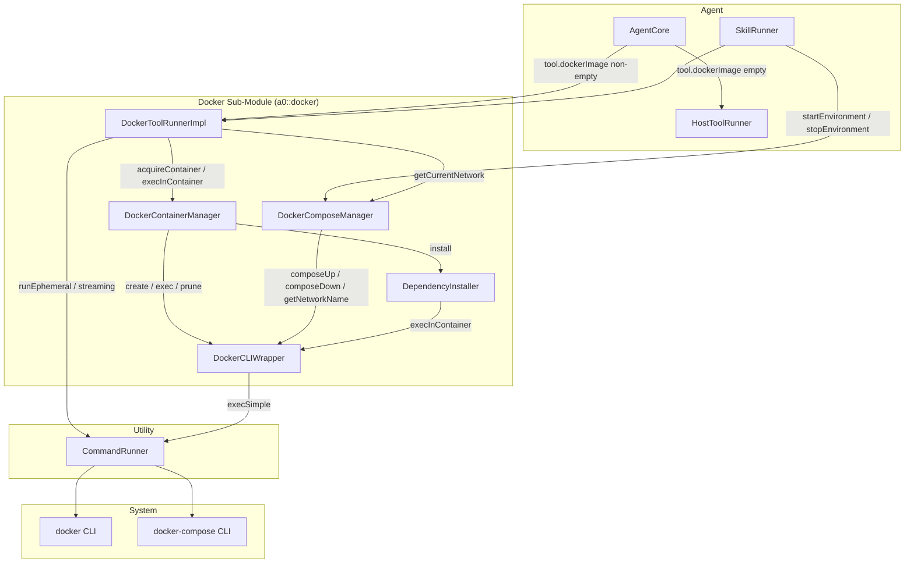
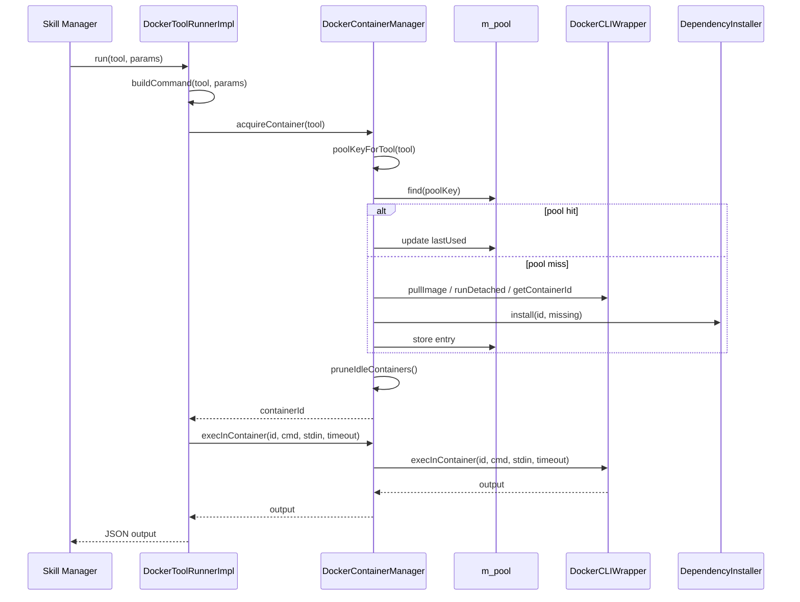
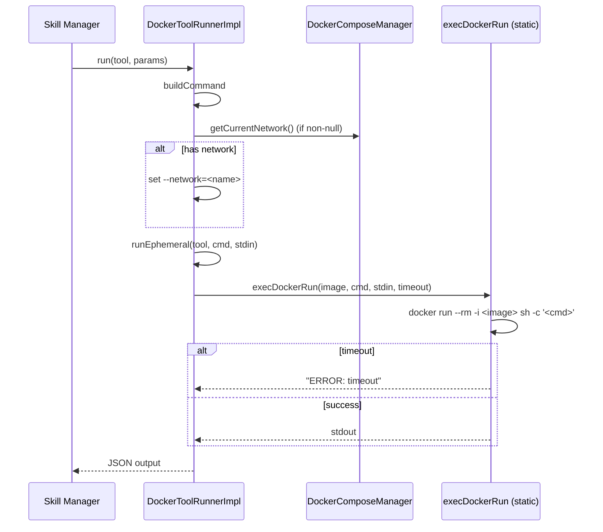
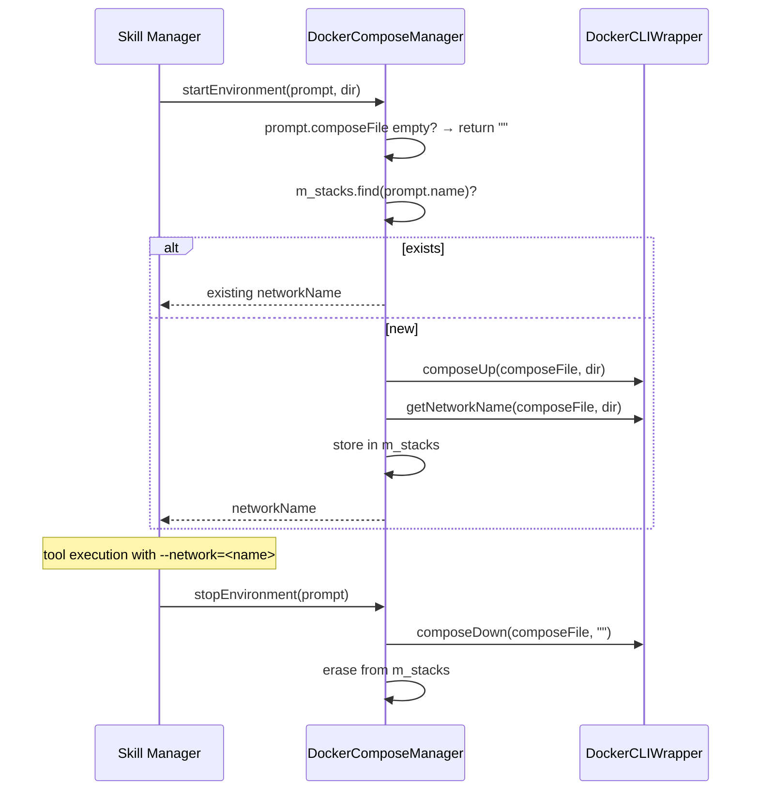
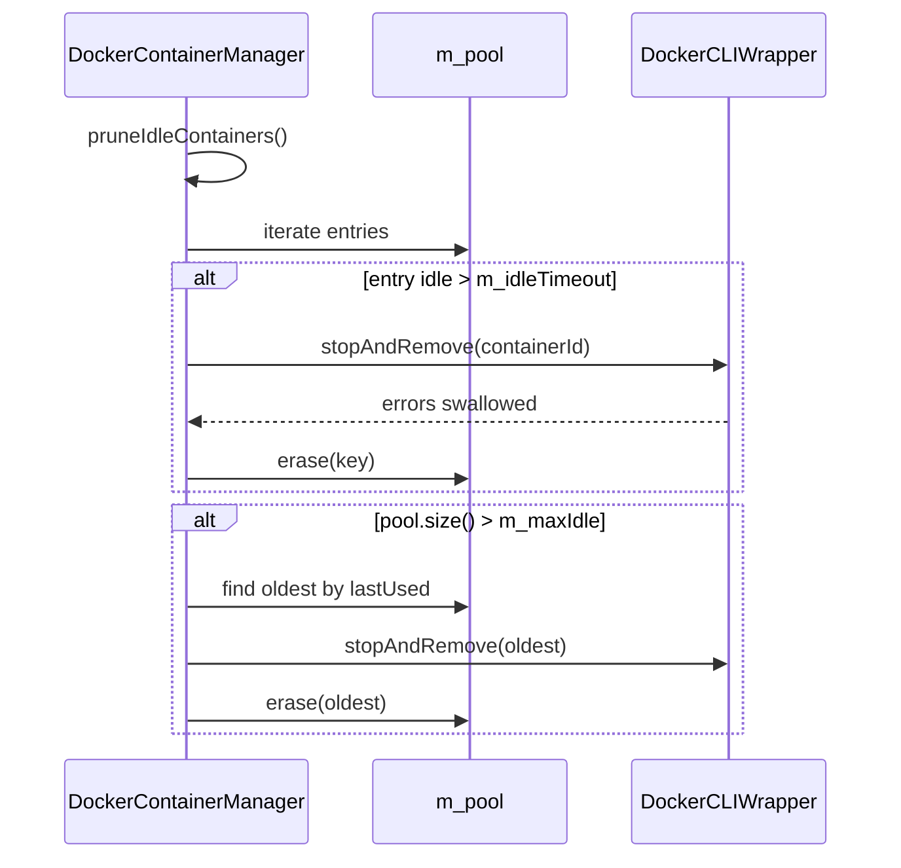

# Technical Specification: Docker Integration Sub-Module

## §1. Overview

The Docker sub-module enables execution of tools inside Docker containers with container pooling, Docker Compose environments for skills, and apt dependency installation. It integrates with the existing `ToolRunner` interface without affecting host-based tools.

**Namespace:** `a0::docker`
**Build target:** `docker_lib` (static library, defined in `src/docker/CMakeLists.txt`)
**Source files:** 5 `.h` / `.cpp` pairs in `src/docker/`

| Component | Header | Source | Role |
|-----------|--------|--------|------|
| `DockerCLIWrapper` | `docker_cli_wrapper.h` | `docker_cli_wrapper.cpp` | Static CLI wrapper over docker/docker-compose |
| `DockerContainerManager` | `container_manager.h` | `container_manager.cpp` | Pooled container lifecycle management |
| `DockerComposeManager` | `compose_manager.h` | `compose_manager.cpp` | Docker Compose environment management |
| `DependencyInstaller` | `dependency_installer.h` | `dependency_installer.cpp` | Static apt package installer |
| `DockerToolRunnerImpl` | `docker_tool_runner.h` | `docker_tool_runner.cpp` | Tool execution via containers |

**Dependencies (shared):** `shared_lib` (agent interfaces: Tool, Prompt, ContainerManager, ComposeManager, DockerToolRunner, TrustLevel), `executor_lib` (CommandRunner), `nlohmann/json`, `shared/trace.h` (TRACE_LOG instrumentation).

**Lifecycle:** Components are created at agent startup in `main.cpp`. `DockerContainerManager` and `DockerComposeManager` are configured via CLI flags and injected into `DockerToolRunnerImpl`. All live for the duration of the agent process.

## §2. Component Specifications

### 2.1 Shared Interfaces (from `shared/agent_interfaces.h`)

```cpp
enum class TrustLevel { HIGH, MEDIUM, LOW };

struct Tool {
    std::string name;
    std::string description;
    std::string command;
    std::string inputMode = "stdin";
    std::string dockerImage;
    TrustLevel trustLevel = TrustLevel::MEDIUM;
    std::vector<std::string> aptDependencies;
    int timeoutSecs = 30;
};

struct Prompt {
    std::string name;
    std::string description;
    std::string prompt;
    std::vector<std::string> dependencies;
    std::vector<ValidatorBinding> validators;
    std::vector<std::string> chain;
    std::string composeFile;
    std::vector<std::string> aptDependencies;
    std::string ns;
    std::string component;
    bool parallelValidators = false;
};

class ContainerManager {
public:
    virtual ~ContainerManager() = default;
    virtual std::string acquireContainer(const Tool& tool) = 0;
    virtual std::string execInContainer(const std::string& containerId,
                                         const std::string& command,
                                         const std::string& stdinData = "",
                                         int timeoutSecs = 30) = 0;
    virtual void pruneIdleContainers() = 0;
};

class ComposeManager {
public:
    virtual ~ComposeManager() = default;
    virtual std::string startEnvironment(const Prompt& prompt, const std::string& skillDirectory) = 0;
    virtual void stopEnvironment(const Prompt& prompt) = 0;
    virtual void markUsed(const Prompt& prompt) = 0;
    virtual void setCurrentPrompt(const Prompt& prompt) = 0;
    virtual std::string getCurrentNetwork() const = 0;
    virtual void clearCurrentPrompt() = 0;
    virtual std::string startPersistent(const std::string& name,
                                         const std::string& composeFile,
                                         const std::string& skillDirectory) = 0;
    virtual void stopPersistent(const std::string& name) = 0;
    virtual bool isPersistent(const std::string& name) const = 0;
};

class DockerToolRunner : public ToolRunner {
public:
    virtual ~DockerToolRunner() = default;
};
```

### 2.2 DockerCLIWrapper

File-static helper `execSimple()` executes a command via `CommandRunner::run` with 120s timeout, throws on non-zero exit, and trims trailing newlines.

```cpp
class DockerCLIWrapper {
public:
    static std::string runDetached(const std::string& image,
                                    const std::string& name,
                                    const std::string& command);
    static std::string execInContainer(const std::string& containerId,
                                        const std::string& command,
                                        const std::string& stdinData = "",
                                        int timeoutSecs = 30);
    static void stopAndRemove(const std::string& containerId);
    static void pullImage(const std::string& image);
    static std::string getContainerId(const std::string& name);
    static void startContainer(const std::string& name);
    static void composeUp(const std::string& composeFile,
                           const std::string& projectDir);
    static void composeDown(const std::string& composeFile,
                             const std::string& projectDir);
    static std::string getNetworkName(const std::string& composeFile,
                                       const std::string& projectDir);
};
```

Full spec: `docker_cli_wrapper.spec.md`

### 2.3 DockerContainerManager

```cpp
struct ContainerPoolEntry {
    std::string containerId;
    std::string image;
    time_t lastUsed;
    std::vector<std::string> installedDeps;
};

class DockerContainerManager : public ContainerManager {
public:
    DockerContainerManager(int idleTimeout, int maxIdle,
                           const std::string& defaultImage);
    std::string acquireContainer(const Tool& tool) override;
    std::string execInContainer(const std::string& containerId,
                                 const std::string& command,
                                 const std::string& stdinData = "",
                                 int timeoutSecs = 30) override;
    void pruneIdleContainers() override;
    void setSessionPrefix(const std::string& prefix);

private:
    std::string poolKeyForTool(const Tool& tool) const;
    std::string createContainer(const std::string& poolKey, const Tool& tool);
    void ensureDependencies(const std::string& containerId,
                             const Tool& tool, ContainerPoolEntry& entry);
    int m_idleTimeout;
    int m_maxIdle;
    std::string m_defaultImage;
    std::string m_sessionPrefix;
    std::unordered_map<std::string, ContainerPoolEntry> m_pool;
};
```

Full spec: `container_manager.spec.md`

### 2.4 DockerComposeManager

```cpp
struct ComposeStackInfo {
    std::string composeFile;
    std::string networkName;
    time_t lastUsed;
};

class DockerComposeManager : public ComposeManager {
public:
    explicit DockerComposeManager(int idleTimeout);
    std::string startEnvironment(const Prompt& prompt,
                                  const std::string& skillDirectory) override;
    void stopEnvironment(const Prompt& prompt) override;
    void markUsed(const Prompt& prompt) override;
    void setCurrentPrompt(const Prompt& prompt) override;
    std::string getCurrentNetwork() const override;
    void clearCurrentPrompt() override;
    std::string startPersistent(const std::string& name,
                                 const std::string& composeFile,
                                 const std::string& skillDirectory) override;
    void stopPersistent(const std::string& name) override;
    bool isPersistent(const std::string& name) const override;

private:
    int m_idleTimeout;
    std::unordered_map<std::string, ComposeStackInfo> m_stacks;
    std::unordered_set<std::string> m_persistentStacks;
    std::string m_currentPromptName;
};
```

Full spec: `compose_manager.spec.md`

### 2.5 DependencyInstaller

```cpp
class DependencyInstaller {
public:
    static void install(const std::string& containerId,
                        const std::vector<std::string>& packages);
};
```

Full spec: `dependency_installer.spec.md`

### 2.6 DockerToolRunnerImpl

File-static helpers:
- `execDockerRun()` — runs `docker run --rm -i`, returns `"ERROR: timeout"` on timeout
- `execDockerRunStreaming()` — streaming variant with optional `--network=` flag

```cpp
class DockerToolRunnerImpl : public DockerToolRunner {
public:
    DockerToolRunnerImpl(ContainerManager* containerManager,
                         ComposeManager* composeManager,
                         bool poolEnabled = true);
    json run(const Tool& tool, const json& params) override;
    a0::StreamHandle runStreaming(const Tool& tool,
                                   const json& params,
                                   a0::StreamCallback onChunk) override;

private:
    std::string buildCommand(const Tool& tool, const json& params,
                              std::string& outStdin) const;
    std::string runEphemeral(const Tool& tool, const std::string& command,
                              const std::string& stdinData) const;
    ContainerManager* m_containerManager;
    ComposeManager* m_composeManager;
    bool m_poolEnabled;
};
```

Full spec: `docker_tool_runner.spec.md`

## §3. Architecture Diagram



## §4. Data Flow

### 4.1 Tool Execution (Pooled)



### 4.2 Tool Execution (Ephemeral)



### 4.3 Compose Environment Lifecycle



### 4.4 Container Pruning



## §5. Testing Requirements

| Component | Method | Key test case | Expected outcome |
|-----------|--------|---------------|-----------------|
| DockerCLIWrapper | runDetached | Valid image | Returns container ID |
| DockerCLIWrapper | execInContainer | Timeout | Throws "timeout" |
| DockerCLIWrapper | stopAndRemove | Non-existent container | No-op |
| DockerCLIWrapper | composeUp | Invalid compose | Throws runtime_error |
| DockerCLIWrapper | getNetworkName | dir=/a/b/c | Returns "c_default" |
| DockerContainerManager | acquireContainer | Pool hit | Returns cached ID |
| DockerContainerManager | acquireContainer | Pool miss, fresh create | Pulls, creates, installs deps |
| DockerContainerManager | execInContainer | Normal | Returns output |
| DockerContainerManager | execInContainer | Timeout | Returns "ERROR: timeout" |
| DockerContainerManager | pruneIdleContainers | Expired + excess | Removed from pool + Docker |
| DockerContainerManager | poolKeyForTool | HIGH trust | Returns "<pfx>high_pool" |
| DockerContainerManager | poolKeyForTool | LOW trust | Returns "<pfx>low_<name>_<image>" |
| DockerComposeManager | startEnvironment | Existing stack | Returns cached network |
| DockerComposeManager | startEnvironment | composeUp throws | Returns "" |
| DockerComposeManager | stopEnvironment | Non-existent | No-op |
| DockerComposeManager | startPersistent | New | Entry in both maps |
| DockerComposeManager | isPersistent | Ephemeral | false |
| DockerComposeManager | getCurrentNetwork | No current prompt | Returns "" |
| DependencyInstaller | install | Empty list | No CLI call |
| DependencyInstaller | install | apt-get fails | runtime_error thrown |
| DockerToolRunnerImpl | run | Pooled | acquire + exec, JSON output |
| DockerToolRunnerImpl | run | Ephemeral + network | --network= flag present |
| DockerToolRunnerImpl | runStreaming | Pooled | StreamHandle + chunks |
| DockerToolRunnerImpl | runStreaming | Ephemeral | StreamHandle via execDockerRunStreaming |
| DockerToolRunnerImpl | buildCommand | Args mode | --key=value style |
| DockerToolRunnerImpl | buildCommand | Stdin mode | input field as stdin |
| DockerToolRunnerImpl | runEphemeral | Timeout | "ERROR: timeout" |

## §6. (not used)

## §7. CLI Entry Point

The Docker sub-module is wired into the agent in `main.cpp` via the following CLI flags and wiring sequence:

| Flag | Default | Description |
|------|---------|-------------|
| `--container-idle-timeout` | `300` | Seconds before idle container is pruned |
| `--max-idle-containers` | `10` | Maximum idle containers retained |
| `--default-docker-image` | `ubuntu:22.04` | Default image when tool omits dockerImage |
| `--no-docker` | `false` | Disable Docker entirely, fall back to host runner |

**Wiring sequence in main.cpp:**
1. Parse CLI flags
2. Create `DockerContainerManager(idleTimeout, maxIdle, defaultImage)`
3. Create `DockerComposeManager(idleTimeout)`
4. Create `DockerToolRunnerImpl(containerMgr, composeMgr, !noDocker)`
5. Register with agent: tools with `dockerImage` non-empty dispatch to `DockerToolRunnerImpl`
6. Session initialization calls `containerMgr->setSessionPrefix(sessionId)`

**Environment variable overrides:**
- `A0_DOCKER_HOST` → future use (Docker daemon socket)
- `A0_CONTAINER_IDLE_TIMEOUT` → overrides `--container-idle-timeout`
- `A0_MAX_IDLE_CONTAINERS` → overrides `--max-idle-containers`

**Build target:** `docker_lib` (static) linked via CMake:
```cmake
add_library(docker_lib STATIC
    docker_cli_wrapper.cpp
    container_manager.cpp
    dependency_installer.cpp
    compose_manager.cpp
    docker_tool_runner.cpp
)
target_link_libraries(docker_lib PUBLIC shared_lib executor_lib ${CMAKE_DL_LIBS})
```
