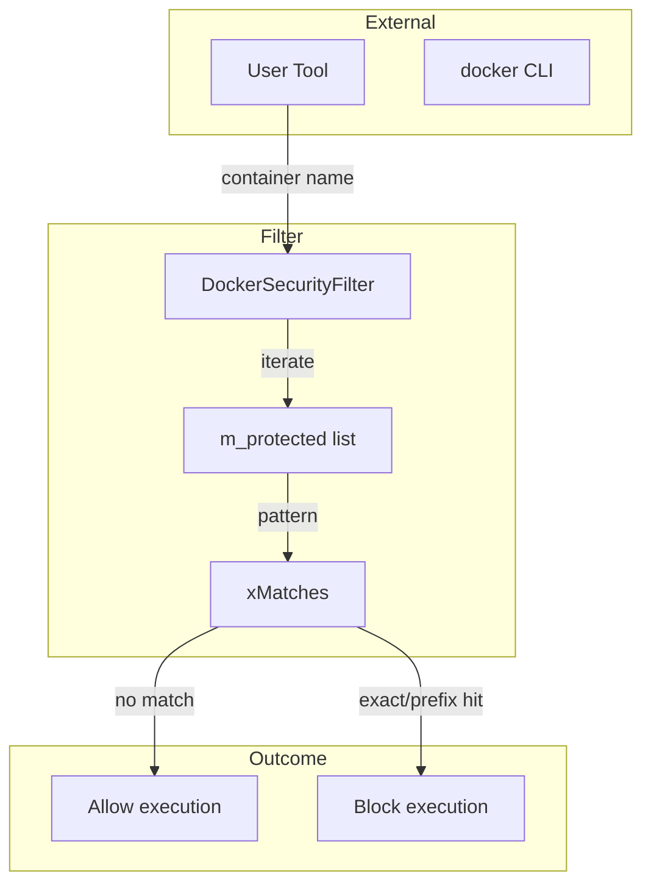
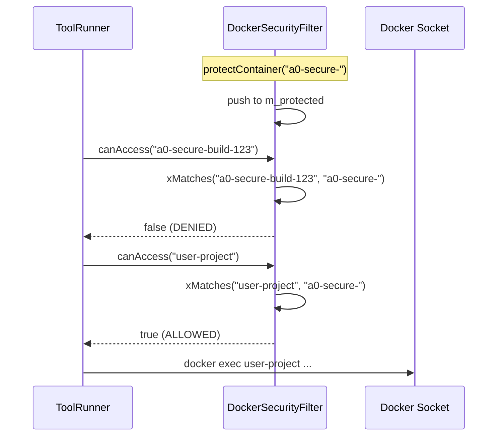

# DockerSecurityFilter Spec

## 1. Overview

Prevents user-facing Docker tool invocations from targeting system-managed sandbox containers. A `DockerSecurityFilter` maintains a list of protected container name/ID prefixes; `canAccess()` and `canAccessAll()` return `false` when a given container name or ID matches any protected entry. Protected entries are registered programmatically at startup and cannot be modified at runtime.

**Source files:** `src/docker_security_filter.h/.cpp`

**Dependencies:** `string`, `vector`, `<algorithm>`

## 2. Component Specifications

```cpp
namespace a0 {

class DockerSecurityFilter {
public:
    DockerSecurityFilter();

    /// Register a container name/ID as protected.
    void protectContainer(const std::string& nameOrId);

    /// Returns false if the operation targets a protected container.
    bool canAccess(const std::string& containerNameOrId) const;

    /// Returns false if any container in the list is protected.
    bool canAccessAll(const std::vector<std::string>& containers) const;

private:
    std::vector<std::string> m_protected;
    bool xMatches(const std::string& target, const std::string& pattern) const;
};

} // namespace a0
```

### Matching Rules (`xMatches`)

| Condition | Match? |
|-----------|--------|
| `target == pattern` | Yes (exact) |
| `target` starts with `pattern` | Yes (prefix) |
| Otherwise | No |

## 3. Architecture Diagram



## 4. Data Flow



## 5. Testing Requirements

| Test | Verification |
|------|-------------|
| Exact match protected | `canAccess` returns `false` |
| Prefix match protected | `canAccess` returns `false` |
| Non-protected container | `canAccess` returns `true` |
| Empty string protect | No entry added |
| `canAccessAll` with one protected | Returns `false` |
| `canAccessAll` all clear | Returns `true` |
