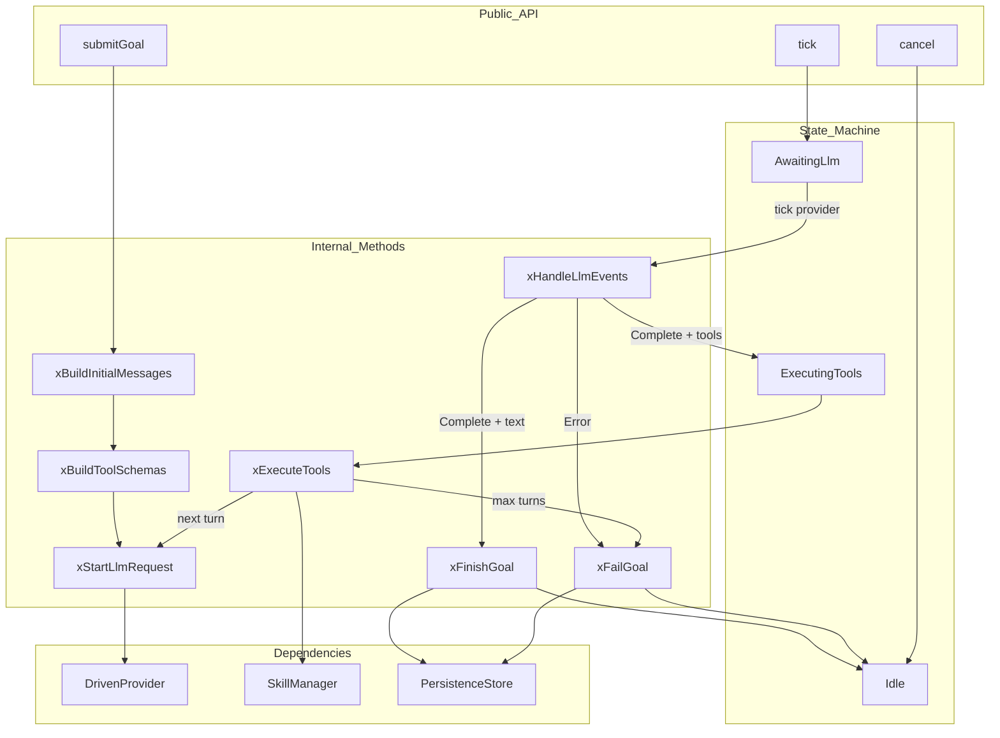
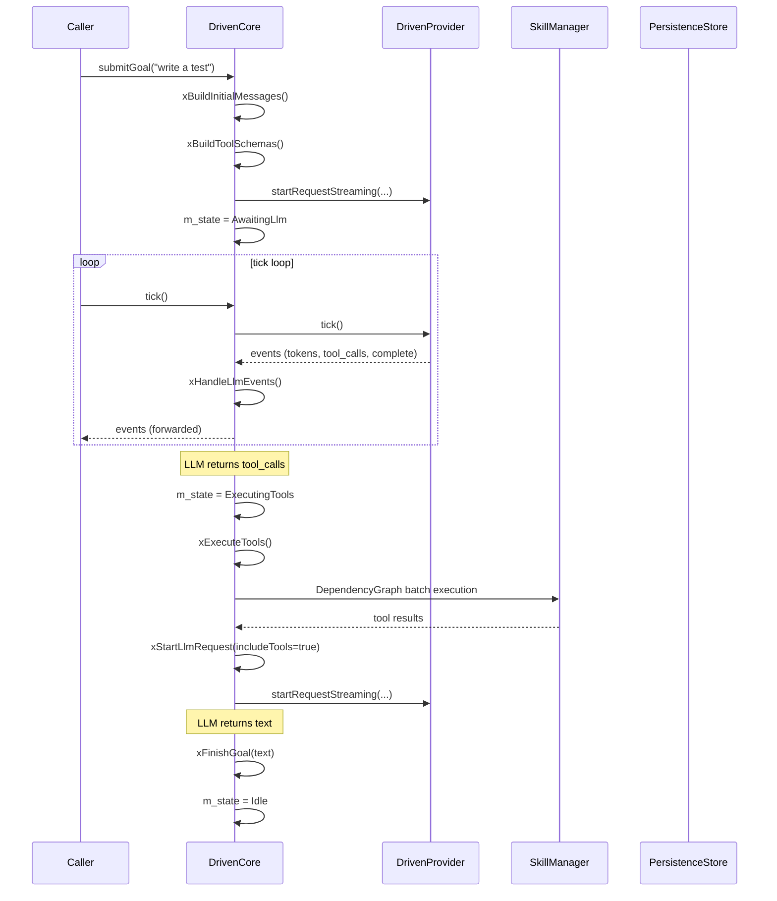

# DrivenCore Spec

## 1. Overview

State-machine driven agent core that replaces the forked-loop implementation. Transitions through `Idle → AwaitingLlm → ExecutingTools → Idle` on each goal. `submitGoal()` starts an LLM request, `tick()` drives the provider and tool execution, and `cancel()` resets to idle.

**Source files:** `src/driven_core.h/.cpp`

**Dependencies:** `driven_provider.h`, `mpsc.h`, `agent_interfaces.h`, `skills/skills.h`, `persistence/persistence_store.h`

## 2. Component Specifications

```cpp
namespace a0 {

class DrivenCore {
public:
    DrivenCore(DrivenProvider* provider,
               a0::skills::SkillManager* skillMgr,
               a0::persistence::PersistenceStore* persistence = nullptr);

    void submitGoal(const std::string& goal);
    std::vector<mpsc::AppCoreEvent> tick();
    bool idle() const { return m_state == CoreState::Idle; }
    void cancel();

    void setSession(int64_t sessionDbId, const std::string& sessionUuid);
    int64_t sessionDbId() const { return m_sessionDbId; }

private:
    enum class CoreState { Idle, AwaitingLlm, ExecutingTools };

    CoreState m_state = CoreState::Idle;
    DrivenProvider* m_provider;
    a0::skills::SkillManager* m_skillMgr;
    a0::persistence::PersistenceStore* m_persistence;

    std::string m_sessionUuid;
    int64_t m_sessionDbId = 0;
    int64_t m_subSessionId = 0;
    int m_seq = 0;
    int m_turnCount = 0;

    std::vector<Message> m_messages;
    std::vector<ToolSchema> m_toolSchemas;
    std::vector<ToolSchema> m_emptySchemas;
    std::unordered_map<std::string, std::string> m_dispatch;
    std::string m_accumText;

    struct PendingToolCall {
        std::string id;
        std::string name;
        json arguments;
    };
    std::vector<PendingToolCall> m_pendingToolCalls;

    static constexpr int MAX_TURNS = 25;

    void xBuildInitialMessages(const std::string& goal);
    void xBuildToolSchemas();
    void xStartLlmRequest(bool includeTools = true);
    void xHandleLlmEvents(const std::vector<mpsc::AppCoreEvent>& events);
    void xExecuteTools();
    void xFinishGoal(const std::string& text);
    void xFailGoal(const std::string& error);
    void xPersistMessage(const std::string& role, const std::string& content,
                         const std::string& toolCallId = "",
                         const std::vector<ToolCall>& toolCalls = {});
};

} // namespace a0
```

## 3. Architecture Diagram



## 4. Data Flow



## 5. Testing Requirements

| Test | Verification |
|------|-------------|
| submitGoal from idle | Transitions to AwaitingLlm, starts request |
| tick in Idle state | Returns empty vector |
| tick in AwaitingLlm | Forwards provider events |
| LLM returns text only | Calls xFinishGoal, transitions to Idle |
| LLM returns tool calls | Transitions to ExecutingTools |
| Tool executes successfully | Result added to messages, next LLM started |
| Max tool call turns exceeded | xFailGoal with error message |
| cancel() from any state | Provider cancelled, state = Idle, state cleared |
| setSession before submit | Session ID used in persistence calls |
| UTF-8 sanitization of tool output | Invalid sequences replaced with `?` |
