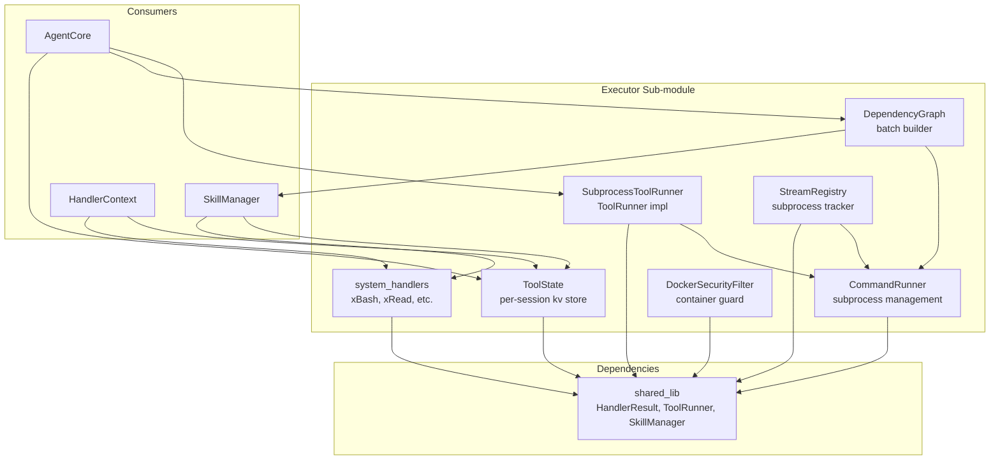
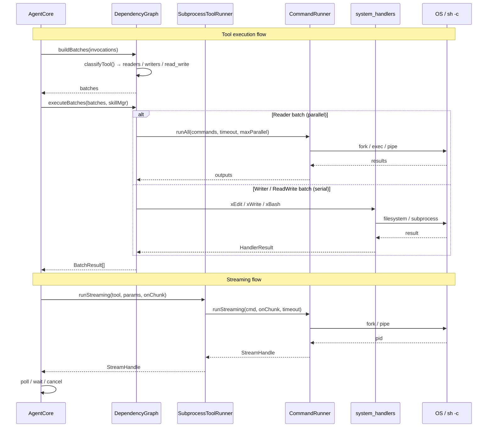

# Technical Specification: Executor Sub-Module

## For a0 Agent — Version 1.0

---

## §1. Overview

The Executor sub-module owns all tool execution infrastructure in the a0 agent — subprocess management, tool running, per-session state management, dependency batching, system tool handlers, Docker security filtering, and streaming subprocess tracking. It replaces the old `a0_lib` executor and `cmd_runner_lib` merged into a single cohesive sub-module.

**Source files:**
- `src/executor/command_runner.h/.cpp` — subprocess fork/exec/alarm management
- `src/executor/tool_runner.h/.cpp` — SubprocessToolRunner (args/stdin mode, timeout, streaming)
- `src/executor/tool_state.h/.cpp` — per-session key-value state bag
- `src/executor/dependency_graph.h/.cpp` — reader/writer classification + batch execution
- `src/executor/system_handlers.h/.cpp` — free-standing handler functions (xBash, xRead, xEdit, xWrite, xGlob, xGrep, etc.)
- `src/executor/docker_security_filter.h/.cpp` — Docker command security filtering
- `src/executor/stream_registry.h/.cpp` — streaming subprocess tracking

**Dependencies:** `shared_lib` (provides HandlerResult, ToolRunner interface, SkillManager)

**Namespaces:** `a0` (CommandRunner, DependencyGraph, DockerSecurityFilter, StreamRegistry, system_handlers free functions), global (SubprocessToolRunner, ToolState)

---

## §2. Component Specifications

### 2.1 CommandRunner

```cpp
namespace a0 {

struct CommandResult {
    int exitCode;
    std::string stdout;
    std::string stderr;
    bool timedOut;
};

using StreamCallback = std::function<void(const std::string& data,
                                           const std::string& direction)>;

struct StreamHandle {
    int64_t streamId = 0;
    int pid = 0;

    bool isDone() const;
    int wait();
    void cancel();
    void sendInput(const std::string& data);

    struct State {
        std::mutex mutex;
        int stdinFd = -1;
        pid_t childPid = 0;
        std::atomic<bool> done{false};
        std::atomic<int> exitCode{-1};
        std::thread thread;
    };
    std::shared_ptr<State> m_state;
};

class CommandRunner {
public:
    static CommandResult run(const std::string& cmd,
                              const std::string& stdinData = "",
                              int timeoutSecs = 30);
    static std::vector<CommandResult> runAll(
        const std::vector<std::string>& cmds,
        int timeoutSecs = 30,
        int maxParallel = 4);
    static StreamHandle runStreaming(const std::string& cmd,
                                      StreamCallback onChunk,
                                      int timeoutSecs = 30);
    static std::string shellEscape(const std::string& s);

private:
    static CommandResult xRunSingle(const std::string& cmd,
                                     const std::string& stdinData,
                                     int timeoutSecs);
};

} // namespace a0
```

### 2.2 DependencyGraph

```cpp
namespace a0 {

using json = nlohmann::json;

enum class ResourceClass {
    READER,      ///< Pure filesystem reads — safe to parallelize
    WRITER,      ///< Pure filesystem writes — must not overlap
    READ_WRITE   ///< Opaque/unknown access — run after all readers
};

struct ToolInvocation {
    std::string qualifiedName;
    json params;
    int* seq = nullptr;             ///< persistence counter (nullptr = skip)
    std::string toolCallId;
    int64_t subSessionId = 0;
};

struct BatchResult {
    std::vector<std::string> outputs;   ///< one per invocation, same order as input
    std::vector<std::string> errors;    ///< non-empty for invocations that failed
};

class DependencyGraph {
public:
    static ResourceClass classifyTool(const std::string& qualifiedName);
    static std::vector<std::vector<ToolInvocation>> buildBatches(
        const std::vector<ToolInvocation>& invocations);
    static std::vector<BatchResult> executeBatches(
        const std::vector<std::vector<ToolInvocation>>& batches,
        a0::skills::SkillManager* skillMgr,
        int maxParallel = 4);

private:
    static bool xIsReader(const std::string& qn);
    static bool xIsWriter(const std::string& qn);
    static json xExecuteOne(const ToolInvocation& inv,
                             a0::skills::SkillManager* skillMgr);
};

} // namespace a0
```

### 2.3 DockerSecurityFilter

```cpp
namespace a0 {

class DockerSecurityFilter {
public:
    DockerSecurityFilter();
    void protectContainer(const std::string& nameOrId);
    bool canAccess(const std::string& containerNameOrId) const;
    bool canAccessAll(const std::vector<std::string>& containers) const;

private:
    std::vector<std::string> m_protected;
    bool xMatches(const std::string& target, const std::string& pattern) const;
};

} // namespace a0
```

### 2.4 StreamRegistry

```cpp
namespace a0 {

class StreamRegistry {
public:
    int64_t registerStream(
        int64_t streamId,
        int pid,
        std::function<void(const std::string&)> sendInput,
        std::function<int()> wait,
        std::function<void()> cancel);
    void unregisterStream(int64_t streamId);

    struct StreamEntry {
        int64_t streamId;
        int pid;
        std::function<void(const std::string&)> sendInput;
        std::function<int()> wait;
        std::function<void()> cancel;
    };

    StreamEntry* getStream(int64_t streamId);
    std::vector<int64_t> listActiveStreams() const;
    void cancelAll();

private:
    mutable std::mutex m_mutex;
    std::unordered_map<int64_t, StreamEntry> m_streams;
};

} // namespace a0
```

### 2.5 System Handlers

```cpp
namespace a0 {

// Core filesystem + execution handlers
HandlerResult xBash(const json& params);
HandlerResult xRead(const json& params);
HandlerResult xGlob(const json& params);
HandlerResult xGrep(const json& params);
HandlerResult xEdit(const json& params);
HandlerResult xWrite(const json& params);

// Git handler (subcommand extracted by wildcard dispatch)
HandlerResult xGitCommand(const std::string& subcommand, const json& params);

// Meta handlers (require SkillManager)
HandlerResult xShowSkills(const json& params, a0::skills::SkillManager* skillMgr);
HandlerResult xShowSkillTools(const json& params, a0::skills::SkillManager* skillMgr);

// Task manager handlers (require PersistenceStore)
HandlerResult xAddTask(const json& params, a0::persistence::PersistenceStore* db);
HandlerResult xRemoveTask(const json& params, a0::persistence::PersistenceStore* db);
HandlerResult xListTasks(const json& params, a0::persistence::PersistenceStore* db);
HandlerResult xSetTaskPriority(const json& params, a0::persistence::PersistenceStore* db);

} // namespace a0
```

### 2.6 SubprocessToolRunner

```cpp
class SubprocessToolRunner : public ToolRunner {
public:
    json run(const Tool& tool, const json& params) override;
    a0::StreamHandle runStreaming(const Tool& tool,
                                   const json& params,
                                   a0::StreamCallback onChunk) override;
};
```

### 2.7 ToolState

```cpp
class ToolState {
public:
    void set(const std::string& key, const json& value);
    json get(const std::string& key) const;
    bool has(const std::string& key) const;
    void remove(const std::string& key);
    void clear();

private:
    mutable std::mutex m_mutex;
    std::unordered_map<std::string, json> m_state;
};
```

---

## §3. Architecture Diagram



---

## §4. Data Flow



---

## §5. Testing Requirements

### CommandRunner

| Method | Test Case | Input | Expected |
|--------|-----------|-------|----------|
| `run` | Simple echo | `"echo hello"` | exitCode=0, stdout="hello\n" |
| `run` | Non-zero exit | `"false"` | exitCode=1 |
| `run` | With stdin | `"cat"`, stdin="test" | exitCode=0, stdout="test" |
| `run` | Timeout | `"sleep 60"`, timeout=1 | timedOut=true |
| `run` | Command not found | `"nonexistent_cmd_xyz"` | exitCode=127 |
| `runAll` | Two commands | `["echo a", "echo b"]` | Both exitCode=0 |
| `runAll` | Empty vector | `[]` | Empty result |
| `shellEscape` | With single quote | `"it's"` | `"'it'\\''s'"` |
| `runStreaming` | Basic echo | `"echo hello"`, null callback | isDone() eventually true |
| `runStreaming` | Cancellation | `"sleep 60"`, cancel() after 100ms | isDone() becomes true |
| `StreamHandle.isDone` | Before child exits | Immediately after runStreaming | Returns false |
| `StreamHandle.wait` | Normal exit | `"echo ok"` | Returns 0 |

### DependencyGraph

| Method | Test Case | Expected |
|--------|-----------|----------|
| `classifyTool` | system-fs-read prefix | READER |
| `classifyTool` | system-fs-write prefix | WRITER |
| `classifyTool` | system-bash prefix | READ_WRITE |
| `buildBatches` | All readers | Single batch |
| `buildBatches` | Mixed readers/writers/readWrite | Correct ordering |
| `buildBatches` | Empty input | Empty vector |
| `executeBatches` | Null skillMgr | Error string per invocation |

### DockerSecurityFilter

| Method | Test Case | Expected |
|--------|-----------|----------|
| `canAccess` | Exact match protected | false |
| `canAccess` | Prefix match protected | false |
| `canAccess` | Non-protected container | true |
| `canAccessAll` | With one protected | false |
| `canAccessAll` | All clear | true |

### StreamRegistry

| Method | Test Case | Expected |
|--------|-----------|----------|
| `registerStream` | New stream | Entry exists, getStream returns non-null |
| `unregisterStream` | Existing stream | Entry removed, getStream returns null |
| `getStream` | Unknown ID | Returns nullptr |
| `listActiveStreams` | All registered | Returns all IDs |
| `cancelAll` | Multiple streams | Each cancel() called once, map cleared |

### System Handlers

| Handler | Test | Expected |
|---------|------|----------|
| `xBash` | Missing command | `"ERROR: missing required..."` |
| `xBash` | Echo command | `"hi\n"` |
| `xRead` | Missing file_path | `"ERROR: missing required..."` |
| `xEdit` | Single replace | `"Edit applied successfully"` |
| `xWrite` | New file | `"Wrote file successfully"` |
| `xGlob` | Glob pattern | Matching files listed |
| `xGrep` | Pattern match | Matching lines |

### SubprocessToolRunner

| Method | Test Case | Expected Output |
|--------|-----------|----------------|
| `run` | args mode | Params flattened to --key=value |
| `run` | stdin mode | Input piped to stdin |
| `run` | Timeout | `"ERROR: timeout"` |
| `run` | Non-zero exit | `"ERROR: command failed with exit code N"` |
| `runStreaming` | Basic streaming | onChunk called, handle.isDone() true |

### ToolState

| Method | Test Case | Expected |
|--------|-----------|----------|
| `set` | New key | Value stored, has returns true |
| `set` | Overwrite existing | New value replaces old |
| `get` | Existing key | Returns stored value |
| `get` | Missing key | Returns json() (null) |
| `has` | Existing key | true |
| `has` | Missing key | false |
| `remove` | Existing key | Key removed |
| `clear` | Multiple keys | All keys removed |

---

## §6. *(skipped)*

---

## §7. CLI Entry Point

The Executor sub-module has no standalone CLI entry point. Its components are consumed by the main a0 agent:

- **AgentCore** creates a `DependencyGraph` and `SubprocessToolRunner` and manages batch execution during `processGoal()`.
- **SkillManager** holds a `ToolState` instance and injects it into system handler `HandlerContext`.
- **main.cpp** registers all system handlers via `xRegisterSystemHandlers()` which calls `SkillManager::registerHandler()` for each handler function in `system_handlers.h`.
- **StreamRegistry** is owned by `AgentCore` and used by `ToolRunner` and `SkillRunner` for tracking streaming subprocesses.
- **DockerSecurityFilter** is constructed at startup with protected container prefixes and injected into docker-related tools.

Build integration:

```cmake
add_library(executor_lib STATIC
    command_runner.cpp
    dependency_graph.cpp
    docker_security_filter.cpp
    stream_registry.cpp
    system_handlers.cpp
    tool_runner.cpp
    tool_state.cpp
)
target_include_directories(executor_lib PUBLIC ${CMAKE_CURRENT_SOURCE_DIR})
target_link_libraries(executor_lib PUBLIC shared_lib)
```
