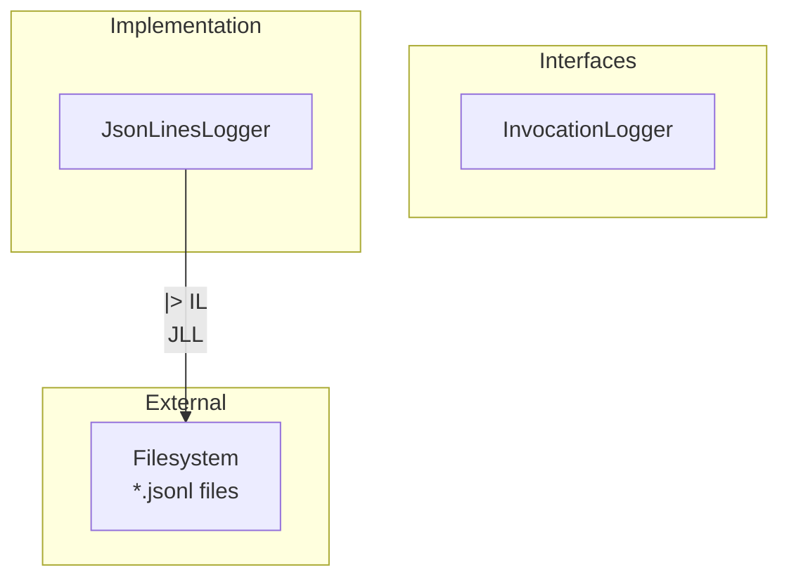
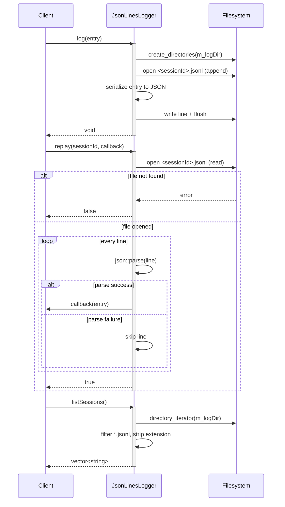

# JsonLinesLogger Spec

## 1. Overview

JsonLinesLogger implements InvocationLogger by writing each LogEntry as a single JSON line to `<logDir>/<sessionId>.jsonl` (append mode). Replay reads the file line-by-line, parses each JSON object, and invokes a user callback. Corrupt lines are silently skipped. The log directory defaults to `"logs"` and is created on first write.

**Dependencies:** filesystem (standard `std::filesystem`), nlohmann/json
**Lifecycle:** Lightweight; directory scan occurs only during `listSessions`.
**Thread-safety:** Not guaranteed – single-threaded use only.

## 2. Component Specifications

```cpp
class JsonLinesLogger : public InvocationLogger {
public:
    /// \param logDir  Directory for JSONL files (created on demand). Defaults to "logs".
    JsonLinesLogger(const std::string& logDir = "logs");

    /// \param entry  LogEntry to persist.
    /// Effects:   Creates m_logDir if missing, appends a JSON line to <logDir>/<sessionId>.jsonl.
    void log(const LogEntry& entry) override;

    /// \param sessionId  Session identifier (also the filename stem).
    /// \param callback   Invoked once per successfully parsed LogEntry.
    /// \retval true   File was opened and read (possibly zero entries).
    /// \retval false  File does not exist or could not be opened.
    bool replay(const std::string& sessionId,
                std::function<void(const LogEntry&)> callback) override;

    /// \returns  Session IDs derived from every *.jsonl file in m_logDir.
    std::vector<std::string> listSessions() const override;

private:
    std::string m_logDir;
};
```

## 3. Architecture Diagram



## 4. Data Flow



## 5. Error Handling

| Scenario | Behaviour |
|----------|-----------|
| Log file cannot be opened (permissions, disk full) | Silent return from `log` (ofstream failure) |
| Replay file does not exist | Returns `false` |
| Corrupt JSON line during replay | Caught by `json::parse` exception handler; line skipped, loop continues |
| `listSessions` with non-existent log dir | Returns empty vector |

## 6. Edge Cases

| Case | Expected Result |
|------|----------------|
| Empty log file | `replay` returns `true`, callback never invoked |
| Very large file (>100 MB) | Streamed line-by-line via `std::getline` – no full-file load |
| Session ID with path separators | Written to `<logDir>/<sessionId>.jsonl` as-is; could create subdirectories |
| Concurrent writes from multiple processes | Unsupported – lines may interleave |
| Missing `sessionId`/`timestamp`/`eventType`/`data` fields in JSON | Default values used (`""` or `0`) via `j.value(key, default)` |

## 7. Testing Requirements

| Method | Test Case | Input | Expected Output |
|--------|-----------|-------|----------------|
| `log` | Basic write | `LogEntry{"s1", 1000, "test", "{}"}` | File `logs/s1.jsonl` created with one JSON line |
| `log` | Log dir creation | Dir missing before call | Directory created, file written |
| `log` | Append mode | Two `log` calls for same session | File contains two lines |
| `replay` | Existing session | Session with one entry | Callback invoked once with matching fields |
| `replay` | Missing session | Non-existent sessionId | Returns `false` |
| `replay` | Corrupt line | File with valid + invalid JSON | Callback invoked once; corrupt line skipped |
| `replay` | Empty file | Zero-length `.jsonl` | Returns `true`, callback never invoked |
| `listSessions` | Multiple files | `a.jsonl`, `b.jsonl` in log dir | `["a", "b"]` |
| `listSessions` | Empty directory | No `.jsonl` files | `[]` |
| `listSessions` | Non-existent dir | `m_logDir` does not exist | `[]` |
