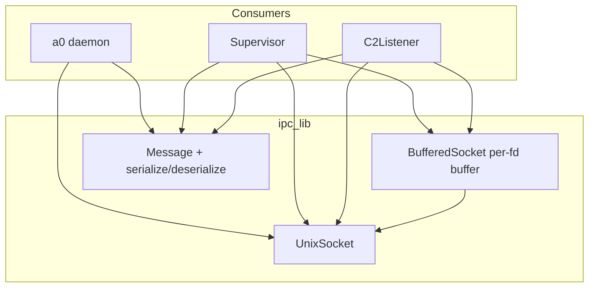
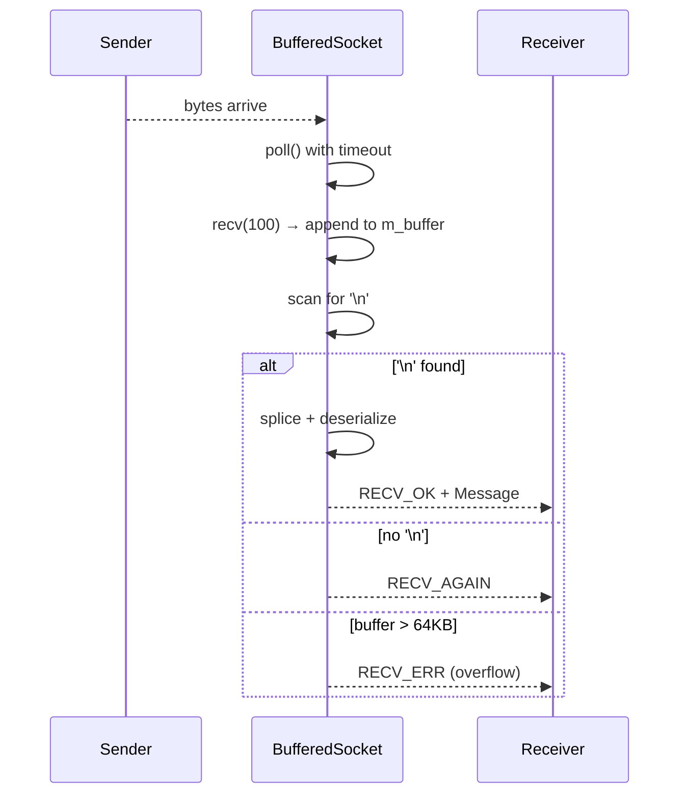

# IPC Protocol Spec

## 1. Overview

Utility library providing Unix domain socket communication and JSON-line message framing for the a0↔b1↔c2 protocol. Includes `UnixSocket` (RAII socket wrapper), `Message` (JSON-line framed protocol message), and `BufferedSocket` (per-connection buffered reader with poll integration).

**Source files:** `src/ipc/unix_socket.h/.cpp`, `src/ipc/ipc_protocol.h/.cpp`

**Dependencies:** POSIX (`socket`, `bind`, `listen`, `accept`, `connect`, `poll`, `send`, `recv`, `unlink`), nlohmann/json

**Namespace:** `a0::ipc`

## 2. Component Specifications

```cpp
namespace a0::ipc {

class UnixSocket {
public:
    UnixSocket();
    explicit UnixSocket(int fd);
    UnixSocket(UnixSocket&&) noexcept;
    UnixSocket& operator=(UnixSocket&&) noexcept;
    UnixSocket(const UnixSocket&) = delete;
    UnixSocket& operator=(const UnixSocket&) = delete;
    ~UnixSocket();

    int bindAndListen(const std::string& socketPath, int backlog = 5);
    int accept(UnixSocket& client);
    int connect(const std::string& socketPath, int timeoutMs = 5000);
    int send(const std::string& data);
    int recv(std::vector<char>& buf, size_t& received);
    int pollReadable(int timeoutMs = -1) const;
    int pollWritable(int timeoutMs = -1) const;
    void close();
    static void unlinkPath(const std::string& socketPath);
    int fd() const;
    bool isOpen() const;
    int release();

private:
    int m_fd = -1;
    int xSetNonBlocking();
    int xCreateSocket();
};

struct Message {
    std::string type;
    int pid = 0;
    std::string sessionUuid;
    std::string workdir;
    std::string hostname;
    nlohmann::json agents;
    std::string status;
    std::string error;
    std::string reason;
    std::string toolCallId;
    std::string prompt;

    int64_t streamId = 0;
    int chunkSeq = 0;
    std::string chunkDirection;
    std::string chunkData;
    std::string terminalId;
    std::string contextType;
    std::string contextId;
    std::string cwd;
};

namespace MessageType {
    constexpr const char* REGISTER      = "register";
    constexpr const char* ACK           = "ack";
    constexpr const char* HEARTBEAT     = "heartbeat";
    constexpr const char* UPDATE        = "update";
    constexpr const char* SHUTDOWN      = "shutdown";
    constexpr const char* USER_PROMPT   = "user_prompt";
    constexpr const char* PROMPT_REPLY  = "prompt_reply";
    constexpr const char* STREAM_DATA   = "stream_data";
    constexpr const char* STREAM_END    = "stream_end";
    constexpr const char* STREAM_INPUT  = "stream_input";
    constexpr const char* TERMINAL_OPEN  = "terminal_open";
    constexpr const char* TERMINAL_READY = "terminal_ready";
}

enum RecvResult { RECV_OK = 0, RECV_AGAIN = 1, RECV_ERR = -1 };

class BufferedSocket {
public:
    BufferedSocket() = default;
    explicit BufferedSocket(int fd);
    ~BufferedSocket();
    BufferedSocket(BufferedSocket&&) noexcept;
    BufferedSocket& operator=(BufferedSocket&&) noexcept;
    BufferedSocket(const BufferedSocket&) = delete;

    int fd() const;
    int release();
    void close();
    int recv(Message& msg, int timeoutMs = 5000);
    int send(const Message& msg);

private:
    int m_fd = -1;
    std::string m_buffer;
    static constexpr size_t READ_CHUNK = 100;
    static constexpr size_t MAX_BUFFER = 65536;
};

std::string serialize(const Message& msg);
int deserialize(const std::string& jsonLine, Message& msg);
int recvMessage(UnixSocket& sock, Message& msg, int timeoutMs = 5000);
int sendMessage(UnixSocket& sock, const Message& msg);

} // namespace a0::ipc
```

## 3. Architecture Diagram



## 4. Data Flow



## 5. Testing Requirements

| Test | Verification |
|------|-------------|
| bindAndListen + accept + connect | Round-trip connect/accept succeeds |
| send/recv round-trip | "hello" → "hello" |
| Message serialize/deserialize | All fields survive round-trip |
| deserialize missing type | Returns -2 |
| BufferedSocket complete message | Single recv returns RECV_OK |
| BufferedSocket fragment without \n | Returns RECV_AGAIN |
| BufferedSocket buffer overflow | 70KB without \n → RECV_ERR |
| recvMessage timeout | Returns -2 |
| UnixSocket move semantics | Source fd becomes -1 |
| UnixSocket release | Returns fd, internal fd becomes -1 |
