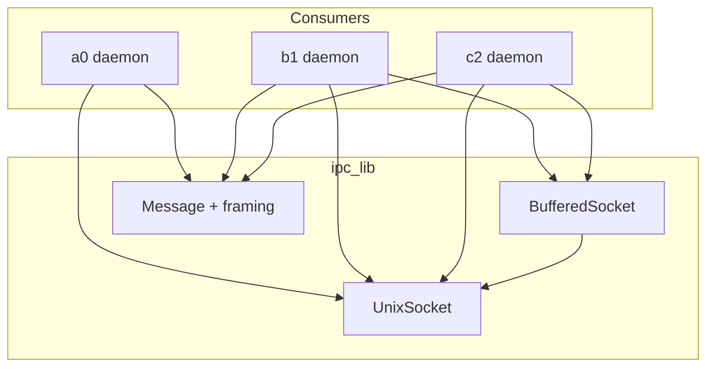
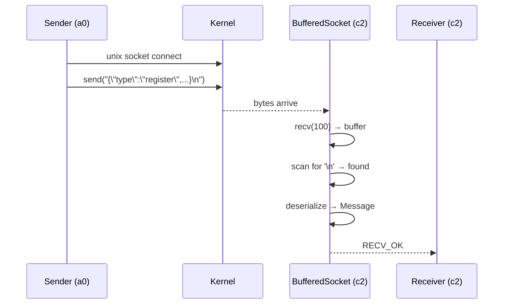

# Technical Specification: IPC Sub-Module

## For a0 Agent — Version 1.0

---

## 1. Overview

The IPC sub-module owns all inter-process communication infrastructure — Unix domain sockets, JSON-line message framing, and BufferedSocket for framed message I/O.

**Source files:**
- `unix_socket.h/.cpp` — Unix domain socket RAII wrapper (bind, listen, accept, connect, send, recv, poll)
- `ipc_protocol.h/.cpp` — JSON-line message framing (Message type, serialize/deserialize, BufferedSocket)
- `app_core_event.capnp` — Cap'n Proto schema (placeholder, future use)

**Dependencies:** `shared_lib`, POSIX sockets, nlohmann/json

**Namespace:** `a0::ipc`

---

## 2. Component Specifications

### 2.1 UnixSocket

See `src/unix_socket.spec.md` for full declaration. Key API:

```cpp
int bindAndListen(const std::string& socketPath, int backlog = 5);
int accept(UnixSocket& client);
int connect(const std::string& socketPath, int timeoutMs = 5000);
int send(const std::string& data);
int recv(std::vector<char>& buf, size_t& received);
int pollReadable(int timeoutMs = -1) const;
int pollWritable(int timeoutMs = -1) const;
void close();
static void unlinkPath(const std::string& socketPath);
```

### 2.2 Message + BufferedSocket

See `src/ipc_protocol.spec.md` for full declaration. Key types:

```cpp
struct Message {
    std::string type;      // "register", "ack", "heartbeat", etc.
    int pid = 0;
    std::string sessionUuid, workdir, hostname, status, error, reason;
    std::string toolCallId, prompt;
    int64_t streamId = 0; int chunkSeq = 0;
    std::string chunkDirection, chunkData, terminalId;
    std::string contextType, contextId, cwd;
};

class BufferedSocket {
    int recv(Message& msg, int timeoutMs = 5000);
    int send(const Message& msg);
};
```

---

## 3. System Architecture



---

## 4. Detailed Data Flow



---

## 5. Visualization

D3 animation not required for sub-module spec — covered by root `technical-specification.md`.

---

## 6. Testing Requirements

| Test File | Tests |
|-----------|-------|
| `test_unix_socket.cpp` | bind/accept/connect round-trip, send/recv, move, close, timeout |
| `test_ipc_protocol.cpp` | Message serialize/deserialize, recvMessage/sendMessage |
| `test_buffered_socket.cpp` | BufferedSocket recv lifecycle, overflow, fragment, back-to-back messages |

---

## 7. CLI Entry Point

No direct CLI entry point. Unix sockets are created internally by daemon processes:

```cmake
add_library(ipc_lib STATIC unix_socket.cpp ipc_protocol.cpp)
target_include_directories(ipc_lib PUBLIC ${CMAKE_CURRENT_SOURCE_DIR})
target_link_libraries(ipc_lib PUBLIC shared_lib)
```
