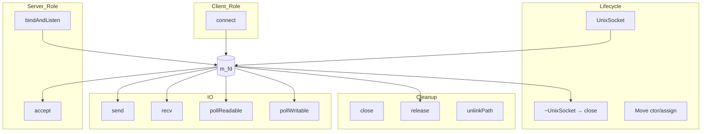
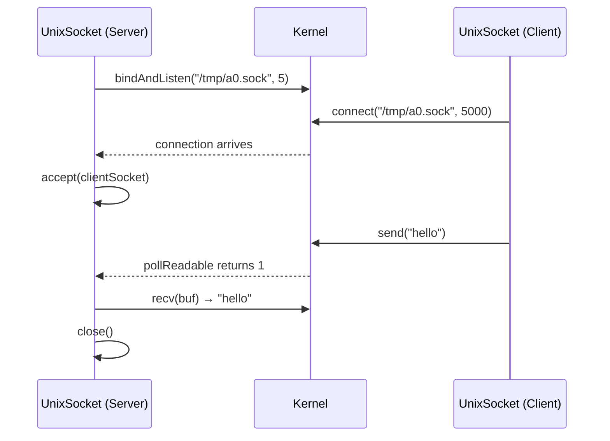

# UnixSocket Spec

## 1. Overview

RAII wrapper around a POSIX `AF_UNIX` (`SOCK_STREAM`) socket file descriptor. Supports both client and server roles: `connect()` for outbound and `bindAndListen()`/`accept()` for inbound. Uses `SOCK_NONBLOCK` for non-blocking I/O and `poll()` for connect timeouts. Move-only semantics with automatic fd cleanup in destructor.

**Source files:** `src/ipc/unix_socket.h/.cpp`

**Dependencies:** POSIX `sys/socket.h`, `sys/un.h`, `poll.h`, `unistd.h`

## 2. Component Specifications

```cpp
namespace a0::ipc {

class UnixSocket {
public:
    UnixSocket();
    explicit UnixSocket(int fd);
    UnixSocket(UnixSocket&&) noexcept;
    UnixSocket& operator=(UnixSocket&&) noexcept;
    UnixSocket(const UnixSocket&) = delete;
    UnixSocket& operator=(const UnixSocket&) = delete;
    ~UnixSocket();

    int bindAndListen(const std::string& socketPath, int backlog = 5);
    int accept(UnixSocket& client);
    int connect(const std::string& socketPath, int timeoutMs = 5000);
    int send(const std::string& data);
    int recv(std::vector<char>& buf, size_t& received);
    int pollReadable(int timeoutMs = -1) const;
    int pollWritable(int timeoutMs = -1) const;
    void close();
    static void unlinkPath(const std::string& socketPath);
    int fd() const;
    bool isOpen() const;
    int release();

private:
    int m_fd = -1;
    int xSetNonBlocking();
    int xCreateSocket();
};

} // namespace a0::ipc
```

## 3. Architecture Diagram



## 4. Data Flow



## 5. Testing Requirements

| Test | Verification |
|------|-------------|
| Create default socket | fd == -1, isOpen() == false |
| bindAndListen | fd >= 0, isOpen() == true |
| connect to listening socket | Returns 0, fd open |
| connect timeout | Returns -1 when no listener |
| accept client | Returns 0, client fd open |
| send/recv round-trip | Data received matches data sent |
| pollReadable with data | Returns 1 |
| pollReadable timeout | Returns 0 |
| Move semantics | Source fd becomes -1, dest takes over |
| release | Returns fd, internal fd becomes -1 |
| close | fd becomes -1, isOpen() false |
| unlinkPath | Removes socket file |
