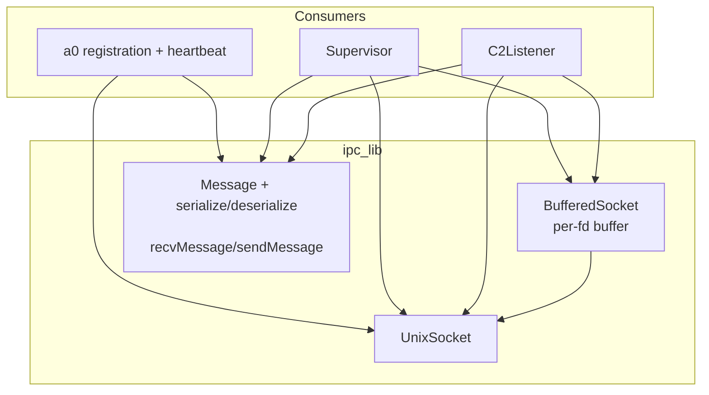
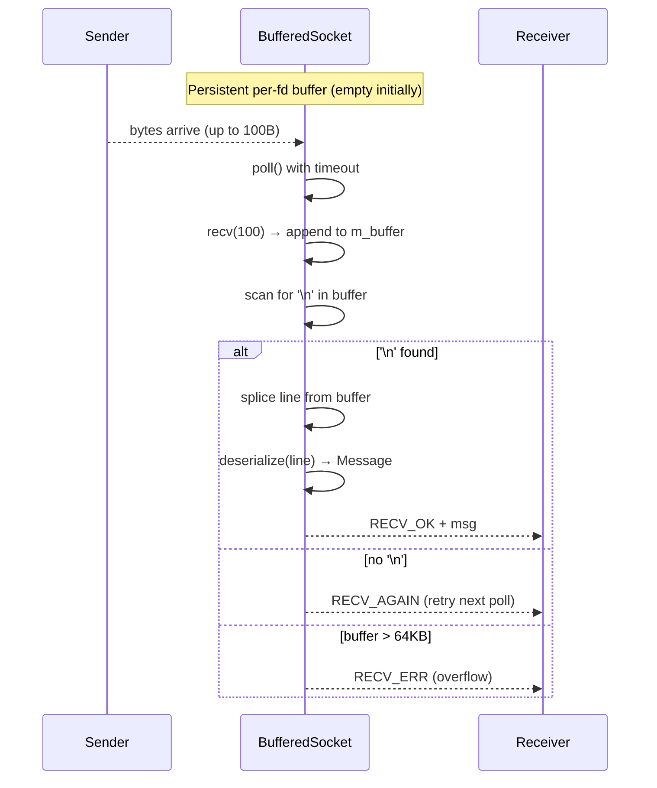

# IPC Protocol Spec

## 1. Overview

Utility library providing Unix domain socket communication and JSON-line message framing for the a0↔b1↔c2 protocol.

**Source files:** `src/ipc_protocol.h/.cpp`, `src/unix_socket.h/.cpp`

**Dependencies:** POSIX (`socket`, `bind`, `listen`, `accept`, `connect`, `poll`, `send`, `recv`, `unlink`), nlohmann/json

**Lifecycle:** Per-connection. `UnixSocket` objects are move-only. Server sockets long-lived; client sockets per-peer.

## 2. Component Specifications

```cpp
namespace a0::ipc {

/// Wrapper around AF_UNIX SOCK_STREAM. Non-blocking I/O via poll(2).
class UnixSocket {
public:
    UnixSocket();
    explicit UnixSocket(int fd);
    UnixSocket(UnixSocket&&) noexcept;
    UnixSocket& operator=(UnixSocket&&) noexcept;
    UnixSocket(const UnixSocket&) = delete;
    UnixSocket& operator=(const UnixSocket&) = delete;
    ~UnixSocket();

    int bindAndListen(const std::string& socketPath, int backlog = 5);
    int accept(UnixSocket& client);
    int connect(const std::string& socketPath, int timeoutMs = 5000);
    int send(const std::string& data);
    int recv(std::vector<char>& buf, size_t& received);
    int pollReadable(int timeoutMs = -1) const;
    int pollWritable(int timeoutMs = -1) const;
    void close();
    static void unlinkPath(const std::string& socketPath);
    int fd() const;
    bool isOpen() const;
    int release();
};

/// A framed JSON-line message from the protocol.
struct Message {
    std::string type;       // "register", "ack", "update", "heartbeat", "shutdown", "user_prompt", "prompt_reply", etc.
    int pid = 0;
    std::string sessionUuid;
    std::string workdir;
    std::string hostname;
    nlohmann::json agents;
    std::string status;
    std::string error;
    std::string reason;
    std::string toolCallId;
    std::string prompt;

    // Streaming fields
    int64_t streamId = 0;
    int chunkSeq = 0;
    std::string chunkDirection;
    std::string chunkData;
    std::string terminalId;
    std::string contextType;
    std::string contextId;
    std::string cwd;
};

/// Canonical message type name constants.
namespace MessageType {
    constexpr const char* REGISTER      = "register";
    constexpr const char* ACK           = "ack";
    constexpr const char* HEARTBEAT     = "heartbeat";
    constexpr const char* UPDATE        = "update";
    constexpr const char* SHUTDOWN      = "shutdown";
    constexpr const char* USER_PROMPT   = "user_prompt";
    constexpr const char* PROMPT_REPLY  = "prompt_reply";
    constexpr const char* STREAM_DATA   = "stream_data";
    constexpr const char* STREAM_END    = "stream_end";
    constexpr const char* STREAM_INPUT  = "stream_input";
    constexpr const char* TERMINAL_OPEN  = "terminal_open";
    constexpr const char* TERMINAL_READY = "terminal_ready";
}

// ============================================================================
// Buffered recv result codes
// ============================================================================

/// Return codes for BufferedSocket::recv().
/// Callers must distinguish RECV_AGAIN (retry next poll) from RECV_ERR (close).
enum RecvResult {
    RECV_OK = 0,      // complete \n-delimited message in msg
    RECV_AGAIN = 1,   // no complete message yet — poll and retry
    RECV_ERR = -1     // fatal error — close connection
};

// ============================================================================
// BufferedSocket — persistent per-connection buffered reader
// ============================================================================

/// Move-only buffered reader that replaces the one-byte-at-a-time recvMessage().
/// Reads up to READ_CHUNK (100) bytes per recv() call, accumulating in a per-fd
/// buffer. Returns RECV_OK when a \n-delimited message is ready, RECV_AGAIN when
/// data arrived but no complete message yet, or RECV_ERR on error/overflow.
class BufferedSocket {
public:
    BufferedSocket() = default;
    explicit BufferedSocket(int fd);
    ~BufferedSocket();
    BufferedSocket(BufferedSocket&&) noexcept;       // clears source
    BufferedSocket& operator=(BufferedSocket&&) noexcept;
    BufferedSocket(const BufferedSocket&) = delete;

    int fd() const;
    int release();              // detach fd without closing
    void close();               // close fd + clear buffer

    /// Read one complete \n-delimited message.
    /// Returns RecvResult: RECV_OK, RECV_AGAIN, or RECV_ERR.
    int recv(Message& msg, int timeoutMs = 5000);

    /// Send a message (delegates to underlying socket send).
    int send(const Message& msg);

private:
    int m_fd = -1;
    std::string m_buffer;               // partial message accumulation
    static constexpr size_t READ_CHUNK = 100;
    static constexpr size_t MAX_BUFFER = 65536;
};

/// Serialize a Message to a JSON-line string (appends \n).
std::string serialize(const Message& msg);

/// Parse a JSON-line string into a Message.
/// \retval 0  Success.
/// \retval -1 Parse error.
/// \retval -2 Missing "type" field.
int deserialize(const std::string& jsonLine, Message& msg);

/// Receive and parse one JSON-line message from a socket.
/// \retval 0  Success.
/// \retval -1 Disconnect or error.
/// \retval -2 Timeout.
int recvMessage(UnixSocket& sock, Message& msg, int timeoutMs = 5000);

/// Serialize and send a message.
/// \retval 0  Sent.
/// \retval -1 Send failed.
int sendMessage(UnixSocket& sock, const Message& msg);

} // namespace a0::ipc
```

## 3. Architecture Diagram



## 4. Data Flow



## 5. Error Handling

| Condition | Behaviour |
|-----------|-----------|
| Socket path exists on bindAndListen | Unlinks first, then binds |
| connect to non-existent path | Returns -1 after timeout |
| send on closed socket | Returns -1 (EPIPE) |
| recv returns 0 bytes (EOF) | Returns -1 — caller treats as disconnect |
| Malformed JSON in deserialize | Returns -1 |
| recvMessage timeout waiting for `\n` | Returns -2, no data consumed |
| recvMessage with missing type | Returns -2 |
| BufferedSocket recv on closed fd | Returns RECV_ERR |
| BufferedSocket recv with partial data | Returns RECV_AGAIN — caller retries |
| BufferedSocket recv buffer overflow (>64KB) | Returns RECV_ERR, buffer cleared |
| BufferedSocket recv invalid JSON | Returns RECV_ERR |
| BufferedSocket send on unconnected | Returns -1 |

## 6. Edge Cases

- **Large message (>1 MB)**: `send` fragments across multiple write calls; `recvMessage` reassembles
- **Multiple concurrent clients**: Server uses poll(2) with one fd per peer
- **Interrupted syscall (EINTR)**: All blocking calls retry internally
- **Stale socket from crash**: bindAndListen calls unlinkPath before bind
- **SOCK_NONBLOCK on connect**: connect returns EINPROGRESS; poll for writable with timeout

## 7. Testing Requirements

| Test | Verification |
|------|-------------|
| bindAndListen + accept + connect | Round-trip connect/accept succeeds |
| send/recv round-trip | "hello" → "hello" |
| send after peer close | Returns -1 |
| connect timeout to non-existent path | Returns -1 |
| Message serialize/deserialize round-trip | All fields survive round-trip, including toolCallId, prompt, streamId, terminalId |
| deserialize missing type | Returns -2 |
| deserialize with streaming fields | streamId, chunkSeq, chunkDirection, chunkData, terminalId parse correctly |
| deserialize with new message types | STREAM_DATA, STREAM_END, TERMINAL_OPEN deserialize without error |
| recvMessage message split across two recvs | Returns 0 after second recv completes line |
| recvMessage timeout | Returns -2 |
| pollWritable returns 1 | Socket is writable |
| BufferedSocket default constructed | fd() == -1 |
| BufferedSocket move transfers ownership | Source fd() == -1 after move |
| BufferedSocket complete message | Single recv() returns RECV_OK with valid Message |
| BufferedSocket message > READ_CHUNK | Accumulates across multiple recv() calls, returns RECV_OK |
| BufferedSocket fragment without \n | Returns RECV_AGAIN, buffer retains partial data |
| BufferedSocket back-to-back messages | Both returned via successive recv() calls (second from buffer, no poll) |
| BufferedSocket buffer overflow | 70KB without \n → returns RECV_ERR |
| BufferedSocket send/recv round-trip | send → recv returns RECV_OK, fields match |
| BufferedSocket caller patterns | prompt_reply, register, update, stream_input — all decode correctly |

All socket tests use `socketpair(AF_UNIX, SOCK_STREAM, 0)` — no filesystem needed.
