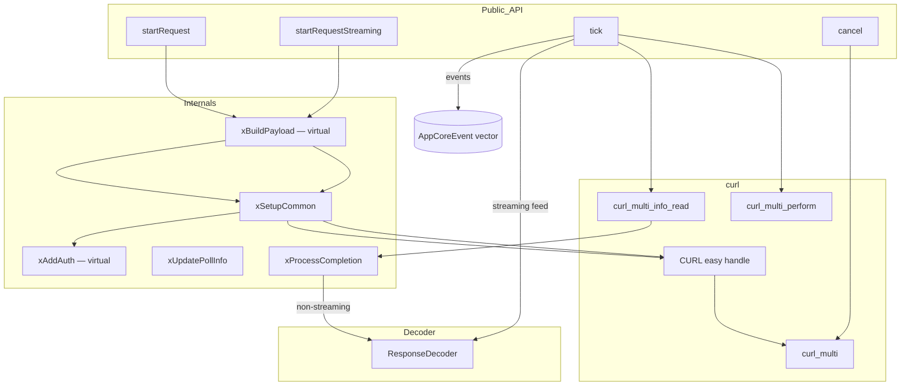

# DrivenProvider Spec

## 1. Overview

Universal async LLM provider using `curl_multi` for non-blocking HTTP requests. Implements the `LlmProvider` interface. Supports both streaming and non-streaming modes. Concrete subclasses provide provider-specific API format and auth via the pure virtual hooks `xBuildPayload()` and `xAddAuth()`.

**Source files:** `src/llm/driven_provider.h/.cpp`

**Dependencies:** `llm/llm_provider.h`, `shared/agent_interfaces.h`, `shared/mpsc.h`, `libcurl`, `nlohmann/json`, `llm/response_decoder.h`

## 2. Component Specifications

```cpp
namespace a0 {

class DrivenProvider : public LlmProvider {
public:
    DrivenProvider(const std::string& apiKey,
                   const std::string& model = "deepseek-chat");
    ~DrivenProvider() override;
    DrivenProvider(const DrivenProvider&) = delete;
    DrivenProvider& operator=(const DrivenProvider&) = delete;
    DrivenProvider(DrivenProvider&&) = delete;
    DrivenProvider& operator=(DrivenProvider&&) = delete;

    void startRequest(const std::string& systemPrompt,
                      const std::vector<Message>& messages,
                      const std::vector<ToolSchema>& tools) override;
    void startRequestStreaming(const std::string& systemPrompt,
                               const std::vector<Message>& messages,
                               const std::vector<ToolSchema>& tools) override;
    std::vector<mpsc::AppCoreEvent> tick() override;
    void cancel() override;
    bool active() const override { return m_active; }
    int timeoutMs() const override;
    void setMockUrl(const std::string& url) override { m_baseUrl = url; }
    const std::string& mockUrl() const { return m_baseUrl; }

protected:
    virtual void xBuildPayload(json& payload,
                               const std::string& systemPrompt,
                               const std::vector<Message>& messages,
                               const std::vector<ToolSchema>& tools,
                               bool stream) const = 0;
    virtual void xAddAuth(curl_slist*& headers) = 0;

    std::string m_apiKey;
    std::string m_model;
    std::string m_baseUrl;

private:
    struct EasyHandle {
        CURL* easy = nullptr;
        curl_slist* headers = nullptr;
        std::string requestBody;
        std::string responseBody;
        bool streaming = false;
        ResponseDecoder decoder;
    };

    CURLM* m_multi = nullptr;
    bool m_active = false;
    EasyHandle m_handle;
    mutable int m_cachedReadFd = -1;
    mutable int m_cachedWriteFd = -1;
    mutable long m_cachedTimeout = -1;

    void xSetupCommon(CURL* curl, curl_slist*& headers, bool streaming);
    void xUpdatePollInfo() const;
    void xProcessCompletion(CURL* easy, CURLcode result,
                            std::vector<mpsc::AppCoreEvent>& out);
};

} // namespace a0
```

## 3. Architecture Diagram



## 4. Data Flow

```mermaid
sequenceDiagram
    participant C as Caller
    participant DP as DrivenProvider
    participant CURL as curl_multi
    participant DEC as ResponseDecoder

    C->>DP: startRequestStreaming(sysPrompt, msgs, tools)
    DP->>DP: xBuildPayload(payload)
    DP->>DP: xSetupCommon(curl, headers)
    DP->>DP: xAddAuth(headers)
    DP->>CURL: curl_multi_add_handle()
    DP-->>C: (returns immediately)

    loop tick cycle
        C->>DP: tick()
        DP->>CURL: curl_multi_wait() — drives async DNS & I/O
        DP->>CURL: curl_multi_perform()
        CURL-->>DP: running handles
        DP->>CURL: curl_multi_info_read()
        CURL-->>DP: CURLMsg (done info)
        DP->>DP: xProcessCompletion()
        alt streaming
            DP->>DEC: feed(responseBody)
            DEC-->>DP: decoder events
        else non-streaming
            DP->>DEC: decodeJson(responseBody)
            DEC-->>DP: decoder events
        end
        DP-->>C: vector&lt;AppCoreEvent&gt;
    end

    C->>DP: cancel()
    DP->>CURL: curl_multi_remove_handle()
    DP->>CURL: curl_easy_cleanup()
```

## 5. Testing Requirements

| Test | Verification |
|------|-------------|
| Non-streaming request completes | HTTP 200, response body decoded into events |
| Streaming request emits tokens | tick() returns events incrementally |
| Cancel in-flight request | active() returns false, no more events |
| HTTP error response | Error event with status code and body |
| Curl transport error | Error event with curl error string |
| timeoutMs() when idle | Returns -1 |
| timeoutMs() when active | Returns curl-derived timeout |
| setMockUrl() changes endpoint | Subsequent requests go to mock URL |
| Multiple startRequest calls | Previous cancelled, new one started |
| SSL skip for localhost | Verification disabled for localhost/127.0.0.1 |
