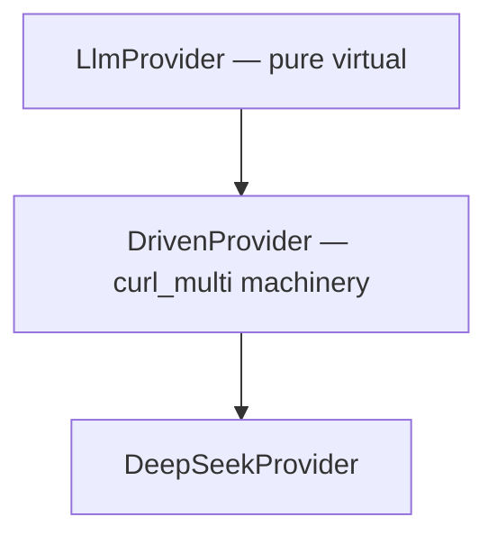

# LlmProvider Spec

## 1. Overview

Abstract async LLM provider interface. Defines the contract that all LLM providers must implement for use with `DrivenCore`. Non-blocking `startRequest()` / `tick()` API designed for event-loop integration.

**Source file:** `src/llm/llm_provider.h`

**Dependencies:** `shared/agent_interfaces.h`, `shared/mpsc.h`

## 2. Component Specifications

```cpp
namespace a0 {

class LlmProvider {
public:
    virtual ~LlmProvider() = default;
    virtual void startRequest(const std::string& systemPrompt,
                              const std::vector<Message>& messages,
                              const std::vector<ToolSchema>& tools) = 0;
    virtual void startRequestStreaming(const std::string& systemPrompt,
                                       const std::vector<Message>& messages,
                                       const std::vector<ToolSchema>& tools) = 0;
    virtual std::vector<mpsc::AppCoreEvent> tick() = 0;
    virtual void cancel() = 0;
    virtual bool active() const = 0;
    virtual int timeoutMs() const = 0;
    virtual void setMockUrl(const std::string& url) = 0;
};

} // namespace a0
```

## 3. Architecture Diagram



## 4. Data Flow

```mermaid
sequenceDiagram
    participant C as DrivenCore
    participant P as LlmProvider
    participant R as ResponseDecoder

    C->>P: startRequestStreaming(sys, msgs, tools)
    P-->>C: (async)

    loop tick()
        C->>P: tick()
        P->>P: drive curl progress
        P->>R: feed(bytes)
        R-->>P: events
        P-->>C: vector&lt;AppCoreEvent&gt;
    end
```

## 5. Testing Requirements

| Test | Verification |
|------|-------------|
| Mock provider returns events | tick() returns pre-programmed AppCoreEvent vector |
| startRequest sets active state | active() returns true |
| cancel resets state | active() returns false after cancel |
| Multiple startRequest calls | Previous implicitly cancelled |
| timeoutMs when idle | Returns -1 |
