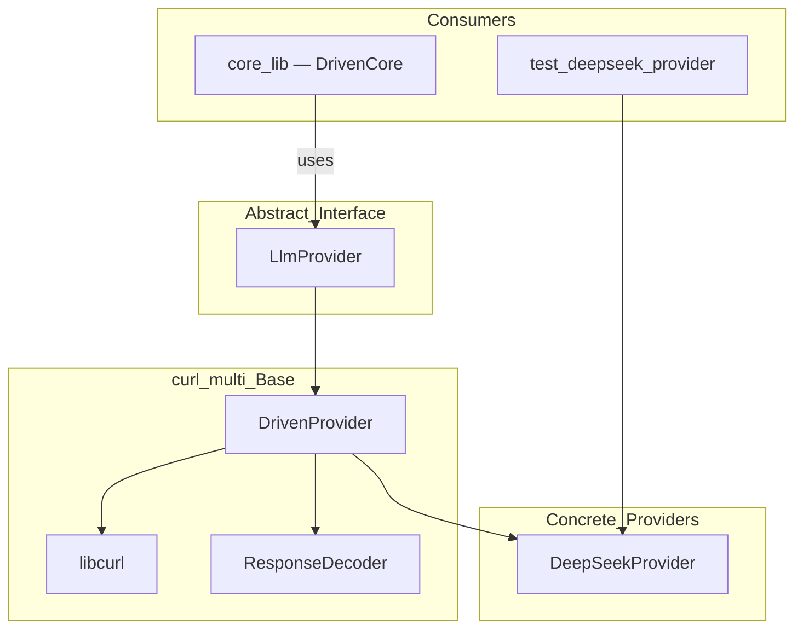
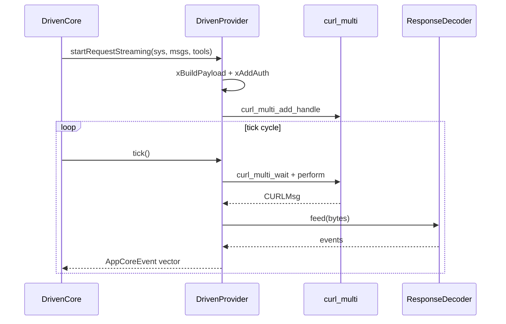

# Technical Specification: LLM Sub-Module

## For a0 Agent — Version 1.0

---

## 1. Overview

The LLM sub-module owns all LLM provider abstractions and implementations. Provides the async `curl_multi`-based provider machinery plus the SSE/JSON response decoder.

**Source files:**
- `llm_provider.h` — abstract async LLM interface (`LlmProvider`)
- `driven_provider.h/.cpp` — `curl_multi` base implementation (`DrivenProvider`)
- `deepseek_provider.h/.cpp` — DeepSeek-specific subclass (`DeepSeekProvider`)
- `response_decoder.h/.cpp` — SSE/JSON response decoder (`ResponseDecoder`)

**Dependencies:** `shared_lib`, `libcurl`, `nlohmann_json`

**Namespace:** `a0`

---

## 2. Component Specifications

### 2.1 LlmProvider (abstract)

```cpp
class LlmProvider {
public:
    virtual ~LlmProvider() = default;
    virtual void startRequest(const std::string& systemPrompt,
                              const std::vector<Message>& messages,
                              const std::vector<ToolSchema>& tools) = 0;
    virtual void startRequestStreaming(const std::string& systemPrompt,
                                       const std::vector<Message>& messages,
                                       const std::vector<ToolSchema>& tools) = 0;
    virtual std::vector<mpsc::AppCoreEvent> tick() = 0;
    virtual void cancel() = 0;
    virtual bool active() const = 0;
    virtual int timeoutMs() const = 0;
    virtual void setMockUrl(const std::string& url) = 0;
};
```

### 2.2 DrivenProvider

```cpp
class DrivenProvider : public LlmProvider {
public:
    DrivenProvider(const std::string& apiKey, const std::string& model = "deepseek-chat");
    // -- LlmProvider impl --
    void startRequest(const std::string&, const std::vector<Message>&, const std::vector<ToolSchema>&) override;
    void startRequestStreaming(const std::string&, const std::vector<Message>&, const std::vector<ToolSchema>&) override;
    std::vector<mpsc::AppCoreEvent> tick() override;
    void cancel() override;
    bool active() const override;
    int timeoutMs() const override;
    void setMockUrl(const std::string& url) override;
    const std::string& mockUrl() const;

protected:
    virtual void xBuildPayload(json&, const std::string&, const std::vector<Message>&,
                               const std::vector<ToolSchema>&, bool) const = 0;
    virtual void xAddAuth(curl_slist*&) = 0;
    std::string m_apiKey, m_model, m_baseUrl;
};
```

### 2.3 DeepSeekProvider

```cpp
class DeepSeekProvider : public DrivenProvider {
public:
    explicit DeepSeekProvider(const std::string& apiKey = "",
                              const std::string& model = "deepseek-chat");
protected:
    void xBuildPayload(json&, const std::string&, const std::vector<Message>&,
                       const std::vector<ToolSchema>&, bool) const override;
    void xAddAuth(curl_slist*&) override;
};
```

### 2.4 ResponseDecoder

```cpp
class ResponseDecoder {
public:
    enum class Mode { Unknown, SSE, JSON };
    explicit ResponseDecoder(ResourceProvider* provider = nullptr, int64_t tokenFlushSize = 256);
    void feed(const char* data, size_t len);
    void feed(const std::string& data);
    std::vector<mpsc::AppCoreEvent> events();
    bool complete() const;
    void reset();
    int64_t streamId() const;
    int roundSeq() const;
    static std::vector<mpsc::AppCoreEvent> decodeJson(const std::string& body);
};
```

See individual `.spec.md` files for full private member declarations: `src/llm_provider.spec.md`, `src/driven_provider.spec.md`, `src/deepseek_provider.spec.md`, `src/response_decoder.spec.md`.

---

## 3. System Architecture



---

## 4. Detailed Data Flow



---

## 5. Visualization

D3 animation not required for sub-module spec — covered by root `technical-specification.md`.

---

## 6. Testing Requirements

| Test File | Tests |
|-----------|-------|
| `test_deepseek_provider.cpp` | DrivenProvider: non-streaming, streaming, cancel, errors |
| `test_driven_core_persistence.cpp` | Integration: DrivenCore + DrivenProvider lifecycle |
| Compile-time | ResponseDecoder: SSE parsing, JSON decoding, mode detection |

---

## 7. CLI Entry Point

No direct CLI entry point. The provider is instantiated in `main.cpp`:

```cpp
auto provider = std::make_unique<a0::DeepSeekProvider>(apiKey, model);
```

```cmake
add_library(llm_lib STATIC
    driven_provider.cpp
    deepseek_provider.cpp
    response_decoder.cpp
)
target_include_directories(llm_lib PUBLIC ${CMAKE_CURRENT_SOURCE_DIR})
target_link_libraries(llm_lib PUBLIC shared_lib CURL::libcurl nlohmann_json::nlohmann_json)
```
