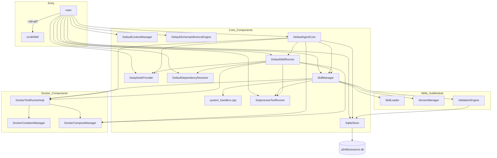
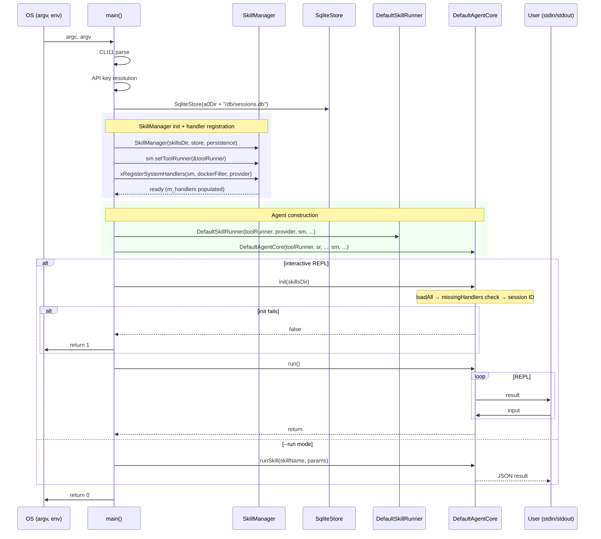

# Main Spec

## 1. Overview

Entry-point module. Parses CLI flags, loads `.env` files, resolves the DeepSeek API key through a priority chain, instantiates all concrete components (skill manager with registered handlers, runners, providers, Docker managers), wires them into `DefaultAgentCore`, and runs the interactive loop.

All C++ tool handlers are registered directly onto `SkillManager` via `xRegisterSystemHandlers()`. `SkillManager` holds `ToolRunner`/`DockerToolRunner` pointers for command-based tool execution.

## 2. Component Specifications

### Handler Registration

```cpp
/// Registers all C++ system tool handlers on SkillManager.
/// Called once during AgentStack construction.
static void xRegisterSystemHandlers(a0::skills::SkillManager& mgr,
                                     a0::DockerSecurityFilter* dockerFilter,
                                     InferenceProvider* provider) {
    // Core handlers: 3-part keys (system:comp:tool)
    mgr.registerHandler("system:bash:bash", [](const json& p) { return a0::xBash(p); });
    mgr.registerHandler("system:fs:read", [](const json& p) { return a0::xRead(p); });
    mgr.registerHandler("system:fs:glob", [](const json& p) { return a0::xGlob(p); });
    mgr.registerHandler("system:fs:grep", [](const json& p) { return a0::xGrep(p); });
    mgr.registerHandler("system:fs:edit", [](const json& p) { return a0::xEdit(p); });
    mgr.registerHandler("system:fs:write", [](const json& p) { return a0::xWrite(p); });

    // Git wildcard: any "system:git:<subcmd>" routes through xGitCommand
    mgr.registerHandler("system:git:*", [](const json& p) {
        return a0::xGitCommand(p.value("_subcommand", ""), p);
    });

    // Docker wildcard
    mgr.registerHandler("system:docker:*", [dockerFilter](const json& p) {
        return a0::xDockerCommand(p.value("_subcommand", ""), p, dockerFilter);
    });

    // Docker compose wildcard
    mgr.registerHandler("system:docker_compose:*", [](const json& p) {
        return a0::xDockerComposeCommand(p.value("_subcommand", ""), p);
    });

    // Meta handlers (capture SkillManager + InferenceProvider)
    mgr.registerHandler("system:meta:show_skills", [&mgr](const json& p) {
        return a0::xShowSkills(p, &mgr);
    });
    mgr.registerHandler("system:meta:show_skill_tools", [&mgr](const json& p) {
        return a0::xShowSkillTools(p, &mgr);
    });
    mgr.registerHandler("system:meta:tools_for_prompt", [&mgr, provider](const json& p) {
        return a0::xToolsForPrompt(p, &mgr, provider);
    });
}
```

### `main`

```cpp
int main(int argc, char* argv[]);

// Flag parsing uses CLI11.hpp.
// Wire-up order (no SystemToolRegistry):
//   1. SqliteStore(a0Dir + "/db/sessions.db")
//   2. SkillManager(skillsDir, a0Dir + "/store", &persistence)
//   3. SubprocessToolRunner, DeepSeekProvider, etc.
//   4. skillMgr.setToolRunner(&toolRunner)
//      skillMgr.setDockerRunner(dockerRunner)
//      skillMgr.setDockerSecurityFilter(&dockerFilter)
//   5. xRegisterSystemHandlers(skillMgr, &dockerFilter, &provider)
//   6. DefaultSkillRunner(toolRunner, provider, &skillMgr, ...)
//   7. DefaultAgentCore(toolRunner, skillRunner, ..., &skillMgr, ...)
```

## 3. AgentStack

```cpp
struct AgentStack {
    a0::persistence::SqliteStore persistence;
    a0::skills::SkillManager skillMgr;       // holds m_handlers + runners
    SubprocessToolRunner toolRunner;
    DeepSeekProvider provider;
    DefaultContextManager context;
    DefaultDependencyResolver depResolver;
    DefaultSchemaInferenceEngine inferenceEngine;
    a0::docker::DockerContainerManager* containerMgr;
    a0::docker::DockerComposeManager* composeMgr;
    a0::docker::DockerToolRunnerImpl* dockerRunner;
    a0::DockerSecurityFilter dockerFilter;
    DefaultSkillRunner* skillRunner;
    DefaultAgentCore* core;

    // Constructor wire-up:
    //   skillMgr.setToolRunner(&toolRunner)
    //   skillMgr.setDockerRunner(dockerRunner)
    //   xRegisterSystemHandlers(skillMgr, ...)
    //   skillRunner → DefaultSkillRunner(toolRunner, provider, skillMgr, ...)
    //   core → DefaultAgentCore(toolRunner, skillRunner, ..., skillMgr, ...)
};
```

## 4. Architecture Diagram



## 5. Data Flow



## 6. Error Handling

| Error Condition | Signal | Notes |
|---|---|---|
| `loadEnvFile` file not found | Silent return | Env file is optional |
| CLI11 parse failure | Prints error, `return 1` | |
| `core.init` fails | Prints error, `return 1` | Includes missingHandler diagnostics |
| API key not found | Provider constructs with empty key | Runtime inference failure |
| `SkillManager::init` with missing handler | Fatal — prints all missing, returns false | Must register in xRegisterSystemHandlers |
| cmdKillAll no PID files | No-op, returns 0 | |
| `skillsDir` does not exist | `loadAll` returns -1, exit 1 | |

## 7. Testing Requirements

| Method | Test Case |
|--------|-----------|
| `loadEnvFile` | Valid file, missing file, malformed line, comment lines, duplicate keys |
| `killByPidFile` | Valid PID, stale PID, missing file |
| `xRegisterSystemHandlers` | All core handlers registered | Every handler listed in the function is present in m_handlers |
| `xRegisterSystemHandlers` | Wildcard handlers | `system:git:*`, `system:docker:*`, `system:docker_compose:*` registered |
| `main` (integration) | No flags, all flags, `--no-docker`, `--resume`, missing API key, init failure |
| `main` (--kill-all) | `a0 --kill-all` → cmdKillAll called, b1/c2 cleaned up |
| `main` (--run mode) | `a0 --run system:test --params '{}'` → skill executed, JSON printed |
| `main` (init with missing handler) | System tool without registerHandler → error printed, exit 1 |
