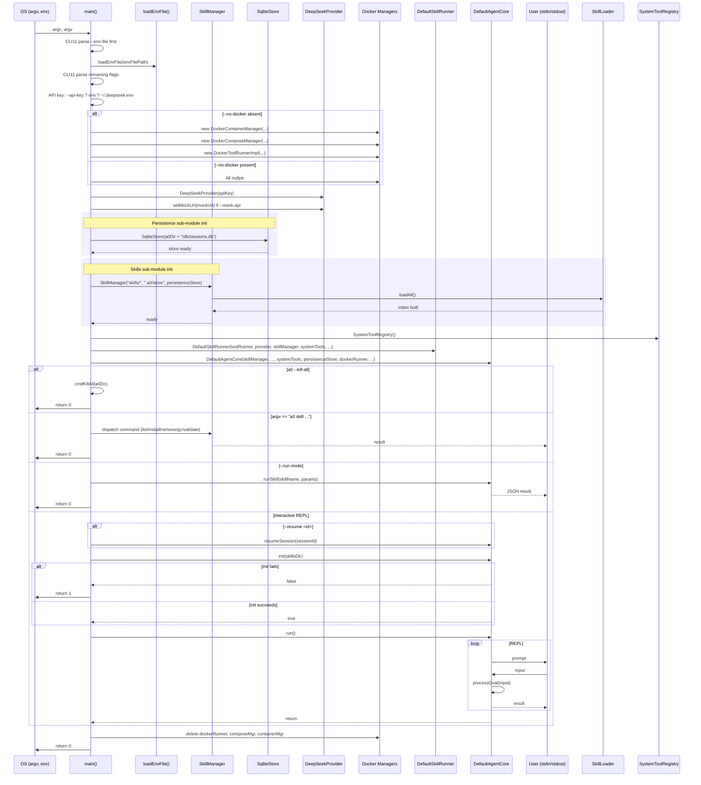

# Main Spec

## 1. Overview
Entry-point module. Parses CLI flags in two passes, loads `.env` files, resolves the DeepSeek API key through a priority chain, instantiates all concrete components (registry, providers, runners, Docker managers), wires them into `DefaultAgentCore`, and runs the interactive loop.

## 2. Component Specifications

### `loadEnvFile`
```cpp
/**
 * @param path Path to a .env file
 * Reads lines in KEY=VALUE format, skips empty/comment (#) lines.
 * Calls setenv(KEY, VALUE, 1) for each valid pair.
 * Silently returns if the file cannot be opened.
 */
static void loadEnvFile(const std::string& path);
```

### `killByPidFile`
```cpp
/**
 * @param path Path to a PID file
 * Reads PID, sends SIGTERM, polls 10×100ms, then SIGKILL if alive.
 * Unlinks the PID file on completion.
 */
static void killByPidFile(const std::string& path);
```

### `xC2SocketFromProc`
```cpp
/**
 * @param pid Process ID of a c2 instance
 * @return The --socket argument from /proc/<pid>/cmdline, or empty.
 */
static std::string xC2SocketFromProc(int pid);
```

### `killByProcessName`
```cpp
/**
 * @param name       Process name to kill (e.g. "c2", "b1")
 * @param outSockets Optional: collects c2 socket paths found via cmdline
 * @return Number of processes killed
 */
static int killByProcessName(const std::string& name,
                              std::vector<std::string>* outSockets = nullptr);
```

### `cmdKillAll`
```cpp
/**
 * Kills b1, c2 processes and unlinks sockets.
 * @param a0Dir Path to .a0/ directory
 * @return 0
 */
static int cmdKillAll(const std::string& a0Dir);
```

### `main`
```cpp
/**
 * Entry point.
 * @param argc Argument count
 * @param argv Argument vector
 * @retval 0  Normal exit
 * @retval 1  Component initialization failure
 *
 * Flag parsing uses CLI11.hpp instead of manual argv scanning.
 * Two-pass: extract --env-file, then parse with CLI11.
 *
 * .a0/ initialization:
 *   After flag parsing, ensureA0Dir(a0Dir) creates the directory if missing.
 *   On first creation, if CWD is a git repo, appends ".a0/" to .gitignore.
 *   All non-committed agent artifacts (b1 socket/pid, SQLite DB, store, logs)
 *   are scoped under this directory.
 *
 * API key resolution order:
 *   1. --api-key CLI flag
 *   2. DEEPSEEK_API_KEY env var (from env or .env)
 *   3. ~/.deepseek.env file
 *
 * Docker conditional on --no-docker flag:
 *   - present: dockerRunner and composeMgr remain nullptr
 *   - absent:  DockerContainerManager, DockerComposeManager,
 *              DockerToolRunnerImpl allocated
 *
 * Wire-up order (no InvocationLogger — logging via PersistenceStore):
 *   SkillManager (with PersistenceStore*), SqliteStore,
 *   toolRunner, provider, context,
 *   depResolver, inferenceEngine, systemTools, skillRunner → DefaultAgentCore
 *
 * --kill-all flag:
 *   Calls cmdKillAll() which does:
 *   killByPidFile(b1.pid) + killByPidFile(c2.pid) +
 *   killByProcessName("c2") + killByProcessName("b1") +
 *   unlink b1.sock + unlink c2 socket + unlink c2.pid
 *
 * b1 auto-launch:
 *   Resolves binary path via readlink(/proc/self/exe) → finds b1
 *   in same directory. Forks, calls setsid() to detach from terminal,
 *   then execlp(b1Path, ...). No PATH dependency.
 *
 * CLI subcommand routing:
 *   "a0 skill list/install/remove/gc/validate/pin" → SkillManager methods
 *   "a0 --run <skill>" → non-interactive skill execution
 *   Other arguments → interactive REPL via AgentCore.run()
 *
 * Post-init: resume session if --resume given,
 *            then call core.run() (interactive REPL).
 * Cleanup: delete Docker objects in reverse order.
 *
 * Wire-up detail:
 *   SkillManager constructed with a0Dir + "/store", PersistenceStore*
 *   SqliteStore at a0Dir + "/db/sessions.db"
 *   SkillManager::loadAll() called during init
 *   DefaultAgentCore receives SkillManager* + PersistenceStore*
 */
int main(int argc, char* argv[]);
```

## 3. Architecture Diagram

```mermaid
graph TB
    subgraph Entry
        M[main]
        LF[loadEnvFile]
        KP[killByPidFile]
        KPN[killByProcessName]
        KA[cmdKillAll]
    end

    subgraph Core_Components
        SM[SkillManager]              # Skills sub-module facade
        TR[SubprocessToolRunner]
        DP[DeepSeekProvider]
        CM[DefaultContextManager]
        PS[SqliteStore]               # Persistence via SQLite
        DR[DefaultDependencyResolver]
        IE[DefaultSchemaInferenceEngine]
        SR[DefaultSkillRunner]
        ST[SystemToolRegistry]
        CORE[DefaultAgentCore]
    end

    subgraph Skills_SubModule
        SL[SkillLoader]
        VM[VersionManager]
        VE[ValidationEngine]
    end

    subgraph Persistence_SubModule
        BI[BuildIdentity]
        RE[ReplayEngine]
    end

    subgraph Docker_Components
        DCM[DockerContainerManager]
        DCoM[DockerComposeManager]
        DTR[DockerToolRunnerImpl]
    end

    subgraph Config
        ENV[.env file]
        HOMEENV[~/.deepseek.env]
        CLI[argv flags]
    end

    M -->|first pass| CLI
    M -->|--env-file| ENV
    M -->|--api-key / env / ~/.deepseek.env| DP
    M -->|--kill-all?| KA
    M -->|--no-docker?| DCM
    M -->|--no-docker?| DCoM
    M -->|--no-docker?| DTR
    M -->|a0 skill ...| SM

    M --> SM
    M --> TR
    M --> DP
    M --> CM
    M --> PS
    M --> DR
    M --> IE
    M --> SR
    M --> ST
    M --> CORE

    SM --> SL
    SM --> VM
    SM --> VE
    VE --> PS

    SR --> TR
    SR --> DP
    SR --> SM
    SR --> DR
    SR --> ST
    SR --> DTR
    SR --> DCoM

    CORE --> SM
    CORE --> TR
    CORE --> SR
    CORE --> DP
    CORE --> CM
    CORE --> PS
    CORE --> DR
    CORE --> IE
    CORE --> ST
    CORE --> DTR
    CORE --> DCoM

    DTR --> DCM
    DTR --> DCoM

    PS --> DB[(.a0/db/sessions.db)]

    CLI --> LF
    LF --> ENV
    LF --> HOMEENV
```

## 4. Data Flow



## 5. Error Handling

| Error Condition | Signal | Notes |
|---|---|---|
| `loadEnvFile` file not found | Silent return | Not an error — env file is optional |
| `.env` parse error (no `=`) | Line skipped | Malformed lines silently ignored |
| CLI11 parse failure | Prints error, `return 1` | CLI11 handles error messaging |
| `core.init` fails | Prints error to `cerr`, `return 1` | |
| Docker init with no Docker daemon | Likely throws in constructor | Propagates uncaught |
| API key not found anywhere | Provider constructs with empty key | Runtime inference failure |
| cmdKillAll no PID files | No-op, returns 0 | Graceful if b1/c2 not running |
| killByProcessName process not found | Returns 0 | No error printed |
| SkillManager::loadAll fails | Prints error, `return 1` | Fatal — skills directory required |

## 6. Edge Cases

| Edge Case | Behavior |
|---|---|
| No `--env-file` flag | Defaults to `.env` in CWD |
| `--env-file` specified twice | Second value wins |
| Both `--api-key` and `DEEPSEEK_API_KEY` env | CLI flag takes priority |
| `--no-docker` combined with Docker-requiring tools | `dockerRunner` is `nullptr`; `SkillRunner` must handle |
| `--resume` with invalid session ID | `resumeSession` returns `false`, continues with fresh session |
| No flags at all | All defaults: `.env`, `./skills`, no Docker constraints |
| `skillsDir` does not exist | `SkillManager::loadAll` returns -1, program exits with 1 |
| `a0 skill install` with no args | Prints usage, exits cleanly |
| `a0 skill install` validation fails | Prints failure report, exits 1, no files changed |
| `a0 skill list` with installed skills | Prints table of all namespaces |
| Empty `.env` file | No environment variables set, no error |
| `--container-idle-timeout` set to non-numeric string | Defaults to 300 |

## 7. Testing Requirements

| Method | Test Case |
|---|---|
| `loadEnvFile` | Valid file, missing file, malformed line, comment lines, duplicate keys |
| `killByPidFile` | Valid PID, stale PID, missing file, process refuses SIGTERM → SIGKILL |
| `killByProcessName` | Process running, process not running, c2 with --socket flag |
| `xC2SocketFromProc` | c2 with --socket arg, c2 without, non-existent PID |
| `cmdKillAll` | b1+c2 running, nothing running, stale sockets |
| `main` (integration) | No flags, all flags, `--no-docker`, `--resume` valid, `--resume` invalid, missing API key, Docker unavailable, init failure |
| `main` (--kill-all) | `a0 --kill-all` → cmdKillAll called, b1/c2 cleaned up |
| `main` (--run mode) | `a0 --run system:test --params '{}'` → skill executed, JSON printed |
| `main` (`a0 skill` routing) | `a0 skill list` → SkillManager::listSkills called, output printed |
| `main` (`a0 skill` install) | `a0 skill install https://github.com/alice/utils` → install flow executed |
| `main` (`a0 skill` validation fail) | Install fails validation → error message printed, exit 1 |
| `main` (SkillManager init fail) | `skills/` directory missing → exit 1 |
