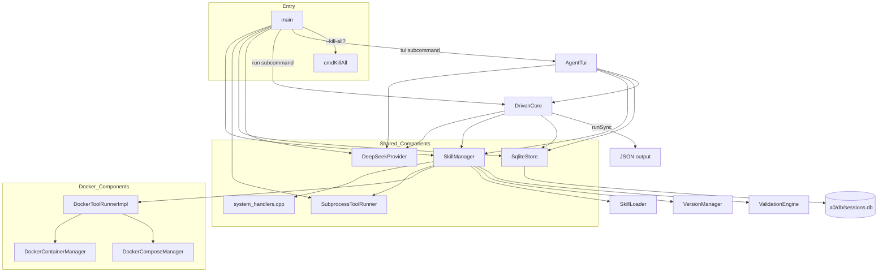
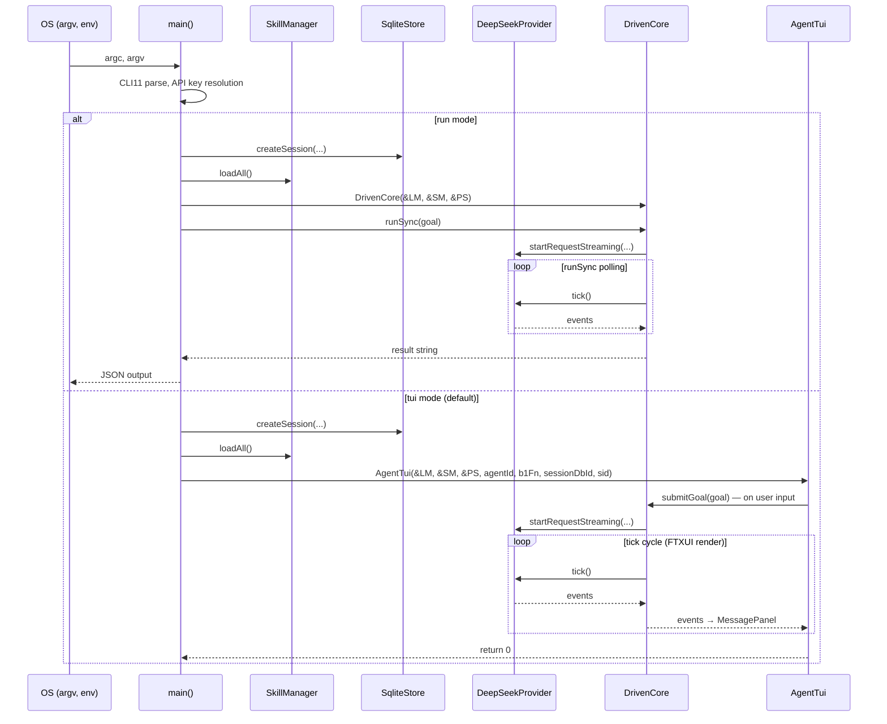

# Main Spec

## 1. Overview

Entry-point module. Parses CLI flags, loads `.env` files, resolves the DeepSeek API key through a priority chain, instantiates all concrete components (skill manager with registered handlers, runners, LLM provider, Docker managers), and runs the interactive TUI or headless run loop. Both paths share `DrivenCore` — the `cmdRun` path uses `runSync()`, the `cmdTui` path uses `tick()` from the FTXUI render loop.

All C++ tool handlers are registered directly onto `SkillManager` via `xRegisterSystemHandlers()`. No `InferenceProvider` is passed — `tools_for_prompt` has been removed.

## 2. Component Specifications

### Handler Registration

```cpp
/// Registers all C++ system tool handlers on SkillManager.
/// No longer takes InferenceProvider* — tools_for_prompt is removed.
static void xRegisterSystemHandlers(a0::skills::SkillManager& mgr) {
    mgr.registerHandler("system-bash-bash", ...);
    mgr.registerHandler("system-fs-read", ...);
    mgr.registerHandler("system-fs-glob", ...);
    mgr.registerHandler("system-fs-grep", ...);
    mgr.registerHandler("system-fs-edit", ...);
    mgr.registerHandler("system-fs-write", ...);

    // Git wildcard
    mgr.registerHandler("system-git-*", ...);

    // Meta handlers (SkillManager only — no InferenceProvider)
    mgr.registerHandler("system-meta-show_skills", ...);
    mgr.registerHandler("system-meta-show_skill_tools", ...);
    // NOTE: system-meta-tools_for_prompt was removed.
    // The function body remains in system_handlers.cpp as reference.
}
```

### `main`

```cpp
int main(int argc, char* argv[]);
```

Wire-up order:
1. `SqliteStore(a0Dir + "/db/sessions.db")`
2. `SkillManager(skillsDir, a0Dir + "/store", &persistence)`
3. `DeepSeekProvider(apiKey)` (new subclass of `DrivenProvider : LlmProvider`)
4. `SubprocessToolRunner`, Docker managers
5. `skillMgr.setToolRunner(&toolRunner)`
6. `xRegisterSystemHandlers(skillMgr)` — no `InferenceProvider*` argument
7. `skillMgr.loadAll()`
8. Session creation via `persistence.createSession()`
9. `DrivenCore(&llmProvider, &skillMgr, &persistence)`

## 3. AgentStack

```cpp
struct AgentStack {
    a0::persistence::SqliteStore persistence;
    a0::skills::SkillManager skillMgr;
    SubprocessToolRunner toolRunner;
    a0::DeepSeekProvider llmProvider;

    a0::docker::DockerContainerManager* containerMgr = nullptr;
    a0::docker::DockerComposeManager* composeMgr = nullptr;
    a0::docker::DockerToolRunnerImpl* dockerRunner = nullptr;
    a0::DockerSecurityFilter dockerFilter;

    // No more: DefaultContextManager, DefaultDependencyResolver,
    //           DefaultSkillRunner*, DefaultAgentCore*
};
```

## 4. Architecture Diagram



## 5. Data Flow



## 6. Error Handling

| Error Condition | Behaviour |
|---|---|
| `loadEnvFile` file not found | Silent return |
| CLI11 parse failure | Prints error, exit 1 |
| `skillMgr.loadAll` fails | Prints error, exit 1 |
| API key not found | Provider constructs with empty key (runtime inference failure) |
| `cmdRun` with skillName | Stub error: "not yet implemented in driven_core path" |
| TUI mode without b1 | b1 launch skipped if `--no-b1` flag set |

## 7. Testing Requirements

| Test | Verification |
|------|-------------|
| `xRegisterSystemHandlers` | All core handlers registered with hyphen-separated keys |
| `xRegisterSystemHandlers` | No `InferenceProvider*` parameter |
| `xRegisterSystemHandlers` | `system-meta-tools_for_prompt` NOT registered |
| `AgentStack` construction | Succeeds with `DeepSeekProvider`, no `AgentCore`/`SkillRunner` |
| `cmdRun` with prompt | `DrivenCore::runSync()` called, JSON output produced |
| `cmdRun` with skill | Exits with error message (stub) |
| `cmdTui` session passing | `sessionDbId` + `sessionUuid` passed to `AgentTui` constructor |
| `cmdTui` mockUrl | `tui.setMockUrl(mockUrl)` forwards to `LlmProvider` |
