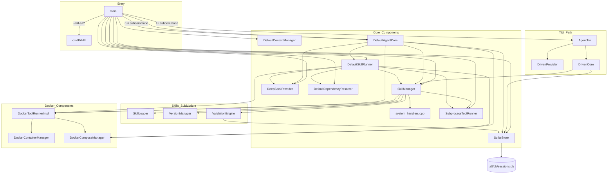
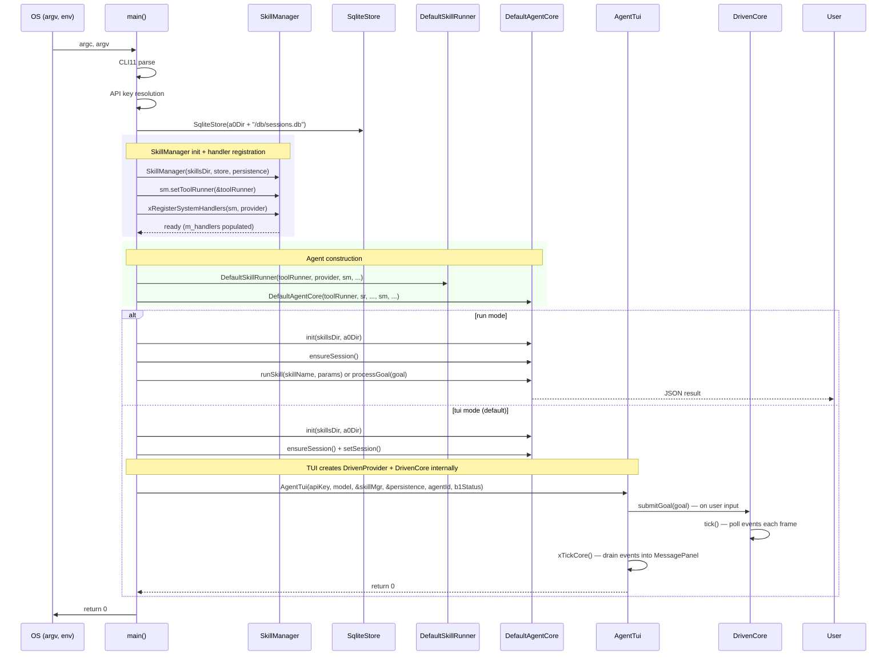

# Main Spec

## 1. Overview

Entry-point module. Parses CLI flags, loads `.env` files, resolves the DeepSeek API key through a priority chain, instantiates all concrete components (skill manager with registered handlers, runners, providers, Docker managers), wires them into `DefaultAgentCore`, and runs the interactive TUI or headless run loop.

All C++ tool handlers are registered directly onto `SkillManager` via `xRegisterSystemHandlers()`. `SkillManager` holds `ToolRunner`/`DockerToolRunner` pointers for command-based tool execution.

The TUI path (`cmdTui`) creates an `AgentStack` for shared infra but then constructs `AgentTui` directly with `DrivenProvider`/`DrivenCore`, bypassing `DefaultAgentCore` for the interactive loop. The headless `cmdRun` path uses `DefaultAgentCore` directly.

## 2. Component Specifications

### Handler Registration

```cpp
/// Registers all C++ system tool handlers on SkillManager.
/// Called once during AgentStack construction.
/// Handler keys use hyphen-separated format: system-<comp>-<tool>.
static void xRegisterSystemHandlers(a0::skills::SkillManager& mgr,
                                     InferenceProvider* provider) {
    // Core handlers: hyphen-separated 3-part keys (system-<comp>-<tool>)
    mgr.registerHandler("system-bash-bash", [](const json& p, const a0::skills::HandlerContext&) { return a0::xBash(p); });
    mgr.registerHandler("system-fs-read", [](const json& p, const a0::skills::HandlerContext&) { return a0::xRead(p); });
    mgr.registerHandler("system-fs-glob", [](const json& p, const a0::skills::HandlerContext&) { return a0::xGlob(p); });
    mgr.registerHandler("system-fs-grep", [](const json& p, const a0::skills::HandlerContext&) { return a0::xGrep(p); });
    mgr.registerHandler("system-fs-edit", [](const json& p, const a0::skills::HandlerContext&) { return a0::xEdit(p); });
    mgr.registerHandler("system-fs-write", [](const json& p, const a0::skills::HandlerContext&) { return a0::xWrite(p); });

    // Git wildcard: ctx.subcommand provides the resolved CLI subcommand
    mgr.registerHandler("system-git-*", [](const json& p, const a0::skills::HandlerContext& ctx) {
        return a0::xGitCommand(ctx.subcommand, p);
    });

    // Meta handlers (capture SkillManager + InferenceProvider)
    mgr.registerHandler("system-meta-show_skills", [&mgr](const json& p, const a0::skills::HandlerContext&) {
        return a0::xShowSkills(p, &mgr);
    });
    mgr.registerHandler("system-meta-show_skill_tools", [&mgr](const json& p, const a0::skills::HandlerContext&) {
        return a0::xShowSkillTools(p, &mgr);
    });
    mgr.registerHandler("system-meta-tools_for_prompt", [&mgr, provider](const json& p, const a0::skills::HandlerContext&) {
        return a0::xToolsForPrompt(p, &mgr, provider);
    });
}
```

### `main`

```cpp
int main(int argc, char* argv[]);

// Flag parsing uses CLI11.hpp.
// New flags:
//   --max-parallel <n>       Max concurrent tool executions (default 4)
//   --external-repo <url>    External a0 repo URL for self-development scripts
//   --skill-arg <key=val>    Repeatable: skill argument key=value pairs
//   --log-file <path>        Redirect stderr to file; child daemons derive own path
//
// Terminal subcommand flags:
//   a0 [--a0-dir <dir>] [--log-file <path>] terminal --terminal-id <id> --cwd <path>
//   --terminal-id <id>       Terminal identifier for c2 stream lookup
//   --cwd <path>             Working directory for the terminal shell (chdir before PTY)

// Wire-up order (no SystemToolRegistry):
//   1. SqliteStore(a0Dir + "/db/sessions.db")
//   2. SkillManager(skillsDir, a0Dir + "/store", &persistence)
//   3. SubprocessToolRunner, DeepSeekProvider, etc.
//   4. skillMgr.setToolRunner(&toolRunner)
//      if (dockerRunner) skillMgr.setDockerRunner(dockerRunner)
//   5. xRegisterSystemHandlers(skillMgr, &provider)  // no DockerSecurityFilter arg
//   6. DefaultSkillRunner(toolRunner, provider, &skillMgr, ...)
//      skillRunner.setMaxParallel(maxParallel)
//   7. DefaultAgentCore(toolRunner, skillRunner, ..., &skillMgr, ...)
//      core.setMaxParallel(maxParallel)
//      core.setExternalRepo(externalRepo)
//   8. core.init(skillsDir, a0Dir)
//      core.ensureSession() + core.sessionDbId() + core.setSession()
//
// TUI path (cmdTui) additionally:
//   - Creates AgentTui(apiKey, model, &skillMgr, &persistence, agentId, b1Status)
//   - AgentTui constructs DrivenProvider + DrivenCore internally
//   - No DefaultAgentCore used for TUI rendering loop
```

## 3. Log File Propagation

### Helper

```cpp
static std::string xChildLog(const std::string& parentLog, const std::string& suffix) {
    if (parentLog.empty()) return "";
    auto dot = parentLog.rfind('.');
    return (dot != std::string::npos)
        ? parentLog.substr(0, dot) + "-" + suffix + parentLog.substr(dot)
        : parentLog + "-" + suffix;
}
```

`xChildLog("/tmp/c2-e2e.log", "a0")` → `"/tmp/c2-e2e-a0.log"`

### Propagation Chain

```
c2 --log-file /tmp/c2-e2e.log
  └── forks a0 terminal with --log-file /tmp/c2-e2e-a0.log
        └── a0 forks b1 with --log-file /tmp/c2-e2e-a0-b1.log
```

When `cmdTerminal` launches b1, it checks whether a parent `--log-file` was set. If so, it derives the b1 log path and passes it as `--log-file` to the b1 executable. The REPL mode b1 launch follows the same derivation.

## 4. AgentStack

```cpp
struct AgentStack {
    a0::persistence::SqliteStore persistence;
    a0::skills::SkillManager skillMgr;       // holds m_handlers + runners + m_toolState
    SubprocessToolRunner toolRunner;
    DeepSeekProvider provider;
    DefaultContextManager context;
    DefaultDependencyResolver depResolver;

    a0::docker::DockerContainerManager* containerMgr = nullptr;
    a0::docker::DockerComposeManager* composeMgr = nullptr;
    a0::docker::DockerToolRunnerImpl* dockerRunner = nullptr;
    a0::DockerSecurityFilter dockerFilter;
    DefaultSkillRunner* skillRunner = nullptr;
    DefaultAgentCore* core = nullptr;

    // Constructor:
    //   AgentStack(a0Dir, skillsDir, apiKey, mockUrl, noDocker, noContainerPool,
    //              idleTimeoutStr, maxIdleStr, defaultImage,
    //              maxParallel=4, externalRepo="https://github.com/opensassi/a0")
    //
    // Wire-up:
    //   provider.setMockUrl(mockUrl)
    //   skillMgr.setToolRunner(&toolRunner)
    //   if (dockerRunner) skillMgr.setDockerRunner(dockerRunner)
    //   xRegisterSystemHandlers(skillMgr, &provider)  // no DockerSecurityFilter
    //   skillRunner → DefaultSkillRunner(toolRunner, provider, &skillMgr, ...)
    //   skillRunner.setMaxParallel(maxParallel)
    //   core → DefaultAgentCore(toolRunner, skillRunner, ..., &skillMgr, ...)
    //   core.setMaxParallel(maxParallel)
    //   core.setExternalRepo(externalRepo)
    //   skillRunner.setSkillsDir(skillsDir)
};
```

## 5. Architecture Diagram



## 6. Data Flow



## 7. Error Handling

| Error Condition | Signal | Notes |
|---|---|---|
| `loadEnvFile` file not found | Silent return | Env file is optional |
| CLI11 parse failure | Prints error, `return 1` | |
| `core.init` fails | Prints error, `return 1` | Includes missingHandler diagnostics |
| API key not found | Provider constructs with empty key | Runtime inference failure |
| `SkillManager::init` with missing handler | Fatal — prints all missing, returns false | Must register in xRegisterSystemHandlers |
| cmdKillAll no PID files | No-op, returns 0 | |
| `skillsDir` does not exist | `loadAll` returns -1, exit 1 | |
| TUI mode without b1 | b1 launch skipped if `--no-b1` flag set | b1 status callback returns false |

## 8. Testing Requirements

| Method | Test Case |
|--------|-----------|
| `loadEnvFile` | Valid file, missing file, malformed line, comment lines, duplicate keys |
| `killByPidFile` | Valid PID, stale PID, missing file |
| `xRegisterSystemHandlers` | All core handlers registered | Every handler listed in the function is present in m_handlers with HandlerContext signature |
| `xRegisterSystemHandlers` | Wildcard handlers | `system-git-*` registered with ctx.subcommand resolution |
| `xRegisterSystemHandlers` | Handler key format | Uses hyphen-separated `system-<comp>-<tool>` keys (not colon-separated) |
| `main` (integration) | No flags, all flags, `--no-docker`, `--resume`, missing API key, init failure |
| `main` (--kill-all) | `a0 --kill-all` → cmdKillAll called, b1/c2 cleaned up |
| `main` (run mode) | `a0 run system:test --params '{}'` → skill executed, JSON printed |
| `main` (init with missing handler) | System tool without registerHandler → error printed, exit 1 |
| `main` (CLI flags) | `--max-parallel 8` → core.setMaxParallel(8) called |
| `main` (CLI flags) | `--external-repo https://example.com/repo` → core.setExternalRepo set |
| `main` (CLI flags) | `--skill-arg key=val` → parsed into skillArgs map, injected via ToolState |
| `main` (CLI flags) | `--skill-arg standalone` (no `=`) → treated as `standalone=true` |
| `main` (CLI flags) | `--external-repo` with missing dir → git clone executed in init |
| `main` (CLI flags) | `--external-repo` with existing dir → git fetch/checkout/reset executed |
| `main` (CLI flags) | `--log-file /tmp/a0.log` → stderr redirected, child b1 receives derived `--log-file` |
| `main` (CLI flags) | `terminal --terminal-id X --cwd /tmp` → terminal subcommand parsed, chdir to /tmp |
| `main` (tui mode) | `a0 tui` → cmdTui constructs AgentTui with DrivenProvider/DrivenCore |
| `cmdTui` | Session management | core.ensureSession() + setSession() called before TUI launch |
| `cmdTui` | mockUrl propagation | Mock URL must be passed to DrivenProvider inside AgentTui |
| `cmdTerminal` | b1 auto-launch when b1.sock missing → fork/exec b1, connect, register |
| `cmdTerminal` | b1 already running → reuses existing b1, no second fork |
| `xChildLog` | `/tmp/a.log` with suffix `"b1"` → returns `/tmp/a-b1.log` |
| `xChildLog` | Empty parent log → returns `""` |
