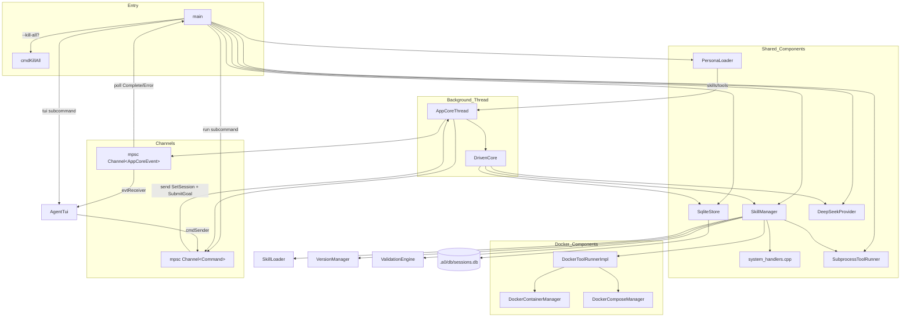

# Main Spec

## 1. Overview

Entry-point module. Parses CLI flags, loads `.env` files, resolves the DeepSeek API key through a priority chain, instantiates all concrete components (skill manager with registered handlers, runners, LLM provider, Docker managers, persona loader), and runs headless (`run` subcommand) or TUI (`tui` subcommand, default). Both paths use `AppCoreThread` which wraps `DrivenCore` on a background thread with MPSC communication. The `cmdRun` path polls MPSC events synchronously; `cmdTui` forwards MPSC events to the FTXUI render loop.

All C++ tool handlers (including task-manager handlers) are registered directly onto `SkillManager` via `xRegisterSystemHandlers()`. Persona loading reads the `--persona` flag (default `"software-engineer"`) and passes the persona's skills/tools to `AppCoreThread` for tool schema filtering.

## 2. Handler Registration

```cpp
static void xRegisterSystemHandlers(a0::skills::SkillManager& mgr,
                                     a0::persistence::PersistenceStore& persistence) {
    mgr.registerHandler("system_bash_bash", ...);
    mgr.registerHandler("system_fs_read", ...);
    mgr.registerHandler("system_fs_glob", ...);
    mgr.registerHandler("system_fs_grep", ...);
    mgr.registerHandler("system_fs_edit", ...);
    mgr.registerHandler("system_fs_write", ...);

    // Git wildcard
    mgr.registerHandler("system_git_*", ...);

    // Meta handlers
    mgr.registerHandler("system_meta_show-skills", ...);
    mgr.registerHandler("system_meta_show-skill-tools", ...);

    // Task manager handlers
    mgr.registerHandler("system_task-manager_add-task", ...);
    mgr.registerHandler("system_task-manager_remove-task", ...);
    mgr.registerHandler("system_task-manager_list-tasks", ...);
    mgr.registerHandler("system_task-manager_set-task-priority", ...);
}
```

## 3. CLI Flags (Relevant Subset)

| Flag | Default | Description |
|------|---------|-------------|
| `--persona` | `"software-engineer"` | Persona name for system prompt and tool filtering |
| `--mock-api <url>` | — | Mock API URL for testing |
| `--skills-dir <path>` | `"./skills"` | Skills root directory |
| `--a0-dir <path>` | `"./.a0"` | Runtime state directory |
| `run --prompt <text>` | — | Execute a prompt goal and exit |
| `tui` | (default subcommand) | Launch interactive TUI |

## 4. Architecture Diagram



## 5. Data Flow

### Headless (Run)

1. Parse CLI flags, resolve API key
2. `ensureA0Dir()`, instantiate `SqliteStore`, `SkillManager`, runners, `PersonaLoader`
3. Load persona manifest → `personaSkills`/`personaTools`
4. Register all system handlers
5. `skillMgr.loadAll()`, register agent, create session + root task, `SessionContext::init()`
6. Create MPSC channels, start `AppCoreThread`
7. Send `SetSession` + `SubmitGoal` via MPSC
8. Poll `evtReceiver` for `Complete`/`Error` events
9. Send `Shutdown`, stop thread, print result JSON

### TUI

Phases 1-5 same as headless, then:
6. Create `AgentTui(cmdSender, evtReceiver, b1StatusFn)` — NO core references
7. Call `AgentTui::run()` — FTXUI event loop drains MPSC events
8. On quit: send `Shutdown` via MPSC, stop thread

## 6. Error Handling

| Error Condition | Behaviour |
|---|---|
| `loadEnvFile` file not found | Silent return |
| CLI11 parse failure | Prints error, exit 1 |
| `skillMgr.loadAll` fails | Prints error, exit 1 |
| API key not found | Provider constructs with empty key |
| Invalid persona name | buildBasePrompt returns error string as system prompt (graceful) |
| TUI mode without b1 | b1 launch skipped if `--no-b1` flag set |

## 7. Testing Requirements

| Test | Verification |
|------|-------------|
| All core handlers registered with `_` separator | Handler registry populated |
| All task-manager handlers registered | Four task handler keys present |
| `--persona` flag parsed | Defaults to "software-engineer" |
| `cmdRun` with prompt | `AppCoreThread` started, `SubmitGoal` sent via MPSC |
| `cmdTui` MPSC wiring | `AgentTui` constructed with sender/receiver, no core refs |
