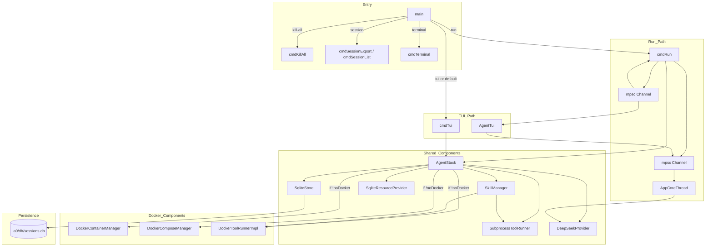
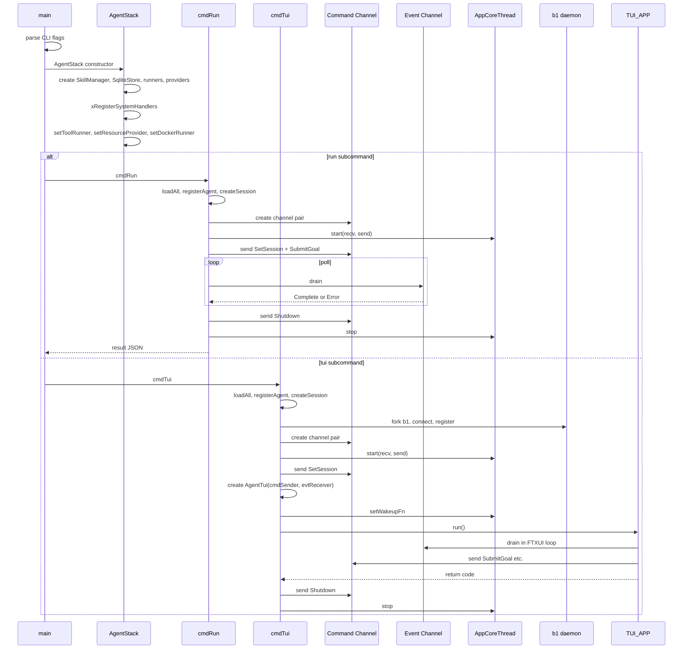

# Main Spec

## 1. Overview

Entry-point module (`src/main.cpp`). Parses CLI flags via CLI11, loads `.env` files, resolves the DeepSeek API key through a priority chain instantiates all concrete components (SkillManager, SqliteStore, SubprocessToolRunner, DeepSeekProvider, Docker managers, PersonaLoader), and dispatches to either headless (`run` subcommand), TUI (`tui` subcommand, default), terminal (`terminal` subcommand), or session management (`session` subcommand).

Both `run` and `tui` use `AppCoreThread` wrapping `DrivenCore` on a background thread with MPSC communication. The `cmdRun` path polls MPSC events synchronously; `cmdTui` forwards MPSC events to the FTXUI render loop via `AgentTui`.

**Dependencies:** All sub-modules (shared, bootstrap, persistence, skills, llm, core, ipc, docker, executor, tui, b1)

## 2. Component Specifications

No classes defined — the file contains static helper functions and a `struct AgentStack`:

```cpp
struct AgentStack {
    a0::persistence::SqliteStore persistence;
    a0::persistence::SqliteResourceProvider resourceProvider;
    a0::skills::SkillManager skillMgr;
    SubprocessToolRunner toolRunner;
    a0::DeepSeekProvider llmProvider;

    a0::docker::DockerContainerManager* containerMgr = nullptr;
    a0::docker::DockerComposeManager* composeMgr = nullptr;
    a0::docker::DockerToolRunnerImpl* dockerRunner = nullptr;
    a0::DockerSecurityFilter dockerFilter;

    AgentStack(const std::string& a0Dir, const std::string& skillsDir,
               const std::string& apiKey, const std::string& mockUrl,
               bool noDocker, bool noContainerPool,
               const std::string& idleTimeoutStr, const std::string& maxIdleStr,
               const std::string& defaultImage, int maxParallel = 4,
               const std::string& externalRepo = "https://github.com/opensassi/a0");
    ~AgentStack();
};
```

**Static functions:**
- `loadEnvFile(path)` — sources .env file, no-op if missing
- `killByPidFile(path)` — SIGTERM then SIGKILL
- `killByProcessName(name)` — pgrep + SIGTERM
- `xSelfDir()` — readlink /proc/self/exe
- `xChildLog(parentLog, suffix)` — derive child log path from parent
- `xMakeLogPath(sessionId, pid, suffix)` — construct per-session log path
- `xRedirectStderr(sessionId, pid)` — redirect stderr to log file
- `xRegisterSystemHandlers(mgr)` — register all C++ handlers
- `xRegisterAgent(store)` — register agent fingerprint
- `cmdKillAll(a0Dir)` — stop daemon processes
- `cmdSessionExport(a0Dir, sessionId, outputPath, outputJson)` — export session as JSONL
- `cmdSessionList(a0Dir, offset, limit, outputJson)` — list sessions
- `cmdRun(a0Dir, skillsDir, ...)` — headless execution
- `cmdTui(a0Dir, skillsDir, ...)` — interactive TUI
- `cmdTerminal(a0Dir, terminalId, cwd)` — PTY terminal session

## 3. Architecture Diagram



## 4. Data Flow



## 5. Testing Requirements

| Test | Verification |
|------|-------------|
| CLI11 parse --help | Prints help, exits 0 |
| CLI11 parse unknown flag | Prints error, exits non-zero |
| run with prompt | AppCoreThread started, SubmitGoal sent, Complete received |
| tui default | AgentTui constructed with cmdSender + evtReceiver |
| session export | Exports JSONL to stdout or file |
| session list | Lists recent sessions |
| kill-all | Sends SIGTERM to b1/c2 processes |
| terminal subcommand | Creates PTY, connects to b1, sends TERMINAL_READY |
