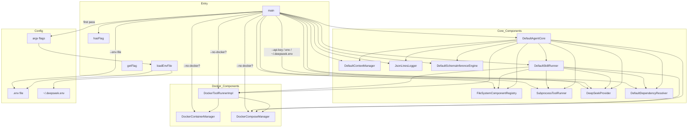
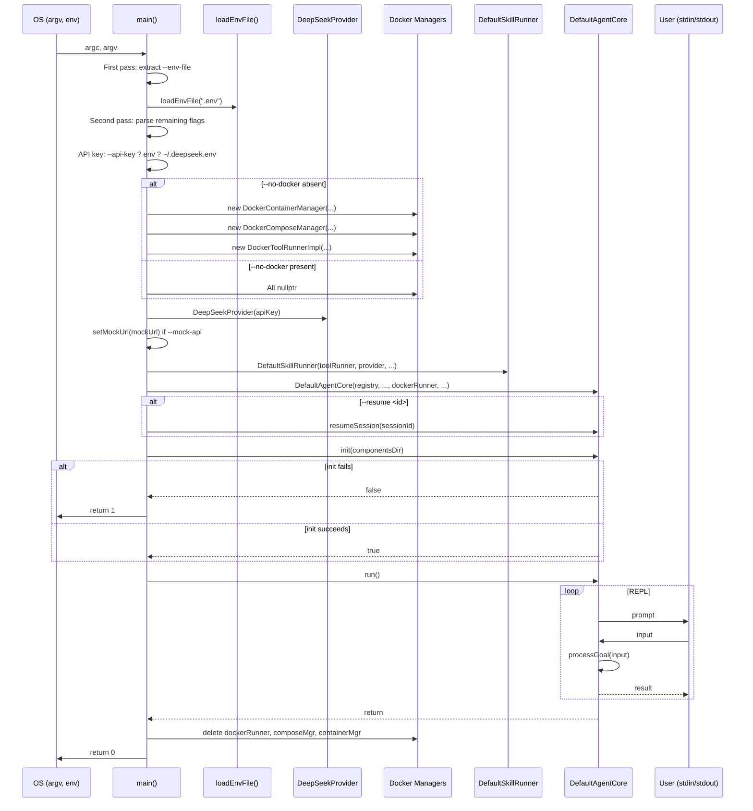

# Main Spec

## 1. Overview
Entry-point module. Parses CLI flags in two passes, loads `.env` files, resolves the DeepSeek API key through a priority chain, instantiates all concrete components (registry, providers, runners, Docker managers), wires them into `DefaultAgentCore`, and runs the interactive loop.

## 2. Component Specifications

### `loadEnvFile`
```cpp
/**
 * @param path Path to a .env file
 * Reads lines in KEY=VALUE format, skips empty/comment (#) lines.
 * Calls setenv(KEY, VALUE, 1) for each valid pair.
 * Silently returns if the file cannot be opened.
 */
static void loadEnvFile(const std::string& path);
```

### `hasFlag`
```cpp
/**
 * @param argc main() argument count
 * @param argv main() argument vector
 * @param name Flag name (e.g. "--no-docker")
 * @retval true  Flag present in argv
 * @retval false Flag absent
 */
static bool hasFlag(int argc, char* argv[], const std::string& name);
```

### `getFlag`
```cpp
/**
 * @param argc        main() argument count
 * @param argv        main() argument vector
 * @param name        Flag name (e.g. "--api-key")
 * @param defaultVal  Fallback value
 * @return Value from argv, then from env var A0_<NAME>
 *         (e.g. --container-idle-timeout → A0_CONTAINER_IDLE_TIMEOUT),
 *         then defaultVal.
 */
static std::string getFlag(int argc, char* argv[],
                            const std::string& name,
                            const std::string& defaultVal);
```

### `main`
```cpp
/**
 * Entry point.
 * @param argc Argument count
 * @param argv Argument vector
 * @retval 0  Normal exit
 * @retval 1  Component initialization failure
 *
 * Flag parsing (two-pass):
 *   1st pass: extract --env-file before any env var reads
 *   2nd pass: --env-file, --components-dir, --api-key, --mock-api, --resume
 *
 * API key resolution order:
 *   1. --api-key CLI flag
 *   2. DEEPSEEK_API_KEY env var (from env or .env)
 *   3. ~/.deepseek.env file
 *
 * Docker conditional on --no-docker flag:
 *   - present: dockerRunner and composeMgr remain nullptr
 *   - absent:  DockerContainerManager, DockerComposeManager,
 *              DockerToolRunnerImpl allocated
 *
 * Wire-up order:
 *   registry, toolRunner, provider, context, logger,
 *   depResolver, inferenceEngine, skillRunner → DefaultAgentCore
 *
 * Post-init: resume session if --resume given,
 *            then call core.run() (interactive REPL).
 * Cleanup: delete Docker objects in reverse order.
 */
int main(int argc, char* argv[]);
```

## 3. Architecture Diagram



## 4. Data Flow



## 5. Error Handling

| Error Condition | Signal | Notes |
|---|---|---|
| `loadEnvFile` file not found | Silent return | Not an error — env file is optional |
| `.env` parse error (no `=`) | Line skipped | Malformed lines silently ignored |
| CLI flag missing value (`--api-key` without arg) | Unexpected next flag used as value | Known limitation |
| `std::stoi` parse failure | Falls back to default | Exceptions caught by `catch(...)` |
| `core.init` fails | Prints error to `cerr`, `return 1` | |
| Docker init with no Docker daemon | Likely throws in constructor | Propagates uncaught |
| API key not found anywhere | Provider constructs with empty key | Runtime inference failure |

## 6. Edge Cases

| Edge Case | Behavior |
|---|---|
| No `--env-file` flag | Defaults to `.env` in CWD |
| `--env-file` specified twice | Second value wins |
| Both `--api-key` and `DEEPSEEK_API_KEY` env | CLI flag takes priority |
| `--no-docker` combined with Docker-requiring tools | `dockerRunner` is `nullptr`; `SkillRunner` must handle |
| `--resume` with invalid session ID | `resumeSession` returns `false`, continues with fresh session |
| No flags at all | All defaults: `.env`, `./components`, no Docker constraints |
| `componentsDir` does not exist | `init` returns `false`, program exits with 1 |
| Empty `.env` file | No environment variables set, no error |
| `--container-idle-timeout` set to non-numeric string | Defaults to 300 |

## 7. Testing Requirements

| Method | Test Case |
|---|---|
| `loadEnvFile` | Valid file, missing file, malformed line, comment lines, duplicate keys |
| `hasFlag` | Flag present, flag absent, partial match, `--` terminator |
| `getFlag` | Flag with value, flag without value, env var fallback, default fallback, `A0_` env var mapping |
| `main` (integration) | No flags, all flags, `--no-docker`, `--resume` valid, `--resume` invalid, missing API key, Docker unavailable, init failure |
