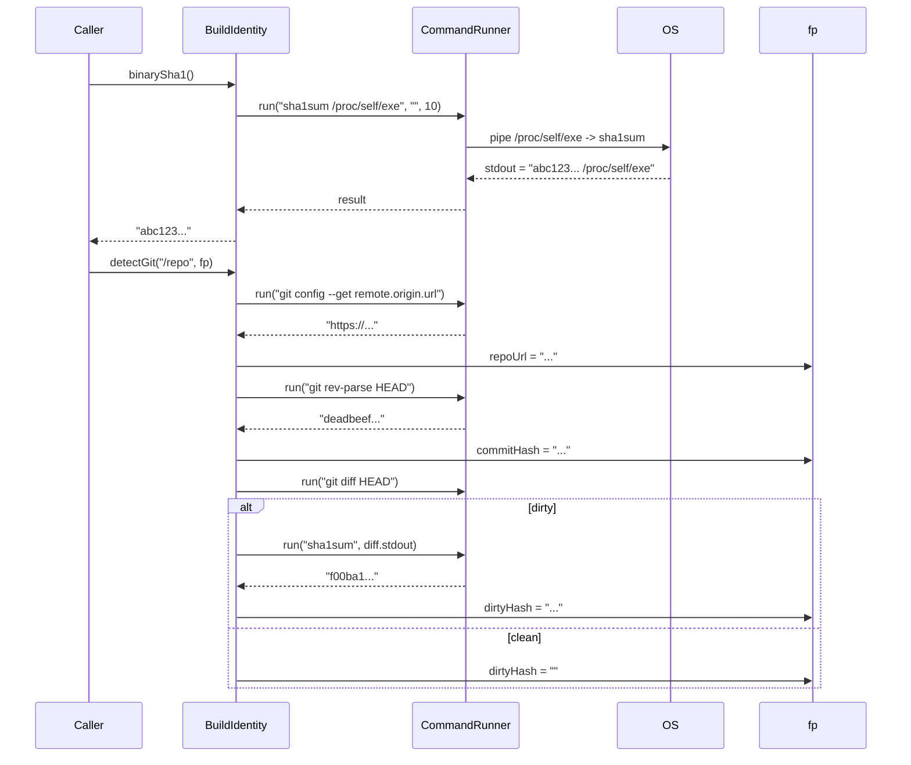

# BuildIdentity Spec

## §1. Overview

Fingerprints the running a0 binary and the git repository state. `binarySha1()` computes a SHA1 of the binary via `/proc/self/exe`. `detectGit()` queries the repository URL, HEAD commit, and dirty-tree hash for session tracing and replay compatibility checks.

**Source files:** `src/persistence/build_identity.h/.cpp`

**Dependencies:** `CommandRunner`, POSIX (`/proc/self/exe`, `sha1sum`, `git`)

**Lifecycle:** Stateless; all methods are static.

## §2. Component Specifications

```cpp
namespace a0::persistence {

class BuildIdentity {
public:
    /// SHA1 of the running a0 binary via /proc/self/exe.
    /// \returns 40-character hex string.
    /// \throws std::runtime_error if sha1sum fails.
    static std::string binarySha1();

    /// Detect git metadata from the project root.
    /// Populates repoUrl, commitHash, and dirtyHash on the fingerprint struct.
    /// Fields are left empty if git commands fail (e.g. outside a repo).
    /// \param projectDir  Directory to run git commands in.
    /// \param fp          BuildFingerprint to populate.
    static void detectGit(const std::string& projectDir, BuildFingerprint& fp);
};

} // namespace a0::persistence
```

## §3. Architecture Diagram

```mermaid
graph TB
    BI[BuildIdentity]
    CR[CommandRunner]
    BIN[/proc/self/exe]
    GIT[git]

    BI --> CR
    CR -. sha1sum /proc/self/exe .-> BIN
    CR -. git config remote.origin.url .-> GIT
    CR -. git rev-parse HEAD .-> GIT
    CR -. git diff HEAD .-> GIT
```

## §4. Data Flow



## §5. Testing Requirements

| Method | Test Case | Expected |
|--------|-----------|----------|
| `binarySha1()` | Running inside a0 binary | 40-char hex string |
| `binarySha1()` | Binary not readable | Throws `std::runtime_error` |
| `detectGit` | Inside git repo, clean | `repoUrl` and `commitHash` set, `dirtyHash` empty |
| `detectGit` | Inside git repo, dirty | `dirtyHash` non-empty |
| `detectGit` | Outside git repo | All fields empty |
| `detectGit` | Git command timeout | Fields empty (command runner returns non-zero exit) |

## §6. (skipped)

## §7. CLI Entry Point

Called during startup in `main.cpp`:

1. `BuildIdentity::binarySha1()` → fingerprints the running binary
2. `BuildIdentity::detectGit(projectDir, fp)` → captures git state
3. Results passed to `PersistenceStore::registerAgent(fp)` → creates/retrieves agent row in `sessions.db`

Not exposed as a user-facing CLI command.
