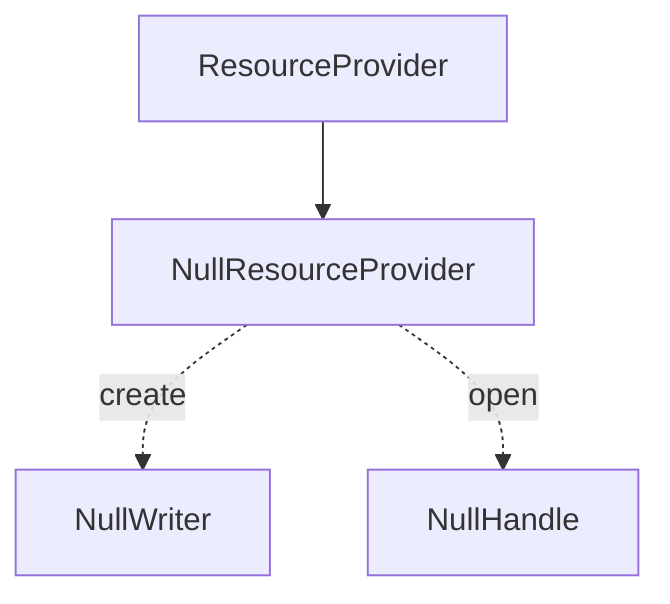
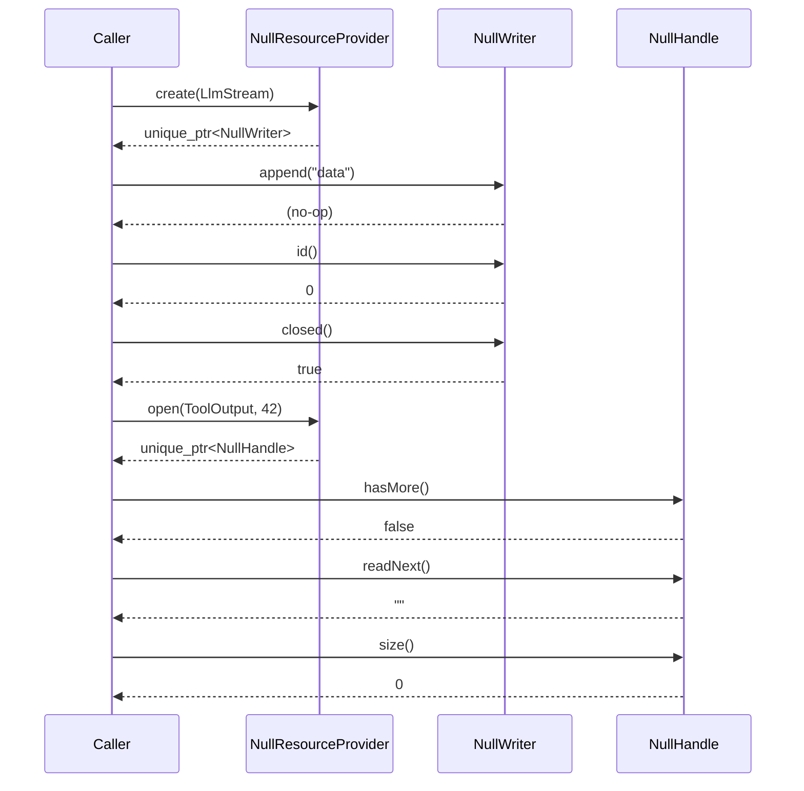

# NullResourceProvider Spec

## §1. Overview

No-op implementation of `ResourceProvider` for testing. `create()` returns a `NullWriter` whose `id()` is 0, `append()` and `close()` are no-ops, and `closed()` always returns true. `open()` returns a `NullHandle` whose `id()` is 0, `hasMore()` returns false, `readNext()`/`read()` return empty strings, and `size()` returns 0.

**Source files:** `src/persistence/null_resource_provider.h`, implemented inline in `src/persistence/sqlite_resource_provider.cpp`

**Dependencies:** `shared/resource_provider.h` (defines `ResourceProvider`, `ResourceWriter`, `ResourceHandle`, `ResourceType`)

**Lifecycle:** Stateless; single instance can be reused across many `create()`/`open()` calls.

## §2. Component Specifications

```cpp
namespace a0::persistence {

class NullResourceProvider : public ResourceProvider {
public:
    NullResourceProvider() = default;
    ~NullResourceProvider() override = default;

    std::unique_ptr<ResourceWriter> create(ResourceType type) override;
    std::unique_ptr<ResourceHandle> open(ResourceType type, int64_t id) override;
};

// Internal helpers (anonymous namespace in .cpp):

class NullWriter : public ResourceWriter {
public:
    int64_t id() const override;          // returns 0
    void append(const std::string&) override;  // no-op
    void close() override;                     // no-op
    bool closed() const override;              // always true
};

class NullHandle : public ResourceHandle {
public:
    int64_t id() const override;               // returns 0
    bool hasMore() const override;             // always false
    std::string readNext() override;           // returns {}
    std::string read(int64_t, int64_t) override; // returns {}
    int64_t size() const override;             // returns 0
};

} // namespace a0::persistence
```

## §3. Architecture Diagram



## §4. Data Flow



## §5. Testing Requirements

| Method | Test Case | Expected |
|--------|-----------|----------|
| `create` | Any ResourceType | Returns non-null `unique_ptr<ResourceWriter>` |
| `create` → `id()` | Returned writer | Always 0 |
| `create` → `append()` | Any data | No crash, no-op |
| `create` → `closed()` | After create | true |
| `open` | Any type and id | Returns non-null `unique_ptr<ResourceHandle>` |
| `open` → `hasMore()` | Returned handle | Always false |
| `open` → `readNext()` | Returned handle | Empty string |
| `open` → `read(0, 100)` | Returned handle | Empty string |
| `open` → `size()` | Returned handle | 0 |

## §6. (skipped)

## §7. CLI Entry Point

`NullResourceProvider` is not wired into the CLI directly. It is used as a safe fallback inside `SqliteResourceProvider::create()` when the SQLite `INSERT` fails, and by unit tests that need to exercise code paths requiring a `ResourceProvider` without a real database.
