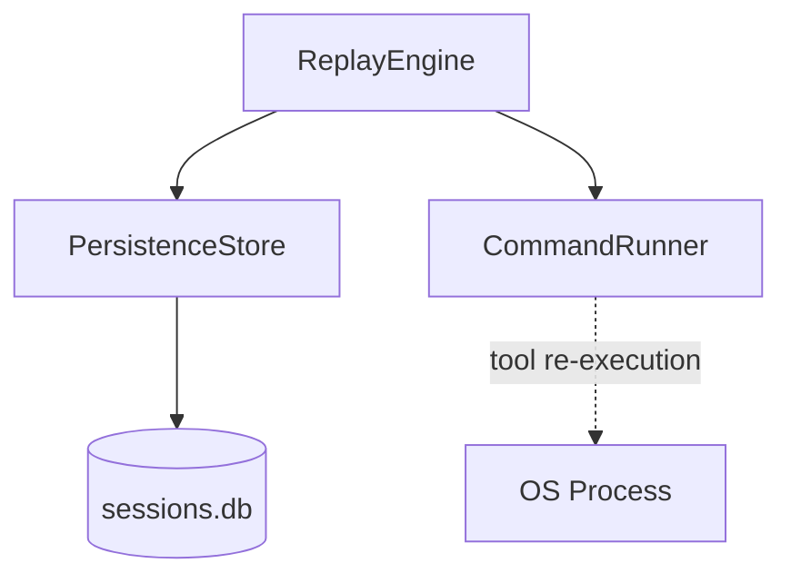
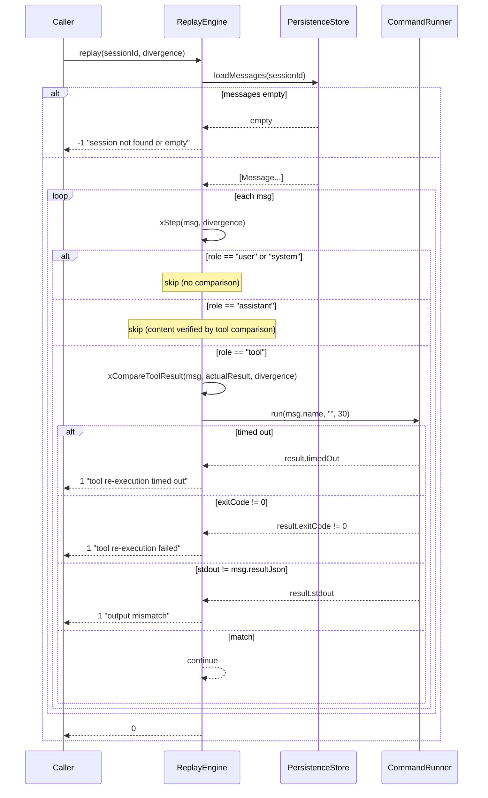

# ReplayEngine Spec

## §1. Overview

Reads a stored session from `PersistenceStore` and replays it deterministically against the current binary. User and system messages are passed through (no comparison). Assistant messages are content-checked. Tool messages trigger re-execution via `CommandRunner`; the stored `resultJson` is compared against the actual output to detect regressions.

**Source files:** `src/persistence/replay_engine.h/.cpp`

**Dependencies:** `PersistenceStore`, `CommandRunner`

**Lifecycle:** Per-replay-instance. Constructed with a `PersistenceStore*` that must outlive the engine. `replay()` or `replayTo()` drives the full loop; `divergence` is populated with the first failure detail.

## §2. Component Specifications

```cpp
namespace a0::persistence {

/// Reads a stored session and replays it against the current binary.
/// LLM responses are injected from the log.
/// Tools are re-executed and compared against stored results.
class ReplayEngine {
public:
    /// \param store  PersistenceStore to load messages from (must outlive this).
    explicit ReplayEngine(PersistenceStore* store);

    /// Replay an entire session.
    /// \param sessionId   Session to replay.
    /// \param divergence  Populated with details if replay fails.
    /// \retval 0  All messages match.
    /// \retval 1  Divergence found.
    /// \retval -1 Session not found.
    int replay(int64_t sessionId, std::string& divergence);

    /// Replay up to a specific message id.
    /// \param sessionId       Session to replay.
    /// \param upToMessageId   Only process messages with id <= this value.
    /// \param divergence      Populated with details if replay fails.
    /// \retval 0  All messages up to target match.
    /// \retval 1  Divergence found.
    /// \retval -1 Session not found.
    int replayTo(int64_t sessionId, int64_t upToMessageId, std::string& divergence);

private:
    PersistenceStore* m_store;

    /// Process a single message during replay.
    /// \param msg         The message to process.
    /// \param divergence  Output for failure detail.
    /// \retval 0  OK / no comparison needed.
    /// \retval 1  Divergence detected.
    /// \retval -1 Fatal error (e.g. tool has no name).
    int xStep(const Message& msg, std::string& divergence);

    /// Re-execute the tool for a tool-role message and compare output.
    /// \param msg           The tool message (name holds the command).
    /// \param actualResult  (Unused in current impl) Actual tool output.
    /// \param divergence    Output for mismatch detail.
    /// \retval 0  Output matches.
    /// \retval 1  Mismatch or execution failure.
    /// \retval -1 Tool has no name.
    int xCompareToolResult(const Message& msg,
                           const std::string& actualResult,
                           std::string& divergence);
};

} // namespace a0::persistence
```

## §3. Architecture Diagram



## §4. Data Flow



## §5. Testing Requirements

| Method | Test Case | Expected |
|--------|-----------|----------|
| `replay` | All tool results match | Returns 0, divergence empty |
| `replay` | Tool result differs | Returns 1, divergence contains "output mismatch" |
| `replay` | Tool re-execution fails | Returns 1, divergence contains "failed" |
| `replay` | Tool times out | Returns 1, divergence contains "timed out" |
| `replay` | Session not found | Returns -1, divergence contains "not found" |
| `replayTo` | Target message reached, all match | Returns 0 |
| `replayTo` | Divergence before target | Returns 1 |
| `replayTo` | Target message nonexistent | Behaves like replay of all loaded messages |
| `xStep` | role="user" | Returns 0 immediately |
| `xStep` | role="system" | Returns 0 immediately |
| `xStep` | role="assistant" | Returns 0 immediately |
| `xStep` | role="tool" with empty name | Returns -1, divergence "tool message has no name" |
| `xStep` | role="tool" with matching output | Returns 0 |

## §6. (skipped)

## §7. CLI Entry Point

Wired via the `a0 replay` command:

```
a0 replay --session <session-id>
    Replay a stored session against the current binary.

a0 replay --session <session-id> --step <message-id>
    Replay up to a specific message and stop.
```

Handling in `main.cpp`:
1. Parse `--session` and optional `--step` flags
2. Open `PersistenceStore` (SqliteStore at `<a0-dir>/db/sessions.db`)
3. Construct `ReplayEngine(store)`
4. Call `replay()` or `replayTo()`
5. Print divergence or success
6. Exit with code matching return value
