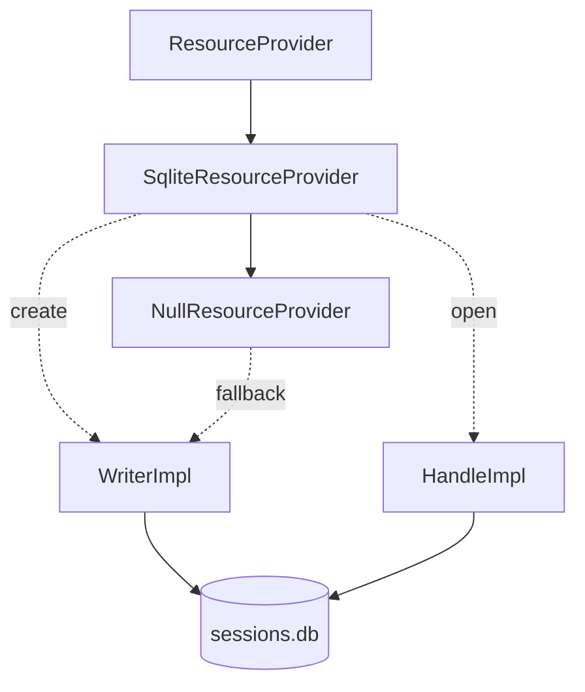
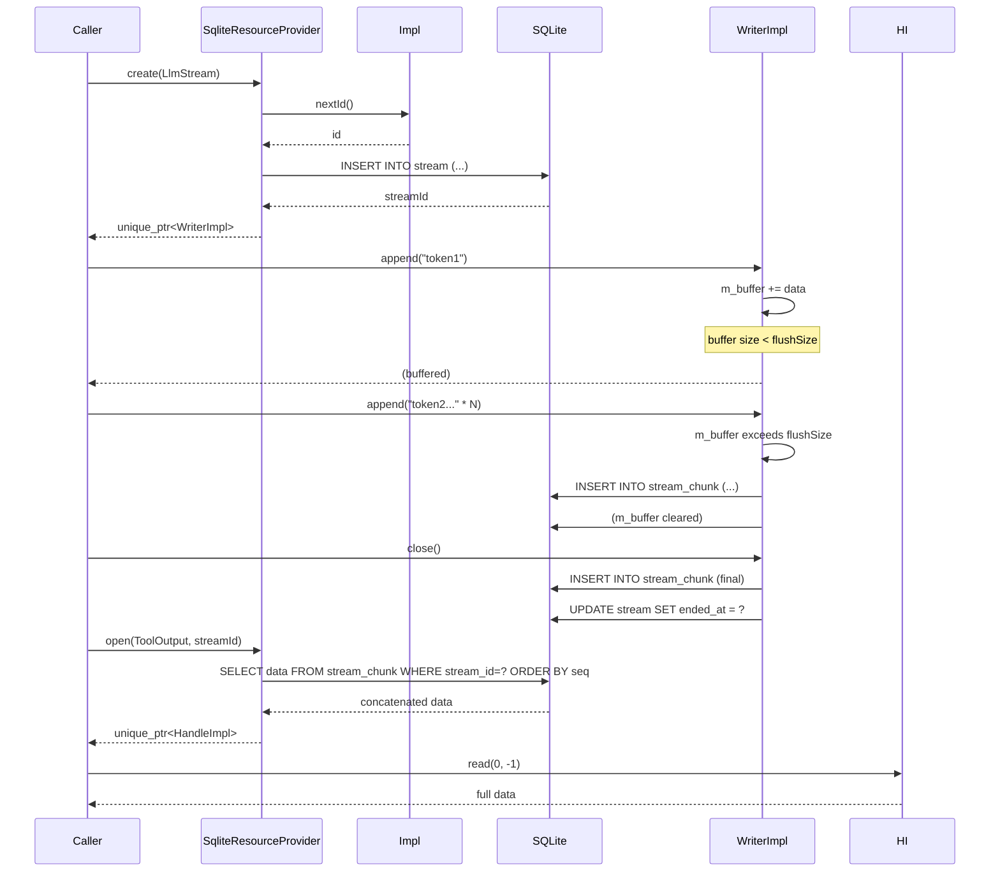

# SqliteResourceProvider Spec

## §1. Overview

SQLite-backed implementation of `ResourceProvider`. Stores all resource types (`LlmStream`, `ToolOutput`, `TerminalStream`, `ToolInvocation`) in the same `sessions.db` database used by `PersistenceStore`, writing to the `stream` and `stream_chunk` tables. Writer operations flush buffered data to `stream_chunk` rows when the buffer crosses a configurable threshold, or at `close()`.

**Source files:** `src/persistence/sqlite_resource_provider.h/.cpp`

**Dependencies:** SQLite3, `shared/resource_provider.h`, `null_resource_provider.h` (fallback)

**Lifecycle:** Constructed with a db path and flush-size parameters. Owns a background-unaware `Impl` that holds the `sqlite3*` connection. Each `create()` call opens a new stream row and returns a `WriterImpl` tied to that stream; each `open()` call reads all chunks for the given stream id and returns a `HandleImpl` with the concatenated data.

## §2. Component Specifications

```cpp
namespace a0::persistence {

class SqliteResourceProvider : public ResourceProvider {
public:
    /// \param dbPath             Path to the SQLite database file.
    /// \param tokenFlushSize     Bytes before flushing LLM token stream (default 256).
    /// \param toolFlushSize      Bytes before flushing tool output stream (default 4096).
    /// \param outputPreviewSize  Max bytes for outputPreview in ToolEnd (default 4096).
    SqliteResourceProvider(const std::string& dbPath,
                           int64_t tokenFlushSize = 256,
                           int64_t toolFlushSize = 4096,
                           int64_t outputPreviewSize = 4096);
    ~SqliteResourceProvider() override;

    std::unique_ptr<ResourceWriter> create(ResourceType type) override;
    std::unique_ptr<ResourceHandle> open(ResourceType type, int64_t id) override;

    void setTokenFlushSize(int64_t bytes);
    void setToolFlushSize(int64_t bytes);
    void setOutputPreviewSize(int64_t bytes);

private:
    class Impl;
    std::unique_ptr<Impl> m_impl;
};

// Internal helper classes (anonymous namespace in .cpp):

class WriterImpl : public ResourceWriter {
public:
    /// \param id         Writer identifier (from Impl::nextId()).
    /// \param streamId   SQLite rowid of the stream row.
    /// \param db         Raw sqlite3 handle.
    /// \param flushSize  Buffer threshold before auto-flush.
    /// \param direction  Chunk direction label (e.g. "llm_token", "tool_stdout").
    WriterImpl(int64_t id, int64_t streamId, sqlite3* db,
               int64_t flushSize, const std::string& direction);
    ~WriterImpl() override;

    int64_t id() const override;
    void append(const std::string& data) override;
    void close() override;
    bool closed() const override;

private:
    int64_t m_id;
    int64_t m_streamId;
    sqlite3* m_db;
    int64_t m_flushSize;
    std::string m_direction;
    std::string m_buffer;
    bool m_closed = false;
    int m_seq = 0;

    /// Flush buffered data to stream_chunk table.
    /// \param isFinal  If true, also UPDATE stream.ended_at.
    void xFlush(bool isFinal);
};

class HandleImpl : public ResourceHandle {
public:
    HandleImpl(int64_t id, std::string data);
    int64_t id() const override;
    bool hasMore() const override;
    std::string readNext() override;
    std::string read(int64_t offset, int64_t limit) override;
    int64_t size() const override;

private:
    int64_t m_id;
    std::string m_data;
    int64_t m_offset = 0;
};

// PIMPL:

class SqliteResourceProvider::Impl {
public:
    Impl(const std::string& dbPath,
         int64_t tokenFlush, int64_t toolFlush, int64_t previewSize);
    ~Impl();

    int64_t nextId();
    sqlite3* db();
    int64_t tokenFlushSize() const;
    int64_t toolFlushSize() const;
    int64_t outputPreviewSize() const;
    void setTokenFlushSize(int64_t v);
    void setToolFlushSize(int64_t v);
    void setOutputPreviewSize(int64_t v);

private:
    sqlite3* m_db = nullptr;
    int64_t m_nextId = 0;
    int64_t m_tokenFlushSize;
    int64_t m_toolFlushSize;
    int64_t m_outputPreviewSize;
    std::mutex m_mutex;

    void xEnsureTables();
};

} // namespace a0::persistence
```

### SQL Schema (managed by `xEnsureTables()`)

```sql
CREATE TABLE IF NOT EXISTS stream (
    id INTEGER PRIMARY KEY AUTOINCREMENT,
    session_id INTEGER NOT NULL DEFAULT 0,
    tool_call_id TEXT, name TEXT NOT NULL,
    context_type TEXT NOT NULL, context_id TEXT, cwd TEXT,
    created_at INTEGER NOT NULL, ended_at INTEGER, exit_code INTEGER
);

CREATE TABLE IF NOT EXISTS stream_chunk (
    id INTEGER PRIMARY KEY AUTOINCREMENT,
    stream_id INTEGER NOT NULL REFERENCES stream(id),
    seq INTEGER NOT NULL, direction TEXT NOT NULL,
    data TEXT NOT NULL, timestamp INTEGER NOT NULL
);
```

## §3. Architecture Diagram



## §4. Data Flow



## §5. Testing Requirements

| Method | Test Case | Expected |
|--------|-----------|----------|
| `SqliteResourceProvider` ctor | Valid db path | No throw, tables created |
| `SqliteResourceProvider` ctor | Invalid db path | Behavior defined by sqlite3_open |
| `create(LlmStream)` | Normal | Returns WriterImpl with unique id, stream row created |
| `create(ToolOutput)` | Normal | flushSize = toolFlushSize |
| `create(TerminalStream)` | Normal | flushSize = toolFlushSize |
| `create` | SQL failure (read-only db) | Falls back to NullWriter |
| WriterImpl `append()` | Within flushSize | Buffered, no chunk written |
| WriterImpl `append()` | Exceeds flushSize | Chunk written to stream_chunk |
| WriterImpl `close()` | With buffered data | Final chunk written, stream.ended_at set |
| WriterImpl `close()` | Already closed | No-op |
| WriterImpl `closed()` | After close | true |
| `open()` | Existing streamId | HandleImpl with concatenated chunks |
| `open()` | Nonexistent streamId | HandleImpl with empty data |
| `open()` | SQL failure | HandleImpl with empty data |
| HandleImpl `hasMore()` | Not fully read | true |
| HandleImpl `readNext()` | Has data | Remaining substring, advances offset |
| HandleImpl `read(offset, limit)` | Valid range | Substring within bounds |
| HandleImpl `read(offset, limit)` | limit=-1 | All data from offset |
| HandleImpl `read(offset, limit)` | offset >= size | Empty string |
| HandleImpl `size()` | After construction | Length of stored data |
| `setTokenFlushSize()` | Any value | Subsequent create() uses new value |
| `setToolFlushSize()` | Any value | Subsequent create() uses new value |
| `setOutputPreviewSize()` | Any value | Value stored in Impl |

## §6. (skipped)

## §7. CLI Entry Point

`SqliteResourceProvider` is not exposed as a top-level CLI command. It is constructed internally by the session infrastructure when streaming I/O is needed (e.g. terminal capture, LLM token streaming). The db path is the same `sessions.db` used by `SqliteStore`, typically at `<a0-dir>/db/sessions.db`.
