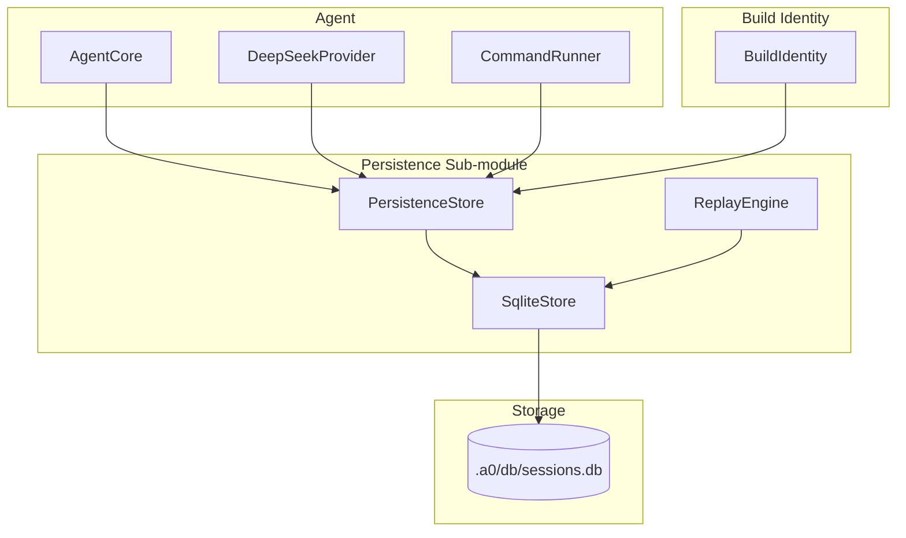
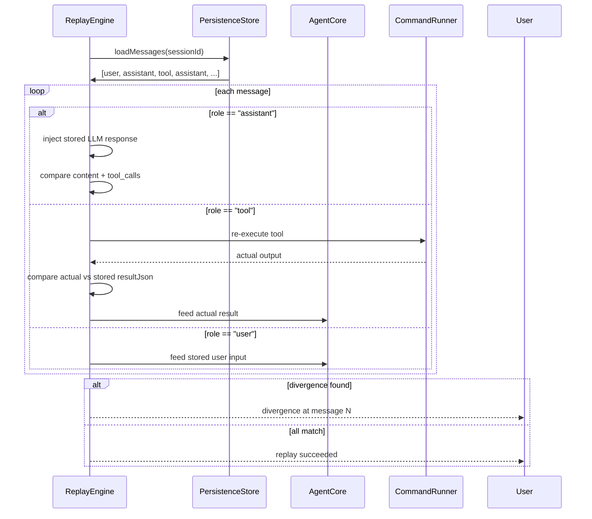

# Technical Specification: Persistence Sub-Module

## For a0 Agent — Version 1.0

---

## 1. Overview

The Persistence sub-module records every agent invocation into a SQLite database for crash reproduction and deterministic replay. It captures the full conversational loop: user input → LLM request → tool execution → LLM response.

**Goals:**

- Record every agent I/O into an append-only message log
- Fingerprint the agent binary by SHA1 so replay uses the correct version
- Support deterministic replay: inject stored LLM responses, re-execute tools, compare outputs
- Enable sub-agent tracing via parent/root session links
- Provide a clean abstract interface so SQLite can be swapped out

**Dependencies:** SQLite3 (default), `CommandRunner` (for replay execution), `BuildIdentity` (for binary fingerprint)

**Lifecycle:** Per-session. One database per project root, located at `a0Dir + "/db/sessions.db"` where `a0Dir` defaults to `./.a0/` and is configurable via the `--a0-dir` CLI flag. The `a0Dir` directory is auto-created on agent startup by `ensureA0Dir()`.

---

## 2. Data Structures

### 2.1 SQLite Schema

```sql
CREATE TABLE agent (
    id INTEGER PRIMARY KEY AUTOINCREMENT,
    binary_sha1 TEXT NOT NULL UNIQUE,
    repo_url TEXT,
    commit_hash TEXT,
    dirty_hash TEXT,
    built_at INTEGER
);

CREATE TABLE session (
    id INTEGER PRIMARY KEY AUTOINCREMENT,
    uuid TEXT NOT NULL UNIQUE,
    agent_id INTEGER NOT NULL REFERENCES agent(id),
    root_session_id INTEGER REFERENCES session(id),
    parent_session_id INTEGER REFERENCES session(id),
    started_at INTEGER NOT NULL,
    ended_at INTEGER
);

CREATE TABLE message (
    id INTEGER PRIMARY KEY AUTOINCREMENT,
    session_id INTEGER NOT NULL REFERENCES session(id),
    sub_session_id INTEGER,
    seq INTEGER NOT NULL DEFAULT 0,
    role TEXT NOT NULL,
    content TEXT NOT NULL DEFAULT '',
    tool_calls_json TEXT,
    tool_call_id TEXT,
    name TEXT,
    result_json TEXT,
    created_at INTEGER NOT NULL,
    UNIQUE(session_id, sub_session_id, seq)
);

CREATE INDEX idx_message_session ON message(session_id, id);

CREATE TABLE stream (
    id INTEGER PRIMARY KEY AUTOINCREMENT,
    session_id INTEGER NOT NULL REFERENCES session(id),
    tool_call_id TEXT,
    terminal_id TEXT,
    name TEXT NOT NULL,
    context_type TEXT NOT NULL,
    context_id TEXT,
    cwd TEXT,
    created_at INTEGER NOT NULL,
    ended_at INTEGER,
    exit_code INTEGER
);

CREATE TABLE stream_chunk (
    id INTEGER PRIMARY KEY AUTOINCREMENT,
    stream_id INTEGER NOT NULL REFERENCES stream(id),
    seq INTEGER NOT NULL,
    direction TEXT NOT NULL,
    data TEXT NOT NULL,
    timestamp INTEGER NOT NULL
);

CREATE INDEX idx_stream_session ON stream(session_id);
CREATE INDEX idx_stream_chunk_stream ON stream_chunk(stream_id, seq);
CREATE INDEX idx_stream_tool_call ON stream(tool_call_id);

CREATE TABLE skill (
    id INTEGER PRIMARY KEY AUTOINCREMENT,
    type INTEGER NOT NULL,
    name TEXT NOT NULL,
    UNIQUE(type, name)
);

CREATE TABLE invocation (
    id INTEGER PRIMARY KEY AUTOINCREMENT,
    message_id INTEGER NOT NULL REFERENCES message(id),
    skill_id INTEGER NOT NULL REFERENCES skill(id),
    tool_name TEXT NOT NULL,
    params_json TEXT,
    output_json TEXT,
    timestamp INTEGER NOT NULL
);

CREATE INDEX idx_invocation_skill ON invocation(skill_id, tool_name);
CREATE INDEX idx_invocation_message ON invocation(message_id);
```

### 2.2 Abstract Interface

```cpp
namespace a0::persistence {

struct BuildFingerprint {
    std::string binarySha1;
    std::string repoUrl;
    std::string commitHash;
    std::string dirtyHash;
};

struct Message {
    int64_t id;
    int64_t sessionId;
    std::string role;
    std::string content;
    std::string toolCallsJson;
    std::string toolCallId;
    std::string name;
    std::string resultJson;
    int64_t createdAt;
};

class PersistenceStore {
public:
    virtual ~PersistenceStore() = default;

    virtual int registerAgent(const BuildFingerprint& fp) = 0;

    virtual int64_t createSession(const std::string& uuid,
                                   int64_t rootId,
                                   int64_t parentId,
                                   int agentId) = 0;
    virtual void endSession(int64_t sessionId) = 0;

    virtual int64_t appendMessage(int64_t sessionId,
                                    std::optional<int64_t> subSessionId,
                                    int seq,
                                    const std::string& role,
                                    const std::string& content,
                                    const std::string& toolCallsJson,
                                    const std::string& toolCallId,
                                    const std::string& name,
                                    const std::string& resultJson) = 0;

    virtual std::vector<Message> loadMessages(int64_t sessionId,
                                               std::optional<int64_t> subSessionId = std::nullopt) = 0;
    virtual int64_t findSessionByUuid(const std::string& uuid) const = 0;
    virtual void flush() = 0;

    // --- Streaming ---
    virtual int64_t createStream(int64_t sessionId,
                                  const std::string& toolCallId,
                                  const std::string& name,
                                  const std::string& contextType,
                                  const std::string& contextId,
                                  const std::string& cwd,
                                  const std::string& terminalId = "") = 0;
    virtual int appendChunk(int64_t streamId, int seq,
                             const std::string& direction,
                             const std::string& data) = 0;
    virtual int endStream(int64_t streamId, int exitCode) = 0;
    virtual std::vector<StreamChunk> loadStreamChunks(int64_t streamId,
                                                       int offset = 0,
                                                       int limit = -1) = 0;
    virtual std::vector<Stream> listSessionStreams(int64_t sessionId) = 0;

    // --- Skill invocation tracking ---
    virtual int ensureSkill(int type, const std::string& name) = 0;
    virtual int64_t appendInvocation(int64_t messageId,
                                      int skillId,
                                      const std::string& toolName,
                                      const std::string& paramsJson,
                                      const std::string& outputJson) = 0;
    virtual std::vector<InvocationRow> loadInvocations(int type,
                                                         const std::string& name) const = 0;

    // --- Session context ---
    virtual int saveSessionContext(const SessionContextRow& row) = 0;
    virtual SessionContextRow loadSessionContext(int64_t sessionId) const = 0;
};

class NullStore : public PersistenceStore {
    // No-op implementations for testing (all methods return 0 or empty).
};
```

### 2.3 Message struct updated

```cpp
struct Message {
    // ...existing fields...
    int64_t subSessionId = 0;
    int seq = 0;
};
```

### 2.4 New data structures

```cpp
struct Stream {
    int64_t id, sessionId;
    std::string toolCallId, terminalId, name, contextType, contextId, cwd;
    int64_t createdAt, endedAt;
    int exitCode;
};

struct StreamChunk {
    int64_t id, streamId;
    int seq;
    std::string direction, data;
    int64_t timestamp;
};

struct InvocationRow {
    int64_t id, messageId, skillId;
    std::string toolName, paramsJson, outputJson;
    int64_t timestamp;
};

struct SessionContextRow {
    int64_t sessionId;
    std::string sessionUuid;
    std::string originalCwd;
    std::string worktreePath;
    std::string gitRepoRoot;
    std::string gitBranch;
    std::string gitCommit;
};
```

### 2.5 PersistenceStore (Updated Interface)

```cpp
namespace a0::persistence {

class SqliteStore : public PersistenceStore {
public:
    explicit SqliteStore(const std::string& dbPath);
    ~SqliteStore() override;

    int registerAgent(const BuildFingerprint& fp) override;
    int64_t createSession(const std::string& uuid,
                           int64_t rootId,
                           int64_t parentId,
                           int agentId) override;
    void endSession(int64_t sessionId) override;
    int64_t appendMessage(int64_t sessionId,
                            std::optional<int64_t> subSessionId,
                            int seq,
                            const std::string& role,
                            const std::string& content,
                            const std::string& toolCallsJson,
                            const std::string& toolCallId,
                            const std::string& name,
                            const std::string& resultJson) override;
    std::vector<Message> loadMessages(int64_t sessionId,
                                       std::optional<int64_t> subSessionId = std::nullopt) override;
    int64_t findSessionByUuid(const std::string& uuid) const override;
    void flush() override;

    // --- Session context ---
    int saveSessionContext(const SessionContextRow& row) override;
    SessionContextRow loadSessionContext(int64_t sessionId) const override;

private:
    class Impl;
    std::unique_ptr<Impl> m_impl;
};

} // namespace a0::persistence
```

### 2.4 Replay Engine

```cpp
namespace a0::persistence {

class ReplayEngine {
public:
    explicit ReplayEngine(PersistenceStore* store);

    int replay(int64_t sessionId, std::string& divergence);
    int replayTo(int64_t sessionId, int64_t upToMessageId, std::string& divergence);

private:
    PersistenceStore* m_store;

    int xInjectAssistant(const Message& msg);
    int xExecuteTool(const Message& msg, std::string& actualResult);
    int xCompareTool(const std::string& expected,
                     const std::string& actual,
                     std::string& divergence);
};

} // namespace a0::persistence
```

### 2.5 Build Identity

```cpp
namespace a0::persistence {

class BuildIdentity {
public:
    static std::string binarySha1();
    static void detectGit(const std::string& projectDir, BuildFingerprint& fp);
};

} // namespace a0::persistence
```

---

## 3. System Architecture



---

## 4. Data Flow

### 4.1 Normal Operation


### 4.2 Deterministic Replay



---

## 5. Error Handling

| Scenario | Behaviour |
|----------|-----------|
| DB file does not exist | Created automatically on first `createSession` |
| DB file is corrupt | `SqliteStore` constructor throws `std::runtime_error` |
| WAL mode write contention | SQLite WAL handles concurrent reads + single writer |
| `appendMessage` after session ended | Returns -1 |
| `loadMessages` with nonexistent session | Returns empty vector |
| Replay: session not found | Returns -1 |
| Replay: tool re-execution fails | Divergence captured with crash output |
| `binarySha1` cannot read self | Returns empty string |
| `createStream` with nonexistent session | Returns -1 |
| `appendChunk` with invalid streamId | Returns -1 |
| `loadStreamChunks` beyond available data | Returns up to available, no error |
| `ensureSkill` with existing (type, name) | Returns existing id |

## 6. Edge Cases

| Case | Expected Result |
|------|----------------|
| Two agents run simultaneously | Separate sessions, WAL handles concurrency |
| Sub-agent spawned recursively | Child session with parent_session_id set |
| Agent crash mid-session | ended_at NULL; replay still works |
| DB deleted mid-session | Next appendMessage fails |
| Very long LLM response (>1 MB) | Stored as-is in content column |
| Binary rebuilt between runs | New SHA1 → new agent row |
| No git repo detected | repo_url/commit_hash stored as NULL |
| Stream with same toolCallId twice | Two separate stream rows (different ids) |
| Invocation for unregistered skill | ensureSkill called first, creates row |
| Sub-session with null sub_session_id | loadMessages filters to seq-only messages |

## 7. Testing Requirements

### SqliteStore

| Method | Test Case | Expected |
|--------|-----------|----------|
| `registerAgent` | New fingerprint | Returns new id |
| `registerAgent` | Duplicate | Returns existing id |
| `createSession` | Root session | root_id = id, parent_id = 0 |
| `createSession` | Sub-session | parent_id set |
| `endSession` | Existing session | ended_at set |
| `appendMessage` | All four roles | Four rows with correct data |
| `appendMessage` | With subSessionId and seq | sub_session_id and seq stored correctly |
| `loadMessages` | Session with 10 messages | 10 messages in order |
| `loadMessages` | Nonexistent | Empty vector |
| `loadMessages` | Filtered by subSessionId | Only matching sub-session messages returned |
| `createStream` | New stream | Returns stream id, fields match |
| `appendChunk` | Single chunk | Stored with correct seq/direction/data |
| `loadStreamChunks` | Multiple chunks | Returned in seq order |
| `endStream` | Existing stream | exit_code set, ended_at set |
| `listSessionStreams` | Session with 2 streams | Both streams returned |
| `ensureSkill` | New (type, name) | Returns new id, unique constraint satisfied |
| `ensureSkill` | Duplicate | Returns existing id |
| `appendInvocation` | Valid messageId + skillId | Returns invocation id |
| `loadInvocations` | By type + name | Returns matching rows |
| `saveSessionContext` | Valid SessionContextRow | Stores context, returns 0 |
| `loadSessionContext` | Existing sessionId | Returns SessionContextRow with matching fields |
| `loadSessionContext` | Nonexistent sessionId | Returns empty/default SessionContextRow |

### ReplayEngine

| Method | Test Case | Expected |
|--------|-----------|----------|
| `replay` | All tool results match | 0 |
| `replay` | Tool result differs | 1 |
| `replay` | Tool re-execution crashes | 1 with crash output |
| `replayTo` | Target message found | 0 |
| `replayTo` | Divergence before target | 1 |

### BuildIdentity

| Method | Test Case | Expected |
|--------|-----------|----------|
| `binarySha1` | Normal binary | 40-char hex |
| `binarySha1` | Binary not readable | Empty string |
| `detectGit` | Clean repo | commitHash set, dirtyHash empty |
| `detectGit` | Dirty repo | dirtyHash non-empty |
| `detectGit` | No git repo | All empty |

## 8. CLI Entry Point

```
a0 replay --session <id>
    Replay a stored session against the current binary.
    Re-executes tools, compares outputs, reports first divergence.

a0 replay --session <id> --step <message-id>
    Replay up to a specific message and stop.
```

The `--root` and `--parent` flags flow into `createSession`:

```
a0 --root <session-id> --parent <session-id> [other flags]
    Spawns a sub-agent. Creates child session linked to parent.
```

## 9. Integration

Wire-up in `main.cpp`:

1. `ensureA0Dir(a0Dir)` creates `./.a0/` (or the configured `--a0-dir` path) on startup
2. `BuildIdentity::binarySha1()` + `BuildIdentity::detectGit()` → register `agent` row
3. `SqliteStore` constructed with `a0Dir + "/db/sessions.db"` during startup
4. `AgentCore` receives `PersistenceStore*`
5. `DrivenCore` records `role=assistant` after LLM response
6. `CommandRunner::run()` records `role=tool`
7. `--root` and `--parent` CLI flags populate `createSession` params
8. `a0 replay` reads DB and drives the agent deterministically

## 10. Implementation Outline

### Phase 1: BuildIdentity + SqliteStore

- Implement `binarySha1()` via reading `/proc/self/exe`
- Implement `detectGit()` via `git rev-parse HEAD`
- Implement `SqliteStore` — schema creation, CRUD for agent/session/message
- Use WAL mode for concurrent sub-agent access

### Phase 2: Instrumentation

- Wire `PersistenceStore*` through `DrivenCore` → `CommandRunner`
- Record messages at each call site
- Handle `--root` / `--parent` in `main.cpp`

### Phase 3: ReplayEngine

- Implement message-driven replay loop
- Tool re-execution via `CommandRunner`
- Output comparison + divergence reporting
