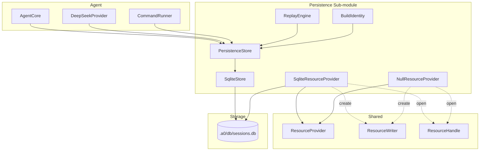
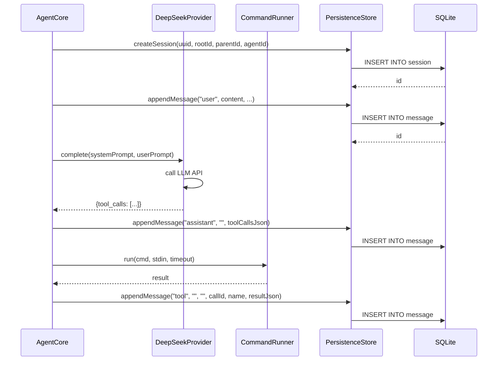
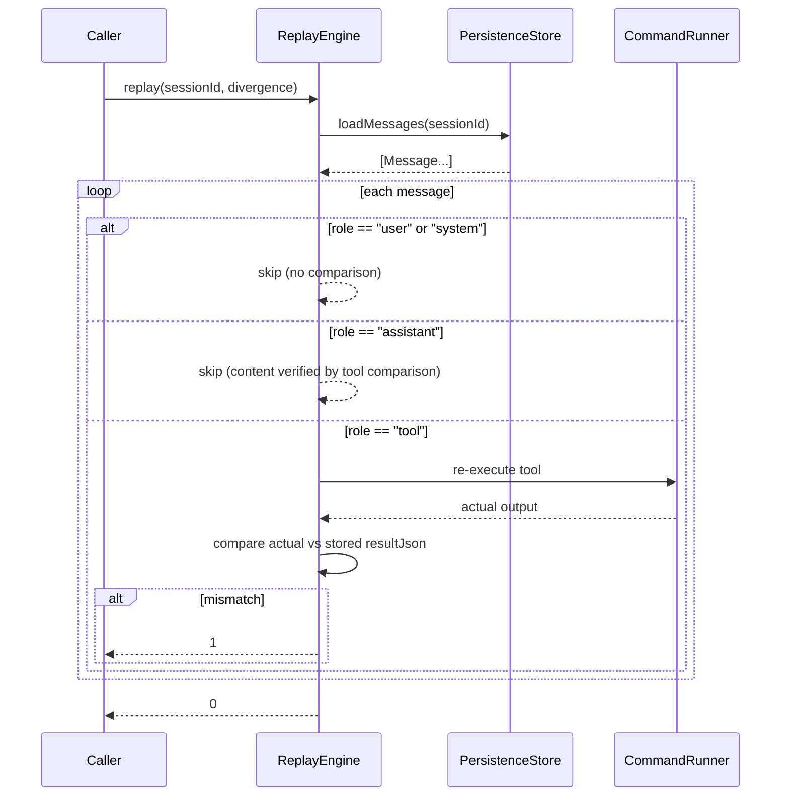
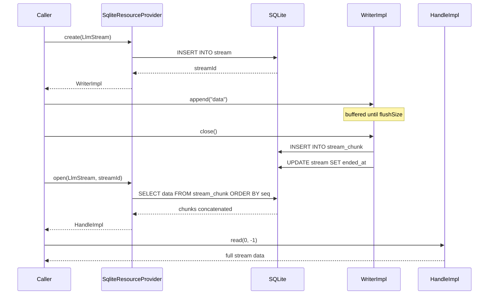

# Technical Specification: Persistence Sub-Module

## For a0 Agent — Version 1.0

---

## §1. Overview

The Persistence sub-module records every agent invocation into a SQLite database for crash reproduction and deterministic replay. It captures the full conversational loop: user input → LLM request → tool execution → LLM response.

**Goals:**

- Record every agent I/O into an append-only message log
- Fingerprint the agent binary by SHA1 so replay uses the correct version
- Support deterministic replay: inject stored LLM responses, re-execute tools, compare outputs
- Enable sub-agent tracing via parent/root session links
- Maintain a **task tree** for each session with priority sorting and automated/human verification fields
- Persist **system prompt and tool definitions** once per session for replay without persona reload
- Provide a clean abstract interface so SQLite can be swapped out
- Support streaming I/O (LLM token streams, tool output, terminal capture) via a `ResourceProvider` abstraction

**Source files:**

| File | Component |
|------|-----------|
| `src/persistence/persistence_store.h` | `PersistenceStore` abstract interface + `NullStore` stub + data structs |
| `src/persistence/persistence_store.spec.md` | Spec for abstract interface |
| `src/persistence/sqlite_store.h/.cpp` | `SqliteStore` — SQLite-backed implementation |
| `src/persistence/sqlite_store.spec.md` | Spec for SQLite store |
| `src/persistence/build_identity.h/.cpp` | `BuildIdentity` — binary + git fingerprinting |
| `src/persistence/build_identity.spec.md` | Spec for build identity |
| `src/persistence/replay_engine.h/.cpp` | `ReplayEngine` — deterministic session replay |
| `src/persistence/replay_engine.spec.md` | Spec for replay engine |
| `src/persistence/null_resource_provider.h` | `NullResourceProvider` — no-op for testing |
| `src/persistence/null_resource_provider.spec.md` | Spec for null resource provider |
| `src/persistence/sqlite_resource_provider.h/.cpp` | `SqliteResourceProvider` — SQLite-backed stream I/O |
| `src/persistence/sqlite_resource_provider.spec.md` | Spec for SQLite resource provider |

**Dependencies:** SQLite3 (default), `CommandRunner` (for replay execution and git fingerprinting), `shared/resource_provider.h` (stream I/O base classes)

**Lifecycle:** Per-session. One database per project root, located at `a0Dir + "/db/sessions.db"` where `a0Dir` defaults to `./.a0/` and is configurable via the `--a0-dir` CLI flag. The `a0Dir` directory is auto-created on agent startup by `ensureA0Dir()`.

---

## §2. Component Specifications

### 2.1 Data Structures (`persistence_store.h`)

```cpp
namespace a0::persistence {

struct BuildFingerprint {
    std::string binarySha1;
    std::string repoUrl;
    std::string commitHash;
    std::string dirtyHash;
};

struct Message {
    int64_t id;
    int64_t sessionId;
    std::string role;
    std::string content;
    std::string toolCallsJson;
    std::string toolCallId;
    std::string name;
    std::string resultJson;
    int64_t createdAt;
    int64_t subSessionId = 0;
    int seq = 0;
};

struct Stream {
    int64_t id;
    int64_t sessionId;
    std::string toolCallId;
    std::string terminalId;
    std::string name;
    std::string contextType;
    std::string contextId;
    std::string cwd;
    int64_t createdAt;
    int64_t endedAt;
    int exitCode;
};

struct StreamChunk {
    int64_t id;
    int64_t streamId;
    int seq;
    std::string direction;
    std::string data;
    int64_t timestamp;
};

struct SessionContextRow {
    int64_t sessionId;
    std::string sessionUuid;
    std::string originalCwd;
    std::string worktreePath;
    std::string gitRepoRoot;
    std::string gitBranch;
    std::string gitCommit;
};

struct InvocationRow {
    int64_t id;
    int64_t messageId;
    int64_t skillId;
    std::string toolName;
    std::string paramsJson;
    std::string outputJson;
    int64_t timestamp;
};

struct Task {
    int64_t id = 0;
    int64_t rootTaskId = 0;
    int64_t parentTaskId = 0;
    int64_t sessionId = 0;
    std::string description;
    std::string detailedPlan;
    std::string automatedVerification;
    std::string humanVerification;
    int priority = 0;
    std::string status = "pending";
    int64_t createdAt = 0;
    int64_t updatedAt = 0;
};

} // namespace a0::persistence
```

### 2.2 PersistenceStore (Abstract Interface)

```cpp
namespace a0::persistence {

class PersistenceStore {
public:
    virtual ~PersistenceStore() = default;

    virtual int registerAgent(const BuildFingerprint& fp) = 0;

    virtual int64_t createSession(const std::string& uuid,
                                   int64_t rootId,
                                   int64_t parentId,
                                   int agentId) = 0;
    virtual void endSession(int64_t sessionId) = 0;

    virtual int64_t appendMessage(int64_t sessionId,
                                   std::optional<int64_t> subSessionId,
                                   int seq,
                                   const std::string& role,
                                   const std::string& content,
                                   const std::string& toolCallsJson,
                                   const std::string& toolCallId,
                                   const std::string& name,
                                   const std::string& resultJson) = 0;

    virtual std::vector<Message> loadMessages(int64_t sessionId,
                                               std::optional<int64_t> subSessionId = std::nullopt) = 0;

    virtual int64_t findSessionByUuid(const std::string& uuid) const = 0;

    struct SessionRow {
        int64_t id = 0;
        std::string uuid;
        int64_t startedAt = 0;
        int64_t endedAt = 0;
        int messageCount = 0;
    };

    virtual std::vector<SessionRow> loadSessions(int limit = 20) const = 0;

    virtual void flush() = 0;

    // --- Streaming ---
    virtual int64_t createStream(int64_t sessionId,
                                  const std::string& toolCallId,
                                  const std::string& name,
                                  const std::string& contextType,
                                  const std::string& contextId,
                                  const std::string& cwd,
                                  const std::string& terminalId = "") = 0;

    virtual int appendChunk(int64_t streamId, int seq,
                             const std::string& direction,
                             const std::string& data) = 0;

    virtual int endStream(int64_t streamId, int exitCode) = 0;

    virtual std::vector<StreamChunk> loadStreamChunks(int64_t streamId,
                                                       int offset = 0,
                                                       int limit = -1) = 0;

    virtual std::vector<Stream> listSessionStreams(int64_t sessionId) = 0;

    // --- Skill invocation tracking ---
    virtual int ensureSkill(int type, const std::string& name) = 0;

    virtual int64_t appendInvocation(int64_t messageId,
                                      int skillId,
                                      const std::string& toolName,
                                      const std::string& paramsJson,
                                      const std::string& outputJson) = 0;

    virtual std::vector<InvocationRow> loadInvocations(int type,
                                                         const std::string& name) const = 0;

    // --- System prompt + tool definitions ---
    virtual int saveSessionSystemPrompt(int64_t sessionId,
                                         const std::string& systemPrompt,
                                         const std::string& toolDefinitionsJson) = 0;

    virtual int loadSessionSystemPrompt(int64_t sessionId,
                                         std::string& systemPrompt,
                                         std::string& toolDefinitionsJson) const = 0;

    // --- Task tree ---
    virtual int64_t createSessionRootTask(int64_t sessionId) = 0;
    virtual int64_t getSessionRootTask(int64_t sessionId) const = 0;
    virtual int64_t addTask(const Task& task) = 0;
    virtual int removeTask(int64_t taskId) = 0;
    virtual std::vector<Task> listTasks(int64_t parentTaskId) const = 0;
    virtual int updateTaskPriority(int64_t taskId, int priority) = 0;
    virtual Task getTask(int64_t taskId) const = 0;

    // --- Session context ---
    virtual int saveSessionContext(const SessionContextRow& row) = 0;

    virtual SessionContextRow loadSessionContext(int64_t sessionId) const = 0;
};

class NullStore : public PersistenceStore {
    // No-op implementations for testing.
    // createSession returns a static counter (starts at 100).
    // appendMessage returns a static counter (starts at 1000).
    // createStream returns a static counter (starts at 200).
    // createSessionRootTask returns 1.
    // All other methods return 0, empty, or default-constructed values.
private:
    int64_t m_nextRoot = 0;
};

} // namespace a0::persistence
```

### 2.3 SqliteStore

```cpp
namespace a0::persistence {

class SqliteStore : public PersistenceStore {
public:
    /// \param dbPath  Filesystem path to the SQLite database.
    explicit SqliteStore(const std::string& dbPath);
    ~SqliteStore() override;

    int registerAgent(const BuildFingerprint& fp) override;
    int64_t createSession(const std::string& uuid, int64_t rootId, int64_t parentId, int agentId) override;
    void endSession(int64_t sessionId) override;
    int64_t appendMessage(int64_t sessionId,
                           std::optional<int64_t> subSessionId,
                           int seq,
                           const std::string& role,
                           const std::string& content,
                           const std::string& toolCallsJson,
                           const std::string& toolCallId,
                           const std::string& name,
                           const std::string& resultJson) override;
    std::vector<Message> loadMessages(int64_t sessionId,
                                       std::optional<int64_t> subSessionId = std::nullopt) override;
    int64_t findSessionByUuid(const std::string& uuid) const override;
    std::vector<SessionRow> loadSessions(int limit = 20) const override;
    void flush() override;

    int64_t createStream(int64_t sessionId,
                          const std::string& toolCallId,
                          const std::string& name,
                          const std::string& contextType,
                          const std::string& contextId,
                          const std::string& cwd,
                          const std::string& terminalId = "") override;
    int appendChunk(int64_t streamId, int seq,
                    const std::string& direction,
                    const std::string& data) override;
    int endStream(int64_t streamId, int exitCode) override;
    std::vector<StreamChunk> loadStreamChunks(int64_t streamId,
                                               int offset = 0,
                                               int limit = -1) override;
    std::vector<Stream> listSessionStreams(int64_t sessionId) override;

    int ensureSkill(int type, const std::string& name) override;
    int64_t appendInvocation(int64_t messageId,
                              int skillId,
                              const std::string& toolName,
                              const std::string& paramsJson,
                              const std::string& outputJson) override;
    std::vector<InvocationRow> loadInvocations(int type,
                                                 const std::string& name) const override;

    int saveSessionSystemPrompt(int64_t sessionId,
                                 const std::string& systemPrompt,
                                 const std::string& toolDefinitionsJson) override;
    int loadSessionSystemPrompt(int64_t sessionId,
                                 std::string& systemPrompt,
                                 std::string& toolDefinitionsJson) const override;

    int64_t createSessionRootTask(int64_t sessionId) override;
    int64_t getSessionRootTask(int64_t sessionId) const override;
    int64_t addTask(const Task& task) override;
    int removeTask(int64_t taskId) override;
    std::vector<Task> listTasks(int64_t parentTaskId) const override;
    int updateTaskPriority(int64_t taskId, int priority) override;
    Task getTask(int64_t taskId) const override;

    int saveSessionContext(const SessionContextRow& row) override;
    SessionContextRow loadSessionContext(int64_t sessionId) const override;

    /// Expose the raw sqlite3 handle for ad-hoc queries.
    /// \returns Pointer to the underlying sqlite3*.
    void* handle() const;

private:
    class Impl;
    std::unique_ptr<Impl> m_impl;
};

} // namespace a0::persistence
```

### 2.4 SqliteStore::Impl (PIMPL)

```cpp
class SqliteStore::Impl {
public:
    sqlite3* db = nullptr;

    /// Opens or creates the database, enables WAL and foreign keys,
    /// creates all required tables and runs migrations.
    Impl(const std::string& dbPath);

    ~Impl();

    /// Execute a raw SQL string.
    /// \throws std::runtime_error on failure.
    void exec(const std::string& sql);
};
```

### 2.5 BuildIdentity

```cpp
namespace a0::persistence {

class BuildIdentity {
public:
    /// SHA1 of the running a0 binary via /proc/self/exe.
    /// \returns 40-character hex string.
    /// \throws std::runtime_error if sha1sum fails.
    static std::string binarySha1();

    /// Detect git metadata from the project root.
    /// Populates repoUrl, commitHash, and dirtyHash on the fingerprint struct.
    /// Fields are left empty if git commands fail.
    /// \param projectDir  Directory to run git commands in.
    /// \param fp          BuildFingerprint to populate.
    static void detectGit(const std::string& projectDir, BuildFingerprint& fp);
};

} // namespace a0::persistence
```

### 2.6 ReplayEngine

```cpp
namespace a0::persistence {

class ReplayEngine {
public:
    /// \param store  PersistenceStore to load messages from (must outlive this).
    explicit ReplayEngine(PersistenceStore* store);

    /// Replay an entire session.
    /// \param sessionId   Session to replay.
    /// \param divergence  Populated with details if replay fails.
    /// \retval 0  All messages match.
    /// \retval 1  Divergence found.
    /// \retval -1 Session not found.
    int replay(int64_t sessionId, std::string& divergence);

    /// Replay up to a specific message id.
    /// \param sessionId       Session to replay.
    /// \param upToMessageId   Only process messages with id <= this value.
    /// \param divergence      Populated with details if replay fails.
    /// \retval 0  All messages up to target match.
    /// \retval 1  Divergence found.
    /// \retval -1 Session not found.
    int replayTo(int64_t sessionId, int64_t upToMessageId, std::string& divergence);

private:
    PersistenceStore* m_store;

    /// Process a single message during replay.
    int xStep(const Message& msg, std::string& divergence);

    /// Re-execute the tool and compare output against stored resultJson.
    int xCompareToolResult(const Message& msg,
                           const std::string& actualResult,
                           std::string& divergence);
};

} // namespace a0::persistence
```

### 2.7 SqliteResourceProvider

```cpp
namespace a0::persistence {

class SqliteResourceProvider : public ResourceProvider {
public:
    /// \param dbPath             Path to the SQLite database file.
    /// \param tokenFlushSize     Bytes before flushing LLM token stream (default 256).
    /// \param toolFlushSize      Bytes before flushing tool output stream (default 4096).
    /// \param outputPreviewSize  Max bytes for outputPreview in ToolEnd (default 4096).
    SqliteResourceProvider(const std::string& dbPath,
                           int64_t tokenFlushSize = 256,
                           int64_t toolFlushSize = 4096,
                           int64_t outputPreviewSize = 4096);
    ~SqliteResourceProvider() override;

    std::unique_ptr<ResourceWriter> create(ResourceType type) override;
    std::unique_ptr<ResourceHandle> open(ResourceType type, int64_t id) override;

    void setTokenFlushSize(int64_t bytes);
    void setToolFlushSize(int64_t bytes);
    void setOutputPreviewSize(int64_t bytes);

private:
    class Impl;
    std::unique_ptr<Impl> m_impl;
};

// Internal WriterImpl:
//   m_id, m_streamId, m_db, m_flushSize, m_direction, m_buffer, m_closed, m_seq
//   xFlush(bool isFinal) -> INSERT INTO stream_chunk, optionally UPDATE stream.ended_at

// Internal HandleImpl:
//   m_id, m_data, m_offset

// SqliteResourceProvider::Impl:
//   m_db, m_nextId, m_tokenFlushSize, m_toolFlushSize, m_outputPreviewSize, m_mutex
//   xEnsureTables() -> CREATE TABLE IF NOT EXISTS stream, stream_chunk

} // namespace a0::persistence
```

### 2.8 NullResourceProvider

```cpp
namespace a0::persistence {

class NullResourceProvider : public ResourceProvider {
public:
    NullResourceProvider() = default;
    ~NullResourceProvider() override = default;

    std::unique_ptr<ResourceWriter> create(ResourceType type) override;
    std::unique_ptr<ResourceHandle> open(ResourceType type, int64_t id) override;
};

// Internal NullWriter: id()=0, append()/close() no-op, closed()=true
// Internal NullHandle: id()=0, hasMore()=false, readNext()/read()="", size()=0

} // namespace a0::persistence
```

---

## §3. Architecture Diagram



---

## §4. Data Flow

### 4.1 Normal Operation (Message Recording)



### 4.2 Deterministic Replay



### 4.3 Stream I/O via ResourceProvider



---

## §5. Testing Requirements

### SqliteStore

| Method | Test Case | Expected |
|--------|-----------|----------|
| `registerAgent` | New fingerprint | Returns new id |
| `registerAgent` | Duplicate fingerprint | Returns existing id |
| `createSession` | Root session | Returns id, uuid stored |
| `createSession` | Sub-session | parent_id set |
| `endSession` | Existing session | ended_at set |
| `appendMessage` | All four roles | Four rows with correct data |
| `appendMessage` | With subSessionId and seq | sub_session_id and seq stored correctly |
| `loadMessages` | Session with 10 messages | 10 messages in order |
| `loadMessages` | Nonexistent session | Empty vector |
| `loadMessages` | Filtered by subSessionId | Only matching sub-session messages |
| `flush` | After writes | WAL checkpoint runs without error |
| `createStream` | New stream | Returns stream id, fields match |
| `appendChunk` | Single chunk | Stored with correct seq/direction/data |
| `loadStreamChunks` | Multiple chunks | Returned in seq order |
| `endStream` | Existing stream | exit_code set, ended_at set |
| `listSessionStreams` | Session with 2 streams | Both streams returned |
| `ensureSkill` | New (type, name) | Returns new id |
| `ensureSkill` | Duplicate | Returns existing id |
| `appendInvocation` | Valid messageId + skillId | Returns invocation id |
| `loadInvocations` | By type + name | Returns matching rows |
| `saveSessionContext` | Valid SessionContextRow | Stores context, returns 0 |
| `loadSessionContext` | Existing sessionId | Returns SessionContextRow with matching fields |
| `loadSessionContext` | Nonexistent sessionId | Returns empty/default SessionContextRow |
| `createSessionRootTask` | New session | Root task with self-referencing ids |
| `getSessionRootTask` | Existing session | Returns root task id |
| `getSessionRootTask` | Nonexistent session | Returns 0 |
| `addTask` | Child task | Returns new id, fields round-trip |
| `removeTask` | Leaf task | Returns 0, task removed |
| `removeTask` | Task with children | Returns -1, task preserved |
| `listTasks` | Has children | Children ordered by priority then id |
| `updateTaskPriority` | Valid task | Priority updated |
| `getTask` | Not found | Default Task (id=0) |
| `saveSessionSystemPrompt` | Valid prompt | Returns 0 |
| `loadSessionSystemPrompt` | Existing session | Returns prompt and tool definitions |
| `loadSessions` | Multiple sessions | Ordered by started_at DESC |
| `handle()` | After construction | Returns non-null pointer |

### ReplayEngine

| Method | Test Case | Expected |
|--------|-----------|----------|
| `replay` | All tool results match | 0 |
| `replay` | Tool result differs | 1 |
| `replay` | Tool re-execution crashes | 1 with crash output |
| `replay` | Tool times out | 1 |
| `replay` | Session not found | -1 |
| `replayTo` | Target message reached | 0 |
| `replayTo` | Divergence before target | 1 |
| `replayTo` | Nonexistent target | -1 or diverges at first mismatch |

### BuildIdentity

| Method | Test Case | Expected |
|--------|-----------|----------|
| `binarySha1` | Normal binary | 40-char hex |
| `binarySha1` | Binary not readable | Throws std::runtime_error |
| `detectGit` | Clean repo | commitHash set, dirtyHash empty |
| `detectGit` | Dirty repo | dirtyHash non-empty |
| `detectGit` | No git repo | All fields empty |

### SqliteResourceProvider

| Method | Test Case | Expected |
|--------|-----------|----------|
| `SqliteResourceProvider` ctor | Valid db path | No throw, tables created |
| `create(LlmStream)` | Normal | Returns WriterImpl, stream row created |
| `create(ToolOutput)` | Normal | flushSize = toolFlushSize |
| `create` | SQL failure | Falls back to NullWriter |
| WriterImpl `append()` | Within flushSize | Buffered |
| WriterImpl `append()` | Exceeds flushSize | Chunk written |
| WriterImpl `close()` | With buffered data | Final chunk, stream.ended_at set |
| `open()` | Existing streamId | HandleImpl with concatenated chunks |
| `open()` | Nonexistent streamId | HandleImpl with empty data |
| HandleImpl `read(offset, limit)` | Valid range | Substring within bounds |
| HandleImpl `readNext()` | Has data | Remaining substring |

### NullResourceProvider

| Method | Test Case | Expected |
|--------|-----------|----------|
| `create` | Any type | Non-null writer with id=0 |
| `create` → `append()` | Any data | No-op |
| `create` → `closed()` | After create | true |
| `open` | Any type/id | Non-null handle with id=0 |
| `open` → `hasMore()` | Returned handle | false |
| `open` → `readNext()` | Returned handle | Empty string |

---

## §6. (skipped)

---

## §7. CLI Entry Point

### Session Management

```
a0 replay --session <id>
    Replay a stored session against the current binary.
    Re-executes tools, compares outputs, reports first divergence.

a0 replay --session <id> --step <message-id>
    Replay up to a specific message and stop.
```

### Sub-agent Flags

```
a0 --root <session-id> --parent <session-id> [other flags]
    Spawns a sub-agent. Creates child session linked to parent.
```

### Database Location

```
a0 --a0-dir <path>
    Override the .a0/ directory (default: ./.a0/).
    The database lives at <a0-dir>/db/sessions.db.
```

### Wire-up in `main.cpp`

1. `ensureA0Dir(a0Dir)` creates `./.a0/` (or configured `--a0-dir`) on startup
2. `BuildIdentity::binarySha1()` + `BuildIdentity::detectGit()` → register `agent` row
3. `SqliteStore` constructed with `a0Dir + "/db/sessions.db"` during startup
4. `AgentCore` receives `PersistenceStore*`
5. `DrivenCore` records `role=assistant` after LLM response
6. `CommandRunner::run()` records `role=tool`
7. `--root` and `--parent` CLI flags populate `createSession` params
8. `createSessionRootTask()` called in `cmdRun`/`cmdTui` after session creation
9. `saveSessionSystemPrompt()` called by `DrivenCore::xStartLlmRequest()` on first LLM request
10. `a0 replay` reads DB and drives the agent deterministically
11. `SqliteResourceProvider` constructed alongside `SqliteStore` for streaming I/O
