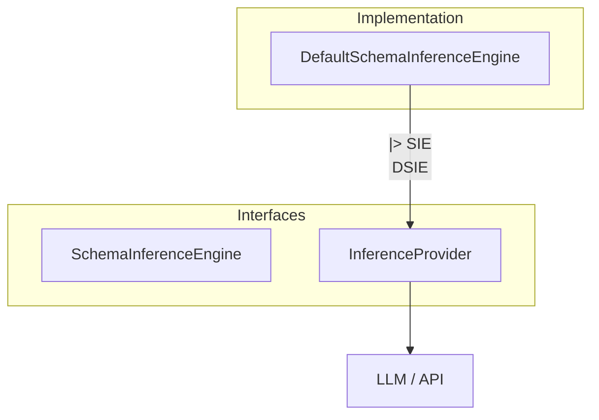
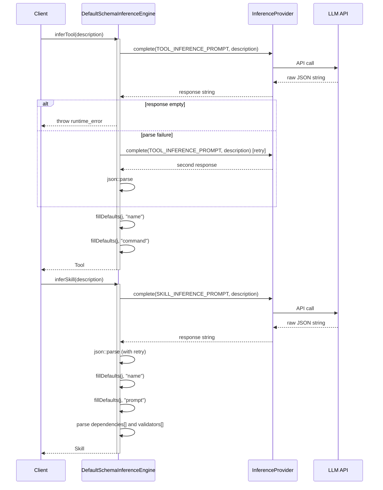

# DefaultSchemaInferenceEngine Spec

## 1. Overview

DefaultSchemaInferenceEngine implements SchemaInferenceEngine. It uses an InferenceProvider (LLM) to turn natural-language descriptions into structured Tool or Skill definitions. Two static system prompts (`TOOL_INFERENCE_PROMPT`, `SKILL_INFERENCE_PROMPT`) instruct the LLM to emit pure JSON. On parse failure the engine retries once; missing mandatory fields are filled with defaults.

**Dependencies:** InferenceProvider (pointer, owned by caller)
**Lifecycle:** Constructor receives a non-owning provider pointer; provider must outlive the engine.

## 2. Component Specifications

```cpp
class DefaultSchemaInferenceEngine : public SchemaInferenceEngine {
public:
    /// \param provider  Non-owning pointer to the LLM inference provider; must remain valid for the lifetime of this engine.
    explicit DefaultSchemaInferenceEngine(InferenceProvider* provider);

    /// \param naturalLanguageDescription  Free-text description of the desired tool.
    /// \returns  A Tool struct hydrated from LLM JSON output.
    /// \throws   std::runtime_error if LLM returns empty or unparseable response after one retry.
    Tool inferTool(const std::string& naturalLanguageDescription) override;

    /// \param naturalLanguageDescription  Free-text description of the desired skill.
    /// \returns  A Skill struct hydrated from LLM JSON output.
    /// \throws   std::runtime_error if LLM returns empty or unparseable response after one retry.
    Skill inferSkill(const std::string& naturalLanguageDescription) override;

private:
    InferenceProvider* m_provider;
};
```

**Static prompts (defined in .cpp):**

- `TOOL_INFERENCE_PROMPT` — Instructs LLM to output JSON with fields `name`, `description`, `command`, `inputMode`.
- `SKILL_INFERENCE_PROMPT` — Instructs LLM to output JSON with fields `name`, `description`, `prompt`, `dependencies`, `validators`.

**Helper function `fillDefaults`:** If a required field is missing, not a string, or empty, assigns `"inferred"`.

## 3. Architecture Diagram



## 4. Data Flow



## 5. Error Handling

| Scenario | Behaviour |
|----------|-----------|
| Empty response from InferenceProvider (`""`) | `std::runtime_error("empty response from inference provider")` thrown |
| Invalid JSON on first attempt | Retries once; if second parse also fails, `json::parse` exception propagates |
| JSON missing required fields (`name`, `command`, `prompt`) | `fillDefaults` substitutes `"inferred"` |
| `dependencies` / `validators` missing from JSON | `j["dependencies"]` yields default empty array; no error |
| InferenceProvider throws (network error, etc.) | Exception propagates to caller unmodified |

## 6. Edge Cases

| Case | Expected Result |
|------|----------------|
| Very short description (one word) | LLM attempts inference with minimal context; may produce generic defaults |
| Description asking for impossible (e.g. "teleport") | LLM returns best-effort JSON; fields likely filled with defaults |
| Empty description | `fillDefaults` sets missing fields to `"inferred"`; return structurally valid but semantically empty object |
| LLM returns markdown-wrapped JSON (```json ... ```) | `json::parse` fails, retry; if second response also wrapped, parse exception propagates |
| Unparseable JSON on both attempts | Exception propagates from `json::parse` |

## 7. Testing Requirements

| Method | Test Case | Input | Expected Output |
|--------|-----------|-------|----------------|
| `inferTool` | Valid LLM response | Description, provider returns valid JSON | Tool with fields from JSON |
| `inferTool` | Empty LLM response | Description, provider returns `""` | `std::runtime_error` thrown |
| `inferTool` | Invalid JSON, retry succeeds | First response garbage, second valid | Tool correctly constructed |
| `inferTool` | Invalid JSON, both attempts fail | Both responses unparseable | `json::parse` exception propagates |
| `inferTool` | Missing `name` in JSON | JSON omits `name` field | Tool.name == `"inferred"` |
| `inferSkill` | Valid LLM response | Description, provider returns valid JSON | Skill with fields, dependencies, validators |
| `inferSkill` | Missing `prompt` in JSON | JSON omits `prompt` field | Skill.prompt == `"inferred"` |
| `inferSkill` | Empty dependencies array | JSON has `"dependencies": []` | Skill.dependencies empty |
| `inferSkill` | Validators in JSON | JSON includes validators array | Skill.validators populated |
