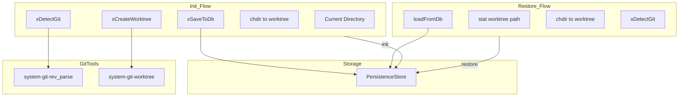
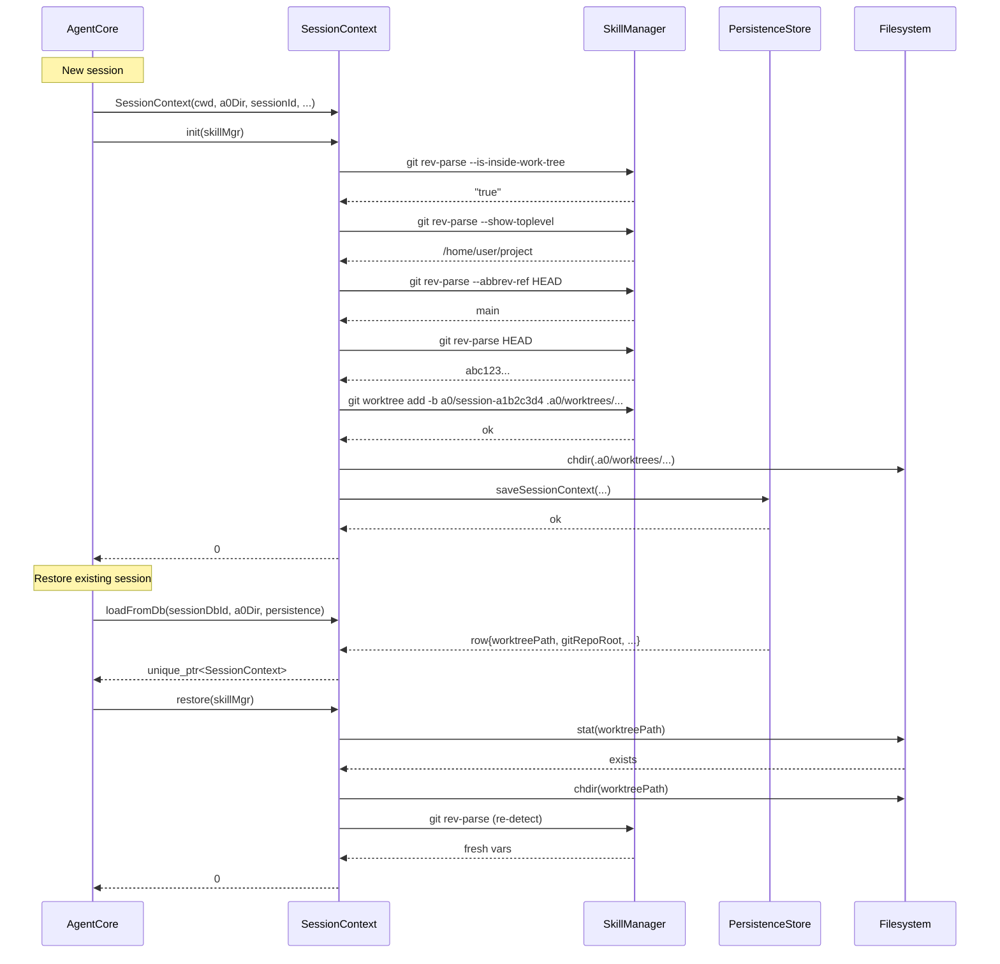

# SessionContext Spec

## 1. Overview

Manages session-level state for a single opencode agent session. On `init()`, it detects whether CWD is inside a git repository, creates an isolated git worktree at `.a0/worktrees/session-<prefix>`, and persists the session context to the database. On `restore()`, it re-attaches to an existing worktree from a prior session. The `containerName()` method derives Docker container names using an 8-character session prefix to ensure isolation between sessions.

**Source files:** `src/session_context.h/.cpp`

**Dependencies:** `nlohmann/json`, `SkillManager` (for git tool execution), `PersistenceStore`, POSIX `chdir`, `stat`

## 2. Component Specifications

```cpp
namespace a0 {

struct GitInfo {
    bool isRepo = false;
    std::string repoRoot;
    std::string currentBranch;
    std::string commitHash;
};

class SessionContext {
public:
    /// Create a new session context: detect git, create worktree, chdir.
    SessionContext(const std::string& cwd, const std::string& a0Dir,
                   const std::string& sessionId, int64_t sessionDbId,
                   a0::persistence::PersistenceStore* persistence = nullptr);

    /// Run git detection and worktree creation.
    int init(a0::skills::SkillManager* skillMgr);

    /// Load an existing session context from the database.
    /// Returns null if no context record exists.
    static std::unique_ptr<SessionContext> loadFromDb(
        int64_t sessionDbId,
        const std::string& a0Dir,
        a0::persistence::PersistenceStore* persistence);

    /// Restore a loaded session context: chdir to worktree, re-detect for vars.
    int restore(a0::skills::SkillManager* skillMgr);

    const GitInfo& gitInfo() const;
    const std::string& originalCwd() const;
    const std::string& worktreePath() const;
    std::string containerName(const std::string& base) const;

private:
    int xDetectGit(a0::skills::SkillManager* skillMgr, int& seq);
    int xCreateWorktree(a0::skills::SkillManager* skillMgr, int& seq);
    int xSaveToDb();

    std::string m_cwd;
    std::string m_a0Dir;
    std::string m_sessionId;
    std::string m_sessionPrefix;
    std::string m_effectiveCwd;
    std::string m_worktreePath;
    GitInfo m_git;
    bool m_hasWorktree = false;
    a0::persistence::PersistenceStore* m_persistence = nullptr;
    int64_t m_sessionDbId = 0;
};

} // namespace a0
```

### Container naming

```
containerName("b1") → "a0-a1b2c3d4-b1"
                      ↑   ↑        ↑
                   fixed prefix   base name
                        8-char session prefix
```

## 3. Architecture Diagram



## 4. Data Flow



## 5. Testing Requirements

| Test | Verification |
|------|-------------|
| No `skillMgr` to `init` | Returns -1, no crash |
| Not in a git repo | `m_git.isRepo == false`, returns 0 |
| Worktree creation succeeds | chdir to worktree, `xSaveToDb` called |
| Worktree creation fails | Returns 0, stays in CWD, error logged |
| `loadFromDb` null persistence | Returns `nullptr` |
| `loadFromDb` no record | Returns `nullptr` |
| `restore` missing worktree | Returns -1 |
| `containerName` format | Returns `"a0-<prefix>-<base>"` |
| `m_sessionPrefix` is first 8 chars of sessionId | Verified in constructor |
