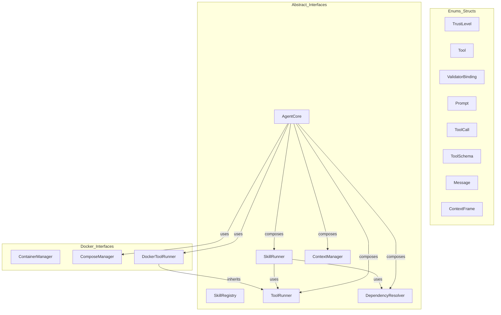
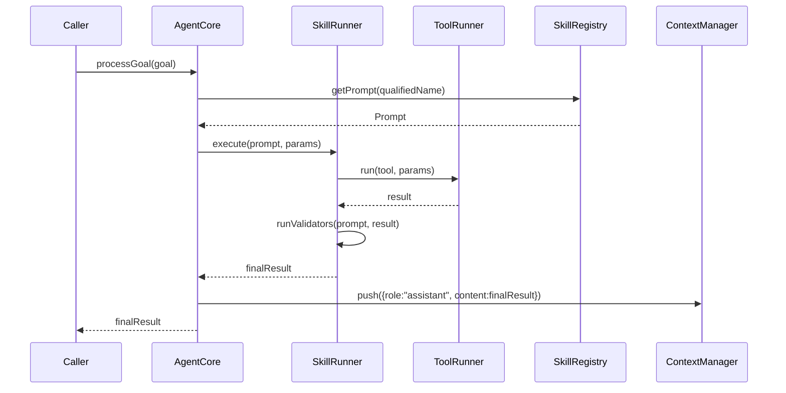

# Agent Interfaces Spec

## 1. Overview

Defines all abstract interfaces and core data structures for the agent framework. These types are consumed by every concrete implementation in the system. No runtime dependencies beyond `nlohmann/json` and the C++ standard library.

**Source file:** `src/shared/agent_interfaces.h`

**Dependencies:** `nlohmann/json`, `executor/command_runner.h` (for `StreamHandle`/`StreamCallback`)

## 2. Component Specifications

```cpp
using json = nlohmann::json;

enum class TrustLevel {
    HIGH,
    MEDIUM,
    LOW
};

struct Tool {
    std::string name;
    std::string description;
    std::string command;
    std::string inputMode = "stdin";
    std::string dockerImage;
    TrustLevel trustLevel = TrustLevel::MEDIUM;
    std::vector<std::string> aptDependencies;
    int timeoutSecs = 30;
};

struct ValidatorBinding {
    std::string toolName;
    std::optional<std::string> transform;
};

struct Prompt {
    std::string name;
    std::string description;
    std::string prompt;
    std::vector<std::string> dependencies;
    std::vector<ValidatorBinding> validators;
    std::vector<std::string> chain;
    std::string composeFile;
    std::vector<std::string> aptDependencies;
    std::string ns;
    std::string component;
    bool parallelValidators = false;
};

class SkillRegistry {
public:
    virtual ~SkillRegistry() = default;
    virtual bool loadFromDirectory(const std::string& path) = 0;
    virtual std::optional<Tool> getTool(const std::string& name) const = 0;
    virtual std::optional<Prompt> getPrompt(const std::string& name) const = 0;
    virtual std::vector<std::string> listTools() const = 0;
    virtual std::vector<std::string> listPrompts() const = 0;
    virtual bool addTool(const Tool& tool) = 0;
    virtual bool addPrompt(const Prompt& prompt) = 0;
};

class ToolRunner {
public:
    virtual ~ToolRunner() = default;
    virtual json run(const Tool& tool, const json& params) = 0;
    virtual a0::StreamHandle runStreaming(const Tool& tool,
                                           const json& params,
                                           a0::StreamCallback onChunk);
};

struct ToolCall {
    std::string id;
    std::string name;
    json arguments;
};

struct ToolSchema {
    std::string name;
    std::string description;
    json inputSchema;
};

struct Message {
    std::string role;
    std::string content;
    std::string toolCallId;
    std::vector<ToolCall> toolCalls;
    Message() = default;
    Message(const std::string& r, const std::string& c);
    Message(const std::string& r, const std::string& c, const std::string& tcid);
};

struct ContextFrame {
    std::string role;
    std::string content;
};

class ContextManager {
public:
    virtual ~ContextManager() = default;
    virtual void push(const ContextFrame& frame) = 0;
    virtual ContextFrame pop() = 0;
    virtual ContextFrame peek() const = 0;
    virtual size_t size() const = 0;
    virtual void clear() = 0;
    virtual std::vector<ContextFrame> snapshot() const = 0;
};

class DependencyResolver {
public:
    virtual ~DependencyResolver() = default;
    virtual bool checkToolDependencies(const Tool& tool) const = 0;
    virtual bool checkPromptDependencies(const Prompt& prompt) const = 0;
    virtual std::vector<std::string> missingDependencies(const Prompt& prompt) const = 0;
};

class SkillRunner {
public:
    virtual ~SkillRunner() = default;
    virtual std::string expandPrompt(const Prompt& prompt, const json& params) = 0;
    virtual json runValidators(const Prompt& prompt, const json& input) = 0;
    virtual json execute(const Prompt& prompt, const json& params) = 0;
    virtual void setGlobalVar(const std::string& key, const std::string& value) = 0;
    virtual void setGlobalVars(const std::unordered_map<std::string, std::string>& vars) = 0;
    virtual a0::StreamHandle executeStreaming(const Prompt& prompt,
                                               const json& params,
                                               a0::StreamCallback onChunk) = 0;
};

class AgentCore {
public:
    virtual ~AgentCore() = default;
    virtual bool init(const std::string& skillsDir) = 0;
    virtual json processGoal(const std::string& goal) = 0;
    virtual bool resumeSession(const std::string& sessionId) = 0;
    virtual std::string currentSessionId() const = 0;
    virtual void run() = 0;
    virtual bool ensureSession() = 0;
    virtual int64_t sessionDbId() const = 0;
    virtual a0::StreamHandle processGoalStreaming(const std::string& goal,
                                                   a0::StreamCallback onChunk) = 0;
};

class ContainerManager {
public:
    virtual ~ContainerManager() = default;
    virtual std::string acquireContainer(const Tool& tool) = 0;
    virtual std::string execInContainer(const std::string& containerId,
                                        const std::string& command,
                                        const std::string& stdinData = "",
                                        int timeoutSecs = 30) = 0;
    virtual void pruneIdleContainers() = 0;
};

class ComposeManager {
public:
    virtual ~ComposeManager() = default;
    virtual std::string startEnvironment(const Prompt& prompt, const std::string& skillDirectory) = 0;
    virtual void stopEnvironment(const Prompt& prompt) = 0;
    virtual void markUsed(const Prompt& prompt) = 0;
    virtual void setCurrentPrompt(const Prompt& prompt) = 0;
    virtual std::string getCurrentNetwork() const = 0;
    virtual void clearCurrentPrompt() = 0;
    virtual std::string startPersistent(const std::string& name,
                                         const std::string& composeFile,
                                         const std::string& skillDirectory) = 0;
    virtual void stopPersistent(const std::string& name) = 0;
    virtual bool isPersistent(const std::string& name) const = 0;
};

class DockerToolRunner : public ToolRunner {
public:
    virtual ~DockerToolRunner() = default;
};
```

## 3. Architecture Diagram



## 4. Data Flow



## 5. Testing Requirements

| Interface | Method | Test Case |
|-----------|--------|-----------|
| SkillRegistry | loadFromDirectory | Valid, missing, malformed directory |
| SkillRegistry | getTool/getPrompt | Existing name, missing name, empty registry |
| SkillRegistry | listTools/listPrompts | Empty, single, multiple entries |
| SkillRegistry | addTool/addPrompt | New entry, duplicate name, invalid data |
| ToolRunner | run | stdin mode, args mode, empty params, timeout |
| ToolRunner | runStreaming | Streaming output callback, cancel mid-stream |
| ContextManager | push/pop | Single frame, multiple frames, underflow |
| ContextManager | peek | Non-empty, empty |
| ContextManager | size/clear | After pushes, after clear |
| ContextManager | snapshot | Returns copy, modification isolation |
| DependencyResolver | checkToolDependencies | Satisfied, missing tool, missing binary |
| DependencyResolver | checkPromptDependencies | All satisfied, missing prompt |
| DependencyResolver | missingDependencies | Fully/partially/all missing |
| SkillRunner | expandPrompt | All params, missing params, empty template |
| SkillRunner | runValidators | Passing, failing, no validators |
| SkillRunner | execute | Successful, tool failure, dependency failure |
| SkillRunner | executeStreaming | Streaming output from tools |
| AgentCore | init | Valid dir, invalid dir, already initialized |
| AgentCore | processGoal | Simple goal, multi-step, empty goal |
| AgentCore | resumeSession | Valid session ID, invalid session ID |
| AgentCore | ensureSession | After init, before init |
| AgentCore | processGoalStreaming | Streaming tool invocations |
| ContainerManager | acquireContainer | Image exists, missing, pool reuse |
| ContainerManager | execInContainer | Valid command, invalid, stdin provided |
| ContainerManager | pruneIdleContainers | No idle, all idle, mixed |
| ComposeManager | startEnvironment | Compose file exists, missing |
| ComposeManager | stopEnvironment | Running, already stopped |
