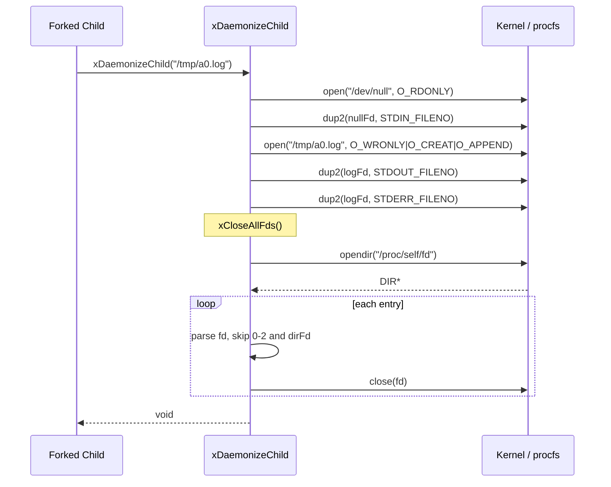

# Daemonize Spec

## 1. Overview

Header-only daemonization utilities for background process management. Provides two inline functions: `xCloseAllFds()` for closing inherited file descriptors, and `xDaemonizeChild()` for fully detaching a forked child from its parent.

**Source file:** `src/shared/daemonize.h`

**Dependencies:** POSIX (`unistd.h`, `fcntl.h`, `dirent.h`)

## 2. Component Specifications

```cpp
namespace a0 {

/// Close every open file descriptor >= 3.
/// Uses /proc/self/fd for efficiency, falls back to iterating up to OPEN_MAX.
inline void xCloseAllFds();

/// Fully detach a forked child from its parent.
/// Call after fork() + setsid(), before exec().
///   - stdin  -> /dev/null
///   - stdout -> logPath (or /dev/null if empty)
///   - stderr -> logPath (or /dev/null if empty)
///   - closes every inherited fd >= 3
/// @param logPath Path for stdout/stderr; empty = /dev/null
inline void xDaemonizeChild(const std::string& logPath);

} // namespace a0
```

## 3. Architecture Diagram

```mermaid
graph TB
    subgraph Public_API
        CLOSE[xCloseAllFds]
        DAEMON[xDaemonizeChild]
    end

    subgraph Internal
        PROCFS[/proc/self/fd]
        OPENDIR[opendir / readdir]
        FALLBACK[Sysconf OPEN_MAX iteration]
        REDIR[dup2 stdin/stdout/stderr]
    end

    CLOSE --> PROCFS
    CLOSE -->|fallback| FALLBACK
    DAEMON --> REDIR
    DAEMON --> CLOSE
```

## 4. Data Flow



## 5. Testing Requirements

| Test | Verification |
|------|-------------|
| xCloseAllFds no-op | Call with no extra fds open — no crash |
| xCloseAllFds closes pipes | Open pipe fds are closed after call |
| xDaemonizeChild redirects output | stdout/stderr go to specified logPath |
| xDaemonizeChild with empty path | stdout/stderr go to /dev/null |
| xDaemonizeChild closes inherited fds | All fds >= 3 are closed |
