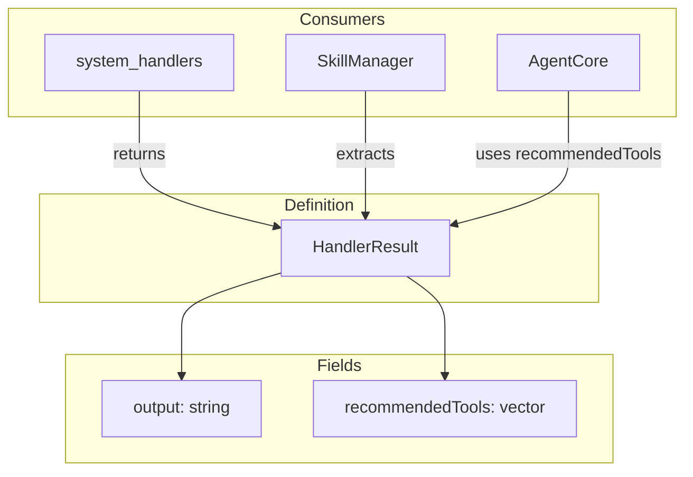
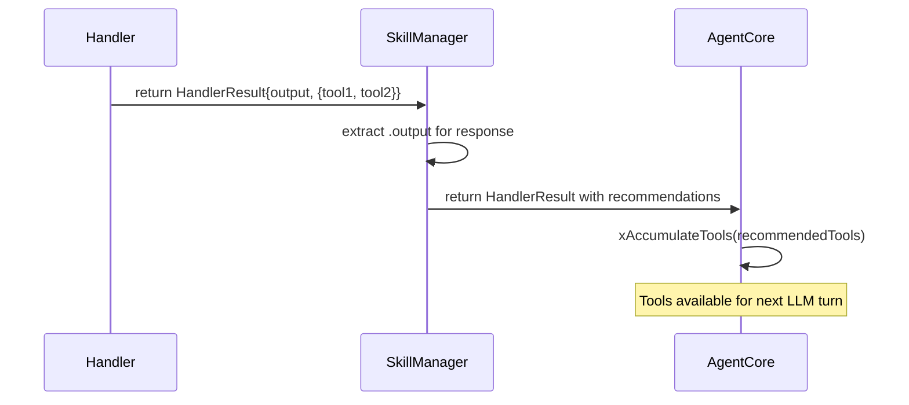

# HandlerResult Spec

## 1. Overview

Lightweight return type for all C++ system tool handler functions. Carries the output string and an optional list of recommended tool names used for dynamic tool accumulation.

**Source file:** `src/shared/handler_results.h`

## 2. Component Specifications

```cpp
namespace a0 {

struct HandlerResult {
    std::string output;
    std::vector<std::string> recommendedTools;
};

}
```

## 3. Architecture Diagram



## 4. Data Flow



## 5. Testing Requirements

| Test | Verification |
|------|-------------|
| Default construction | output.empty(), recommendedTools.empty() |
| Output-only result | HandlerResult{"ok"} — output populated, recommendedTools empty |
| Result with recommendations | HandlerResult{"plan", {"tool1", "tool2"}} — both fields populated |
