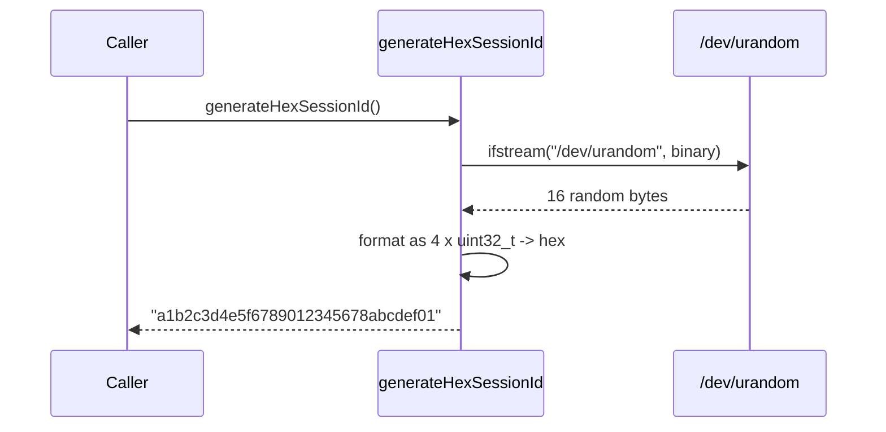

# HexSessionId Spec

## 1. Overview

Generates a 32-character hex session identifier using `/dev/urandom`. Reads 16 bytes from `/dev/urandom` and formats them as lowercase hex, yielding 128 bits of entropy per identifier. Header-only utility.

**Source file:** `src/shared/hex_session_id.h`

**Dependencies:** Standard library only (`string`, `sstream`, `iomanip`, `fstream`, `array`, `cstdint`)

## 2. Component Specifications

```cpp
#pragma once

#include <string>
#include <sstream>
#include <iomanip>
#include <fstream>
#include <array>
#include <cstdint>

/// Returns a 32-character hex string (e.g. "a1b2c3d4e5f6789012345678abcdef01").
/// 128 bits of entropy per call. Reads from /dev/urandom.
inline std::string generateHexSessionId() {
    std::array<uint32_t, 4> buf{};
    std::ifstream urandom("/dev/urandom", std::ios::binary);
    if (urandom) {
        urandom.read(reinterpret_cast<char*>(buf.data()), buf.size() * sizeof(uint32_t));
    }
    std::ostringstream ss;
    ss << std::hex << std::setfill('0');
    for (uint32_t val : buf) {
        ss << std::setw(8) << val;
    }
    return ss.str();
}
```

## 3. Architecture Diagram

```mermaid
graph TB
    subgraph Source
        URANDOM[/dev/urandom]
    end

    subgraph Function
        CALL[generateHexSessionId]
        READ[read 16 bytes]
        LOOP[4 x uint32_t]
        FORMAT[ostringstream << hex << setw 8]
    end

    subgraph Output
        RESULT[32-char hex string]
    end

    URANDOM -->|ifstream binary| READ
    READ -->|fill array| LOOP
    LOOP -->|format| FORMAT
    FORMAT --> RESULT
```

## 4. Data Flow



## 5. Testing Requirements

| Test | Verification |
|------|-------------|
| Length | Returns exactly 32 characters |
| Characters | All chars in [0-9a-f] |
| Uniqueness | Consecutive calls produce different values |
| /dev/urandom unavailable | Returns 32 zeros (graceful fallback) |
| Determinism not required | Two calls produce different sequences |
